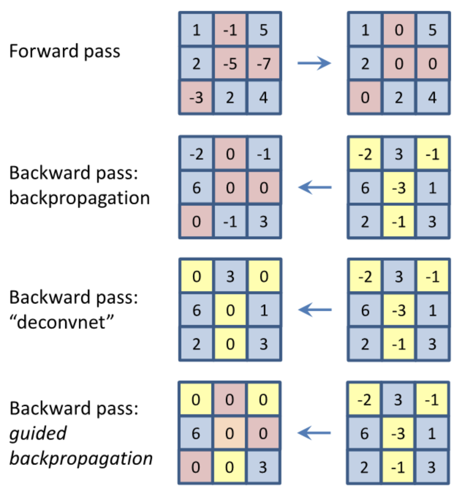

# Data Science Cheatsheets

The purpose of this README is two fold:
* To help you (data science practitioners) prepare for data science related interviews
* To introduce to people who don't know but want to learn some basic data science concepts

Here are the categories:

* [SQL](#sql)
* [Statistics](#statistics)
* [Mathematics](#mathematics)
* [Machine Learning Concepts](#machine-learning-concepts)
* [Deep Learning Concepts](#deep-learning-concepts)
* [Supervised Learning](#supervised-learning)
* [Unsupervised Learning](#unsupervised-learning)
* [Natural Language Processing](#natural-language-processing)
* [Software Engineering](#software-engineering)
* [Stanford Materials](#stanford-materials)

## SQL

* [Finding Data Queries](#finding-data-queries)
* [Data Modification Queries](#data-modification-queries)
* [Reporting Queries](#reporting-queries)
* [Join Queries](#join-queries)
* [View Queries](#view-queries)
* [Altering Table Queries](#altering-table-queries)
* [Creating Table Query](#creating-table-query)

### Finding Data Queries

#### **SELECT**: used to select data from a database
* `SELECT` * `FROM` table_name;

#### **DISTINCT**: filters away duplicate values and returns rows of specified column
* `SELECT DISTINCT` column_name;

#### **WHERE**: used to filter records/rows
* `SELECT` column1, column2 `FROM` table_name `WHERE` condition;
* `SELECT` * `FROM` table_name `WHERE` condition1 `AND` condition2;
* `SELECT` * `FROM` table_name `WHERE` condition1 `OR` condition2;
* `SELECT` * `FROM` table_name `WHERE NOT` condition;
* `SELECT` * `FROM` table_name `WHERE` condition1 `AND` (condition2 `OR` condition3);
* `SELECT` * `FROM` table_name `WHERE EXISTS` (`SELECT` column_name `FROM` table_name `WHERE` condition);

#### **ORDER BY**: used to sort the result-set in ascending or descending order
* `SELECT` * `FROM` table_name `ORDER BY` column;
* `SELECT` * `FROM` table_name `ORDER BY` column `DESC`;
* `SELECT` * `FROM` table_name `ORDER BY` column1 `ASC`, column2 `DESC`;

#### **SELECT TOP**: used to specify the number of records to return from top of table
* `SELECT TOP` number columns_names `FROM` table_name `WHERE` condition;
* `SELECT TOP` percent columns_names `FROM` table_name `WHERE` condition;
* Not all database systems support `SELECT TOP`. The MySQL equivalent is the `LIMIT` clause
* `SELECT` column_names `FROM` table_name `LIMIT` offset, count;

#### **LIKE**: operator used in a WHERE clause to search for a specific pattern in a column
* % (percent sign) is a wildcard character that represents zero, one, or multiple characters
* _ (underscore) is a wildcard character that represents a single character
* `SELECT` column_names `FROM` table_name `WHERE` column_name `LIKE` pattern;
* `LIKE` ‘a%’ (find any values that start with “a”)
* `LIKE` ‘%a’ (find any values that end with “a”)
* `LIKE` ‘%or%’ (find any values that have “or” in any position)
* `LIKE` ‘[a-c]%’ (find any values starting with “a”, “b”, or “c”

#### **IN**: operator that allows you to specify multiple values in a WHERE clause
* essentially the IN operator is shorthand for multiple OR conditions
* `SELECT` column_names `FROM` table_name `WHERE` column_name `IN` (value1, value2, …);
* `SELECT` column_names `FROM` table_name `WHERE` column_name `IN` (`SELECT STATEMENT`);

#### **BETWEEN**: operator selects values within a given range inclusive
* `SELECT` column_names `FROM` table_name `WHERE` column_name `BETWEEN` value1 `AND` value2;
* `SELECT` * `FROM` Products `WHERE` (column_name `BETWEEN` value1 `AND` value2) `AND NOT` column_name2 `IN` (value3, value4);
* `SELECT` * `FROM` Products `WHERE` column_name `BETWEEN` #01/07/1999# AND #03/12/1999#;

#### **NULL**: values in a field with no value
* `SELECT` * `FROM` table_name `WHERE` column_name `IS NULL`;
* `SELECT` * `FROM` table_name `WHERE` column_name `IS NOT NULL`;

#### **AS**: aliases are used to assign a temporary name to a table or column
* `SELECT` column_name `AS` alias_name `FROM` table_name;
* `SELECT` column_name `FROM` table_name `AS` alias_name;
* `SELECT` column_name `AS` alias_name1, column_name2 `AS` alias_name2;
* `SELECT` column_name1, column_name2 + ‘, ‘ + column_name3 `AS` alias_name;

#### **UNION**: set operator used to combine the result-set of two or more SELECT statements
* Each SELECT statement within UNION must have the same number of columns
* The columns must have similar data types
* The columns in each SELECT statement must also be in the same order
* `SELECT` columns_names `FROM` table1 `UNION SELECT` column_name `FROM` table2;
* `UNION` operator only selects distinct values, `UNION ALL` will allow duplicates

#### **INTERSECT**: set operator which is used to return the records that two SELECT statements have in common
* Generally used the same way as **UNION** above
* `SELECT` columns_names `FROM` table1 `INTERSECT SELECT` column_name `FROM` table2;

#### **EXCEPT**: set operator used to return all the records in the first SELECT statement that are not found in the second SELECT statement
* Generally used the same way as **UNION** above
* `SELECT` columns_names `FROM` table1 `EXCEPT SELECT` column_name `FROM` table2;

#### **ANY|ALL**: operator used to check subquery conditions used within a WHERE or HAVING clauses
* The `ANY` operator returns true if any subquery values meet the condition
* The `ALL` operator returns true if all subquery values meet the condition
* `SELECT` columns_names `FROM` table1 `WHERE` column_name operator (`ANY`|`ALL`) (`SELECT` column_name `FROM` table_name `WHERE` condition);

#### **GROUP BY**: statement often used with aggregate functions (COUNT, MAX, MIN, SUM, AVG) to group the result-set by one or more columns
* `SELECT` column_name1, COUNT(column_name2) `FROM` table_name `WHERE` condition `GROUP BY` column_name1 `ORDER BY` COUNT(column_name2) DESC;

#### **HAVING**: this clause was added to SQL because the WHERE keyword could not be used with aggregate functions
* `SELECT` `COUNT`(column_name1), column_name2 `FROM` table `GROUP BY` column_name2 `HAVING` `COUNT(`column_name1`)` > 5;

[back to current section](#sql)

### Data Modification Queries

#### **INSERT INTO**: used to insert new records/rows in a table
* `INSERT INTO` table_name (column1, column2) `VALUES` (value1, value2);
* `INSERT INTO` table_name `VALUES` (value1, value2 …);

#### **UPDATE**: used to modify the existing records in a table
* `UPDATE` table_name `SET` column1 = value1, column2 = value2 `WHERE` condition;
* `UPDATE` table_name `SET` column_name = value;

#### **DELETE**: used to delete existing records/rows in a table
* `DELETE FROM` table_name `WHERE` condition;
* `DELETE` * `FROM` table_name;

[back to current section](#sql)

### Reporting Queries

#### **COUNT**: returns the # of occurrences
* `SELECT COUNT (DISTINCT` column_name`)`;

#### **MIN() and MAX()**: returns the smallest/largest value of the selected column
* `SELECT MIN (`column_names`) FROM` table_name `WHERE` condition;
* `SELECT MAX (`column_names`) FROM` table_name `WHERE` condition;

#### **AVG()**: returns the average value of a numeric column
* `SELECT AVG (`column_name`) FROM` table_name `WHERE` condition;

#### **SUM()**: returns the total sum of a numeric column
* `SELECT SUM (`column_name`) FROM` table_name `WHERE` condition;

[back to current section](#sql)

### Join Queries

####  **INNER JOIN**: returns records that have matching value in both tables
* `SELECT` column_names `FROM` table1 `INNER JOIN` table2 `ON` table1.column_name=table2.column_name;
* `SELECT` table1.column_name1, table2.column_name2, table3.column_name3 `FROM` ((table1 `INNER JOIN` table2 `ON` relationship) `INNER JOIN` table3 `ON` relationship);

#### **LEFT (OUTER) JOIN**: returns all records from the left table (table1), and the matched records from the right table (table2)
* `SELECT` column_names `FROM` table1 `LEFT JOIN` table2 `ON` table1.column_name=table2.column_name;

### **RIGHT (OUTER) JOIN**: returns all records from the right table (table2), and the matched records from the left table (table1)
* `SELECT` column_names `FROM` table1 `RIGHT JOIN` table2 `ON` table1.column_name=table2.column_name;

#### **FULL (OUTER) JOIN**: returns all records when there is a match in either left or right table
* `SELECT` column_names `FROM` table1 ``FULL OUTER JOIN`` table2 `ON` table1.column_name=table2.column_name;

#### **Self JOIN**: a regular join, but the table is joined with itself
* `SELECT` column_names `FROM` table1 T1, table1 T2 `WHERE` condition;

[back to current section](#sql)

### View Queries

#### **CREATE**: create a view
* `CREATE VIEW` view_name `AS SELECT` column1, column2 `FROM` table_name `WHERE` condition;

#### **SELECT**: retrieve a view
* `SELECT` * `FROM` view_name;

#### **DROP**: drop a view
* `DROP VIEW` view_name;

[back to current section](#sql)

### Altering Table Queries

#### **ADD**: add a column
* `ALTER TABLE` table_name `ADD` column_name column_definition;

#### **MODIFY**: change data type of column
* `ALTER TABLE` table_name `MODIFY` column_name column_type;

#### **DROP**: delete a column
* `ALTER TABLE` table_name `DROP COLUMN` column_name;

[back to current section](#sql)

### Creating Table Query

### **CREATE**: create a table
* `CREATE TABLE` table_name `(`  
   `column1` `datatype`,  
   `column2` `datatype`,  
   `column3` `datatype`,  
   `column4` `datatype`,  
   `);`

[back to current section](#sql)

[back to top](#data-science-cheatsheets)

## Statistics

* [Probability Cheatsheet](https://github.com/khanhnamle1994/cracking-the-data-science-interview/tree/master/Cheatsheets/probability_cheatsheet.pdf)
* [Statistics Cheatsheet](https://github.com/khanhnamle1994/cracking-the-data-science-interview/tree/master/Cheatsheets/stats_cheatsheet.pdf)
* [Think Stats](https://github.com/khanhnamle1994/cracking-the-data-science-interview/tree/master/Cheatsheets/Think-Stats.md)
* [Enunciating the Central Limit Theorem](#enunciating-the-Central-Limit-Theorem)
* [Defining good hypotheses in a hypothesis test](#defining-good-hypotheses-in-a-hypothesis-test)
* [Calculating the probability of a sum of random variables](#calculating-the-probability-of-a-sum-of-random-variables)
* [Calculating the probability of an intersection of events](#calculating-the-probability-of-an-intersection-of-events)
* [Analyzing a residuals plot](#analyzing-a-residuals-plot)
* [Calculating conditional probabilities using the Bayes rule](#calculating-conditional-probabilities-using-the-Bayes-rule)

### Enunciating the Central Limit Theorem

The CTL is enunciated in a comprehensible way in [this lecture video](https://www.coursera.org/lecture/inferential-statistics-intro/clt-for-the-mean-examples-XhkI6).
* Question 1: X = length of one song => P(X > 5) = 500 / 3000 = 0.17
* Question 2: P(X1 + X2 + ... + X100 > 360 min) = P(X_average > 3.6)
=> Mean = 3.45, Standard Error = 0.165 => Z-score = (3.6 - 3.45) / 0.163 = 0.92
=> P(Z > 0.92) = 0.179
* Question 3: Plot A is a distribution of 100 sample means from random samples with size 7 (Remaining choice), Plot B is a single random sample of 100 observations from this population (It is right-skewed just like the parent distribution and also has the largest spread), and Plot C is a distribution of 100 sample means from random samples with size 49 (CLT tells us that sampling distributions will be nearly normal when n is large).

If you're looking for more content on the CTL, [here](https://www.coursera.org/lecture/six-sigma-define-measure-advanced/the-central-limit-theorem-clt-VLACz) is another video about the CTL.
* CLT enables use to go from descriptive statistics to inferential statistics.
* The mean of the sampling distribution of means is equal to the mean of the population from which the samples were drawn.
-> Our sample mean is a fair estimate of the population mean.
* The variance of the sampling distribution of means is equal to the variance of the population from which the samples were drawn divided by the size of the samples.
-> Larger samples have less variability and are more likely to be close to the true population mean.
* If the original distribution is normally distributed, the sampling distribution of the means will also be normal. Otherwise, if n >= 30, we can still safely assume normality.

It is followed by [practical examples](https://www.coursera.org/lecture/six-sigma-define-measure-advanced/the-central-limit-theorem-clt-applications-SSvkU) applying the CTL.
* **Standard Error** of the means is `\sigma / \sqrt{n}` (standard deviation of the means)
* **Confidence Interval**: A 95% CI on the mean = 95% of the time, the true population mean should be within that interval. This metric allows us to provide some confidence around the estimate.

[back to current section](#statistics)

### Defining good hypotheses in a hypothesis test

If you are carrying-out a statistical test, it is important to define good hypotheses. [These slides](http://www.sci.utah.edu/~arpaiva/classes/UT_ece3530/hypothesis_testing.pdf) contain several case studies to build intuition on choosing good hypotheses for your statistical test.
* A statistical hypothesis is an assertion or conjecture concerning one or more populations. To prove that a hypothesis is true, or false, with absolute
certainty, we would need absolute knowledge. That is, we would have to examine the entire population. Instead, **hypothesis testing** concerns on how to use a random sample to judge if it is evidence that supports or not the hypothesis.
* Hypothesis testing is formulated in terms of two hypotheses: H0: the null hypothesis; H1: the alternate hypothesis. The hypothesis we want to test is if H1 is “likely” true. So, there are two possible outcomes: (1) Reject H0 and accept H1 because of sufficient evidence in the sample in favor or H1; (2) Do not reject H0 because of insufficient evidence to support H1.
* The acceptance of H1 when H0 is true is called a **Type I error**. The probability of committing a type I error is called the level of significance and is denoted by α. Example: Convicting the defendant when he is innocent! The lower significance level α, the less likely we are to commit a type I error. Generally, we would like small values of α; typically, 0.05 or smaller.
* Failure to reject H0 when H1 is true is called a **Type II error**. The probability of committing a type II error is denoted by β. It is impossible to compute β unless we have a specific alternate hypothesis.

Properties of hypothesis testing:
1. α and β are related; decreasing one generally increases the other.
2. α can be set to a desired value by adjusting the critical value. Typically, α is set at 0.05 or 0.01.
3. Increasing n decreases both α and β.
4. β decreases as the distance between the true value and hypothesized value (H1) increases.

Steps in hypothesis testing:
1. State the null and alternate hypothesis.
2. Choose a significance level α.
3. Choose the test statistic and establish the critical region.
4. Collect the sample and compute the test statistic. If the test statistic is in the critical region, reject H0. Otherwise, do not reject H0.

[back to current section](#statistics)

### Calculating the probability of a sum of random variables

[This series of videos](https://www.khanacademy.org/math/ap-statistics/random-variables-ap/combining-random-variables/v/mean-of-sum-and-difference-of-random-variables) explains how to compute the mean and the variance for a sum of random variables.
* Mean of the sum of random variables equals to the sum of the means of the random variables: E(X + Y) = E(X) + E(Y)
* Variance of the sum of random variables equals to the sum of the variances of the random variables: Var(X + Y) = Var(X) + Var(Y)
=> Assumes that X and Y are independent variables.

[back to current section](#statistics)

### Calculating the probability of an intersection of events

To review the basic definitions and rules of probabilities (including the intersection and union of events), you can also watch [this video](https://www.coursera.org/lecture/introductiontoprobability/definition-and-rules-k3RwU).
* Definition 1: (Classical Probability) `P(A) = (# of basic outcomes that satisfy A) / (total # of outcomes in the sample space)`
* Definition 2: (Empirical Probability) `P(A) = (# of times the event A occurs in repeated trials / (total # of trials in a random experiment)`
* Definition 3: (Subjective Probability) `P(A) = an opinion or belief about the chance of occurrence`

Fundamental Probability rules
* Rule 1: The probability of an outcome in the sample space is 1 - `P(S) = 1`
* Rule 2: For any event A, the probability of A is between 0 and 1 - `0 <= P(A) <= 1`
* Rule 3: For disjoint events A and B, `P(A U B) = P(A or B) = P(A) + P(B)`

Additional Rule when A and B are not disjointed: `P(A U B) = P(A or B) = P(A) + P(B) - P(A join B)`

[back to current section](#statistics)

### Calculating conditional probabilities using the Bayes rule

The Bayes rule is a common interview topic for machine learning and data science roles. [These course notes](https://math.la.asu.edu/~surgent/mat142/Sect_8_5.pdf) (pages 381-388) show techniques to solve problems involving conditional probabilities. Also, [these course notes](http://faculty.washington.edu/tamre/BayesTheorem.pdf) (pages 7-9) offer examples and practice exercises. If you prefer watching videos, [this lecture](https://www.coursera.org/lecture/probability-intro/conditional-probability-fN6Kh) is an intuitive explanation on conditional probabilities.

[back to current section](#statistics)

[back to top](#data-science-cheatsheets)

## Mathematics

* [Finding the eigenvectors of a matrix](#finding-the-eigenvectors-of-a-matrix)
* [Finding the eigenvalues of a matrix](#finding-the-eigenvalues-of-a-matrix)
* [Understanding the properties of a matrix's inverse](#understanding-the-properties-of-a-matrix-inverse)
* [Performing a matrix or vector multiplication](#performing-a-matrix-or-vector-multiplication)
* [Taking the integral of a function](#taking-the-integral-of-a-function)
* [Taking the sigmoid of a vector](#taking-the-sigmoid-of-a-vector)
* [Taking the softmax of a vector](#taking-the-softmax-of-a-vector)
* [Understanding the difference between sigmoid and softmax functions](#understanding-the-difference-between-sigmoid-and-softmax-functions)
* [Evaluating the argmax of a function](#evaluating-the-argmax-of-a-function)

### Finding the eigenvectors of a matrix

For a review of eigenvectors, check out [the Stanford CS229 lecture notes (Part 3.12)](http://cs229.stanford.edu/summer2019/cs229-linalg.pdf).

### Understanding the properties of a matrix inverse

Learn about the properties of a matrix inverse in [this lecture video](https://www.coursera.org/lecture/machine-learning/inverse-and-transpose-FuSWY), or read the [Wikipedia paragraph](https://en.wikipedia.org/wiki/Invertible_matrix#Properties) on the properties of an invertible matrix.

### Performing a matrix or vector multiplication

Learn about matrix/vector multiplications in [this lecture video](https://www.coursera.org/lecture/machine-learning/matrix-vector-multiplication-aQDta), or read the [Stanford CS229 lecture note (part 2.2)](http://cs229.stanford.edu/summer2019/cs229-linalg.pdf) on matrix-vector product. You can also watch [this follow-up lecture](https://www.coursera.org/lecture/machine-learning/matrix-multiplication-properties-W1LNU) on matrix multiplications properties, or read [the Wikipedia page](https://en.wikipedia.org/wiki/Matrix_multiplication).

### Finding the eigenvalues of a matrix

For a review of eigenvalues, check out [the Stanford CS229 lecture notes (Part 3.12)](http://cs229.stanford.edu/summer2019/cs229-linalg.pdf).

### Taking the integral of a function

Although it isn't required for all roles (only for MLE/DS/MLR), integration (just as differentiation) is an important operation to have in your machine learning toolkit. Check out [this integral cheat sheet](http://tutorial.math.lamar.edu/pdf/calculus_cheat_sheet_integrals.pdf) to review the integral of major functions.

### Taking the sigmoid of a vector

Sigmoid is applied elementwise to a vector's entries.

### Taking the softmax of a vector

From the Wikipedia page on sofmax functions: "[Sofmax] takes as input a vector of K real numbers, and normalizes it into a probability distribution consisting of K probabilities proportional to the exponentials of the input numbers." You can learn more about softmax in [this lecture](https://www.coursera.org/lecture/deep-neural-network/softmax-regression-HRy7y).

### Understanding the difference between sigmoid and softmax functions

Sigmoid outputs a number (or a vector with entries) between 0 and 1. Softmax outputs a vector with entries summing up to 1. Thus, softmax is often used for multi-class classification, while sigmoid is usually used for binary classification. Watch this [softmax regression lecture](https://www.coursera.org/lecture/deep-neural-network/softmax-regression-HRy7y).

### Evaluating the argmax of a function

Review the definition of argmax and examples of applications in [this wikipedia page](https://en.wikipedia.org/wiki/Arg_max).

[back to top](#data-science-cheatsheets)

## Machine Learning Concepts

* [Project Workflow](#project-workflow)
* [Cross Validation](#cross-validation)
* [Distribution Mismatch](#distribution-mismatch)
* [Feature Importance](#feature-importance)
* [Mean Squared Error vs. Mean Absolute Error](#mean-squared-error-vs.-mean-absolute-error)
* [L1 vs L2 regularization](#l1-vs-l2-regularization)
* [Correlation vs Covariance](#correlation-vs-covariance)
* [Would adding more data address underfitting](#would-adding-more-data-address-underfitting)
* [Reducing Avoidable Bias](#reducing-avoidable-bias)
* [Activation Function](#activation-function)
* [Bagging](#bagging)
* [Stacking](#stacking)
* [Generative vs discriminative](#generative-vs-discriminative)
* [Parametric vs Nonparametric](#parametric-vs-nonparametric)

### Project Workflow

Given a data science / machine learning project, what steps should we follow?

* **Specify business objective.** Are we trying to win more customers, achieve higher satisfaction, or gain more revenues?
* **Define problem.** What is the specific gap in your ideal world and the real one that requires machine learning to fill? Ask questions that can be addressed using your data and predictive modeling (ML algorithms).
* **Create a common sense baseline.** But before you resort to ML, set up a baseline to solve the problem as if you know zero data science. You may be amazed at how effective this baseline is. It can be as simple as recommending the top N popular items or other rule-based logic. This baseline can also server as a good benchmark for ML algorithms.
* **Review ML literatures.** To avoid reinventing the wheel and get inspired on what techniques / algorithms are good at addressing the questions using our data.
* **Set up a single-number metric.** What it means to be successful - high accuracy, lower error, or bigger AUC - and how do you measure it? The metric has to align with high-level goals, most often the success of your business. Set up a single-number against which all models are measured.
* **Do exploratory data analysis (EDA).** Play with the data to get a general idea of data type, distribution, variable correlation, facets etc. This step would involve a lot of plotting.
* **Partition data.** Validation set should be large enough to detect differences between the models you are training; test set should be large enough to indicate the overall performance of the final model; training set, needless to say, the larger the merrier.
* **Preprocess.** This would include data integration, cleaning, transformation, reduction, discretization and more.
* **Engineer features.** Coming up with features is difficult, time-consuming, requires expert knowledge. Applied machine learning is basically feature engineering. This step usually involves feature selection and creation, using domain knowledge. Can be minimal for deep learning projects.
* **Develop models.** Choose which algorithm to use, what hyperparameters to tune, which architecture to use etc.
* **Ensemble.** Ensemble can usually boost performance, depending on the correlations of the models/features. So it’s always a good idea to try out. But be open-minded about making tradeoff - some ensemble are too complex/slow to put into production.
* **Deploy model.** Deploy models into production for inference.
* **Monitor model.** Monitor model performance, and collect feedbacks.
* **Iterate.** Iterate the previous steps. Data science tends to be an iterative process, with new and improved models being developed over time.

[back to current section](#machine-learning-concepts)

### Cross Validation

Cross-validation is a technique to evaluate predictive models by partitioning the original sample into a training set to train the model, and a validation set to evaluate it. For example, a k-fold cross validation divides the data into k folds (or partitions), trains on each k-1 fold, and evaluate on the remaining 1 fold. This results to k models/evaluations, which can be averaged to get an overall model performance.

[back to current section](#machine-learning-concepts)

### Distribution Mismatch

Learn how to identify and address data distribution mismatch in this series of videos: [1](https://www.coursera.org/lecture/machine-learning-projects/training-and-testing-on-different-distributions-Xs9IV), [2](https://www.coursera.org/lecture/machine-learning-projects/bias-and-variance-with-mismatched-data-distributions-ht85t), [3](https://www.coursera.org/lecture/machine-learning-projects/addressing-data-mismatch-biLiy).

[back to current section](#machine-learning-concepts)

### Feature Importance

* In linear models, feature importance can be calculated by the scale of the coefficients.
* In tree-based methods (such as random forest), important features are likely to appear closer to the root of the tree.  We can get a feature's importance for random forest by computing the averaging depth at which it appears across all trees in the forest.

[back to current section](#machine-learning-concepts)

### Mean Squared Error vs. Mean Absolute Error

* **Similarity**: both measure the average model prediction error; range from 0 to infinity; the lower the better.
* Mean Squared Error (MSE) gives higher weights to large error (e.g., being off by 10 just MORE THAN TWICE as bad as being off by 5), whereas Mean Absolute Error (MAE) assign equal weights (being off by 10 is just twice as bad as being off by 5).
* MSE is continuously differentiable, MAE is not (where y_pred == y_true).

[back to current section](#machine-learning-concepts)

### L1 vs L2 regularization

* **Similarity**: both L1 and L2 regularization **prevent overfitting** by shrinking (imposing a penalty) on the coefficients.
* **Difference**: L2 (Ridge) shrinks all the coefficient by the same proportions but eliminates none, while L1 (Lasso) can shrink some coefficients to zero, performing variable selection.
* **Which to choose**: If all the features are correlated with the label, ridge outperforms lasso, as the coefficients are never zero in ridge. If only a subset of features are correlated with the label, lasso outperforms ridge as in lasso model some coefficient can be shrunken to zero.
* In Graph (a), the black square represents the feasible region of the L1 regularization while graph (b) represents the feasible region for L2 regularization. The contours in the plots represent different loss values (for the unconstrained regression model ). The feasible point that minimizes the loss is more likely to happen on the coordinates on graph (a) than on graph (b) since graph (a) is more **angular**.  This effect amplifies when your number of coefficients increases, i.e. from 2 to 200. The implication of this is that the L1 regularization gives you sparse estimates. Namely, in a high dimensional space, you got mostly zeros and a small number of non-zero coefficients.

[back to current section](#machine-learning-concepts)

### Correlation vs Covariance

* Both determine the relationship and measure the dependency between two random variables.
* Correlation is when the change in one item may result in the change in the another item, while covariance is when two items vary together (joint variability).
* Covariance is nothing but a measure of correlation. On the contrary, correlation refers to the scaled form of covariance.
* Range: correlation is between -1 and +1, while covariance lies between negative infinity and infinity.

[back to current section](#machine-learning-concepts)

### Would adding more data address underfitting

Underfitting happens when a model is not complex enough to learn well from the data. It is the problem of model rather than data size. So a potential way to address underfitting is to increase the model complexity (e.g., to add higher order coefficients for linear model, increase depth for tree-based methods, add more layers / number of neurons for neural networks etc.).

[back to current section](#machine-learning-concepts)

### Reducing Avoidable Bias

Learn how to reduce avoidable bias in [this video](https://www.coursera.org/lecture/machine-learning-projects/avoidable-bias-LG12R).

[back to current section](#machine-learning-concepts)

### Activation Function

For neural networks:

* Non-linearity: ReLU is often used. Use Leaky ReLU (a small positive gradient for negative input, say, `y = 0.01x` when x < 0) to address dead ReLU issue.
* Multi-class: softmax.
* Binary: sigmoid.
* Regression: linear.

[back to current section](#machine-learning-concepts)

### Bagging

To address overfitting, we can use an ensemble method called bagging (bootstrap aggregating), which reduces the variance of the meta learning algorithm. Bagging can be applied to decision tree or other algorithms.

Here is a [great illustration](http://scikit-learn.org/stable/auto_examples/ensemble/plot_bias_variance.html#sphx-glr-auto-examples-ensemble-plot-bias-variance-py) of a single estimator vs. bagging.

* Bagging is when sampling is performed *with* replacement. When sampling is performed *without* replacement, it's called pasting.
* Bagging is popular due to its boost for performance, but also due to that individual learners can be trained in parallel and scale well.
* Ensemble methods work best when the learners are as independent from one another as possible.
* Voting: soft voting (predict probability and average over all individual learners) often works better than hard voting.
* out-of-bag instances can act validation set for bagging.

[back to current section](#machine-learning-concepts)

### Stacking

* Instead of using trivial functions (such as hard voting) to aggregate the predictions from individual learners, train a model to perform this aggregation.
* First split the training set into two subsets: the first subset is used to train the learners in the first layer.
* Next the first layer learners are used to make predictions (meta features) on the second subset, and those predictions are used to train another models (to obtain the weights of different learners) in the second layer.
* We can train multiple models in the second layer, but this entails subsetting the original dataset into 3 parts.

[back to current section](#machine-learning-concepts)

### Generative vs discriminative

* Discriminative algorithms model *p(y|x; w)*, that is, given the dataset and learned parameter, what is the probability of y belonging to a specific class. A discriminative algorithm doesn't care about how the data was generated, it simply categorizes a given example
* Generative algorithms try to model *p(x|y)*, that is, the distribution of features given that it belongs to a certain class. A generative algorithm models how the data was generated.

[back to current section](#machine-learning-concepts)

### Parametric vs Nonparametric

* A learning model that summarizes data with a set of parameters of fixed size (independent of the number of training examples) is called a parametric model.
* A model where the number of parameters is not determined prior to training. Nonparametric does not mean that they have no parameters. On the contrary, nonparametric models (can) become more and more complex with an increasing amount of data.

[back to current section](#machine-learning-concepts)

[back to top](#data-science-cheatsheets)

## Deep Learning Concepts

* [Standard Architectures](#standard-architectures)
* [Common Regularizers](#common-regularizers)
* [Common Normalization](#common-normalization)
* [Common Optimizers](#common-optimizers)
* [Reparameterization Trick](#reparameterization-trick)
* [Neural Networks From Scratch](#neural-networks-from-scratch)
* [Notes from Coursera Deep Learning Specialization](https://github.com/khanhnamle1994/cracking-the-data-science-interview/tree/master/Cheatsheets/Notes-From-Coursera-DL-Specialization.pdf)
* [Backpropagation with ReLU](#backpropagation-with-ReLU)
* [Transfer Learning](#transfer-learning)
* [Convolutional Filters](#convolutional-filters)
* [Forward Propagation](#forward-propagation)

### Standard Architectures

* [Multi-Layer Perceptron](http://ufldl.stanford.edu/tutorial/supervised/MultiLayerNeuralNetworks/)
* [Recurrent Neural Networks](http://karpathy.github.io/2015/05/21/rnn-effectiveness/)
* [Long Short Term Memory Networks](http://colah.github.io/posts/2015-08-Understanding-LSTMs/)
* [Gated Recurrent Units](https://arxiv.org/abs/1412.3555v1)
* [Convolutional](http://colah.github.io/posts/2014-07-Conv-Nets-Modular/) [layers](https://cs231n.github.io/convolutional-networks/)
* [ResNets](https://arxiv.org/abs/1512.03385)
* [Attention](https://arxiv.org/abs/1409.0473) [Mechanisms](https://arxiv.org/abs/1706.03762)

### Common Regularizers

* [Weight Decay](https://papers.nips.cc/paper/563-a-simple-weight-decay-can-improve-generalization.pdf)
* [Dropout](http://jmlr.org/papers/volume15/srivastava14a.old/srivastava14a.pdf)

### Common Normalization

* [Batch Norm](https://arxiv.org/abs/1502.03167)
* [Layer Norm](https://arxiv.org/abs/1607.06450)
* [Weight Norm](https://arxiv.org/abs/1602.07868)

### Common Optimizers

* [SGD/Momentum SGD](http://ufldl.stanford.edu/tutorial/supervised/OptimizationStochasticGradientDescent/)
* [Adam](https://arxiv.org/abs/1412.6980)
* [Others](https://arxiv.org/abs/1609.04747)

### Reparameterization Trick

* [Auto-Encoding Variational Bayes](https://arxiv.org/abs/1312.6114)

### Neural Networks From Scratch

These are the code snippets from [Emil Wallner](https://github.com/emilwallner/Deep-Learning-From-Scratch):

* [Method of Least Squares](https://github.com/khanhnamle1994/cracking-the-data-science-interview/tree/master/Cheatsheets/Least-Squares.py): First cost function.
* [Gradient Descent](https://github.com/khanhnamle1994/cracking-the-data-science-interview/tree/master/Cheatsheets/Gradient-Descent.py): Finding the minimum of the cost function.
* [Linear Regression](https://github.com/khanhnamle1994/cracking-the-data-science-interview/tree/master/Cheatsheets/Linear-Regression.py): Automatically decrease the cost function.
* [Perceptron](https://github.com/khanhnamle1994/cracking-the-data-science-interview/tree/master/Cheatsheets/Perceptron.py): Use a linear regression equation to mimic a neuron.
* [Backpropagation](https://github.com/khanhnamle1994/cracking-the-data-science-interview/tree/master/Cheatsheets/Backprop.py): Leverage backpropagation to solve non-linear problems.

[back to current section](#deep-learning-concepts)

### Backpropagation with ReLU

* Watch Stanford's CS230 [lecture 7](https://youtu.be/gCJCgQW_LKc?list=PLoROMvodv4rOABXSygHTsbvUz4G_YQhOb&t=4592) from 1:16:32 to 1:20:30.

[back to current section](#deep-learning-concepts)

### Transfer Learning

* Review transfer learning in [this lecture video](https://www.coursera.org/lecture/machine-learning-projects/transfer-learning-WNPap).
* Assuming that both tasks have the same input, transfer learning makes sense when you have a lot of data from the problem you are transferring from and usually relatively less data for the problem you are transferring to. It doesn't make sense if the opposite happens.
* Examples: Image Recognition (1M images) -> Radiology Diagnosis (100 images), Speech Recognition (10,000 hours) -> Wakeword/Triggered Detection (1 hour). Low level features from task A could be helpful for learning task B.
* Learn about the hyperparameters involved when applying transfer learning in [Stanford CS230's lecture 5](https://youtu.be/IM9ANAbufYM?list=PLoROMvodv4rOABXSygHTsbvUz4G_YQhOb&t=3783) from 1:03:03 to 1:10:22: There are 3 hyperparameters we need to take care of - the number of pretrained layers, the number of randomly initialized weights for the fine-tuning task, and the number of frozen layers.

[This tutorial](https://nbviewer.jupyter.org/github/fchollet/deep-learning-with-python-notebooks/blob/master/5.3-using-a-pretrained-convnet.ipynb) from Francis Chollet is very handy. There are two ways to leverage a pre-trained network: feature extraction and fine-tuning.
* **Feature extraction** consists of using the representations learned by a previous network to extract interesting features from new samples. These features are then run through a new classifier, which is trained from scratch.

* **Fine-tuning** consists in unfreezing a few of the top layers of a frozen model base used for feature extraction, and jointly training both the newly added part of the model (in our case, the fully-connected classifier) and these top layers. This is called "fine-tuning" because it slightly adjusts the more abstract representations of the model being reused, in order to make them more relevant for the problem at hand.

[back to current section](#deep-learning-concepts)

### Convolutional Filters

* Review the role of filters in a convolutional layer in [this lecture](https://www.coursera.org/lecture/convolutional-neural-networks/one-layer-of-a-convolutional-network-nsiuW).
* A convolutional neural network (CNN) applies a filter to an image in a very tricky way. When you use a CNN you have to be aware of the relationship between the image size, the filter size, the size of the padding around the image, and the distance the filter moves (the stride) during convolution.
* Without image padding, the pixels on the edge of the image are only partially processed (which may be OK), and the result of convolution will be smaller than the original image size (usually not good).

Suppose an image has size W x W, the filter has size F x F, the padding is P, and the stride is S. Then:

1. The result size of a convolution will be (W – F + 2P) / S + 1. For example, if an image is 100×100, a filter is 6×6, the padding is 7, and the stride is 4, the result of convolution will be (100 – 6 + (2)(7)) / 4 + 1 = 28×28.

2. Therefore, the quantity (W – F + 2P) / S + 1 should be an integer, and so (W – F + 2P) should be evenly divisible by S. This will never be a problem if S = 1 but could be a problem if S is greater than 1.

3. If you set S = 1 (very common), then by setting P = (F – 1) / 2 the result size of convolution will be the same as the image size (which is usually what you want). If S is greater than 1, then you need to adjust P and/or F if you want to retain the original image size.

[back to current section](#deep-learning-concepts)

### Forward Propagation

* Review the forward propagation of convolutional layer in [this lecture](https://www.coursera.org/lecture/convolutional-neural-networks/one-layer-of-a-convolutional-network-nsiuW).
* If you have 10 filters that are 3 x 3 x 3 in one layer of a neural network, how many parameters does that layer have?
=> We have 280 parameters: 3 * 3 * 3 (27 params) + 1 bias param = 28 for one filter. For 10 filters, we have 28 * 10 = 280

[back to top](#data-science-cheatsheets)

## Supervised Learning

* [Linear regression](#linear-regression)
* [Logistic regression](#logistic-regression)
* [Naive Bayes](#naive-bayes)
* [KNN](#knn)
* [SVM](#svm)
* [Decision Trees](#decision-trees)
* [Random Forest](#random-forest)
* [Boosting Trees](#boosting-trees)
* [MLP](#mlp)
* [CNN](#cnn)
* [RNN and LSTM](#rnn-and-lstm)

### Linear regression

* How to learn the parameter: minimize the cost function.
* How to minimize cost function: gradient descent.
* Regularization:
    - L1 (Lasso): can shrink certain coef to zero, thus performing feature selection.
    - L2 (Ridge): shrink all coef with the same proportion; almost always outperforms L1.
    - Elastic Net: combined L1 and L2 priors as regularizer.
* Assumes linear relationship between features and the label.
* Can add polynomial and interaction features to add non-linearity.

[back to current section](#supervised-learning)

### Logistic regression

* Generalized linear model (GLM) for binary classification problems.
* Apply the sigmoid function to the output of linear models, squeezing the target to range [0, 1].
* Threshold to make prediction: usually if the output > .5, prediction 1; otherwise prediction 0.
* A special case of softmax function, which deals with multi-class problems.

[back to current section](#supervised-learning)

### Naive Bayes

* Naive Bayes (NB) is a supervised learning algorithm based on applying [Bayes' theorem](https://en.wikipedia.org/wiki/Bayes%27_theorem).
* It is called naive because it builds the naive assumption that each feature are independent of each other.
* NB can make different assumptions (i.e., data distributions, such as Gaussian, Multinomial, Bernoulli).
* Despite the over-simplified assumptions, NB classifier works quite well in real-world applications, especially for text classification (e.g., spam filtering).
* NB can be extremely fast compared to more sophisticated methods.

[back to current section](#supervised-learning)

### KNN

* Given a data point, we compute the K nearest data points (neighbors) using certain distance metric (e.g., Euclidean metric). For classification, we take the majority label of neighbors; for regression, we take the mean of the label values.
* Note for KNN we don't train a model; we simply compute during inference time. This can be computationally expensive since each of the test example need to be compared with every training example to see how close they are.
* There are approximation methods can have faster inference time by partitioning the training data into regions.
* When K equals 1 or other small number the model is prone to over-fitting (high variance), while when K equals number of data points or other large number the model is prone to under-fitting (high bias).

[back to current section](#supervised-learning)

### SVM

* Can perform linear, nonlinear, or outlier detection (unsupervised).
* Large margin classifier: using SVM we not only have a decision boundary, but want the boundary to be as far from the closest training point as possible.
* The closest training examples are called support vectors, since they are the points based on which the decision boundary is drawn.
* SVMs are sensitive to feature scaling.

[back to current section](#supervised-learning)

### Decision Trees

* Non-parametric, supervised learning algorithms.
* Given the training data, a decision tree algorithm divides the feature space into regions. For inference, we first see which region does the test data point fall in, and take the mean label values (regression) or the majority label value (classification).
* **Construction**: top-down, chooses a variable to split the data such that the target variables within each region are as homogeneous as possible. Two common metrics: gini impurity or information gain, won't matter much in practice.
* Advantage: simple to understand & interpret, mirrors human decision making.
* Disadvantage:
    - can overfit easily (and generalize poorly) if we don't limit the depth of the tree.
    - can be non-robust: A small change in the training data can lead to a totally different tree.
    - instability: sensitive to training set rotation due to its orthogonal decision boundaries.

[back to current section](#supervised-learning)

### Random Forest

Random forest improves bagging further by adding some randomness. In random forest, only a subset of features are selected at random to construct a tree (while often not subsample instances). The benefit is that random forest **decorrelates** the trees.

For example, suppose we have a dataset. There is one very predicative feature, and a couple of moderately predicative features. In bagging trees, most of the trees will use this very predicative feature in the top split, and therefore making most of the trees look similar, **and highly correlated**. Averaging many highly correlated results won't lead to a large reduction in variance compared with uncorrelated results.

In random forest, for each split, we only consider a subset of the features and therefore reduce the variance even further by introducing more uncorrelated trees. In practice, tuning random forest entails having a large number of trees (the more the better, but always consider computation constraint). Also, `min_samples_leaf` (The minimum number of samples at the leaf node)to control the tree size and overfitting. Always cross validate the parameters.

[back to current section](#supervised-learning)

### Boosting Trees

**How it works**

Boosting builds on weak learners, and in an iterative fashion. In each iteration, a new learner is added, while all existing learners are kept unchanged. All learners are weighted based on their performance (e.g., accuracy), and after a weak learner is added, the data are re-weighted: examples that are misclassified gain more weights, while examples that are correctly classified lose weights. Thus, future weak learners focus more on examples that previous weak learners misclassified.

**Difference from random forest (RF)**

* RF grows trees **in parallel**, while Boosting is sequential
* RF reduces variance, while Boosting reduces errors by reducing bias

**XGBoost (Extreme Gradient Boosting)**

* XGBoost uses a more regularized model formalization to control overfitting, which gives it better performance.

[back to current section](#supervised-learning)

### MLP

A feedforward neural network of multiple layers. In each layer we can have multiple neurons, and each of the neuron in the next layer is a linear/nonlinear combination of the all the neurons in the previous layer. In order to train the network we back propagate the errors layer by layer. In theory MLP can approximate any functions.

[back to current section](#supervised-learning)

### CNN

The Conv layer is the building block of a Convolutional Network. The Conv layer consists of a set of learnable filters (such as 5 * 5 * 3, width * height * depth). During the forward pass, we slide (or more precisely, convolve) the filter across the input and compute the dot product. Learning again happens when the network back propagate the error layer by layer.

Initial layers capture low-level features such as angle and edges, while later layers learn a combination of the low-level features and in the previous layers and can therefore represent higher level feature, such as shape and object parts.

[back to current section](#supervised-learning)

### RNN and LSTM

RNN is another paradigm of neural network where we have difference layers of cells, and each cell not only takes as input the cell from the previous layer, but also the previous cell within the same layer. This gives RNN the power to model sequence.

This seems great, but in practice RNN barely works due to exploding/vanishing gradient, which is cause by a series of multiplication of the same matrix. To solve this, we can use a variation of RNN, called long short-term memory (LSTM), which is capable of learning long-term dependencies.

The math behind LSTM can be pretty complicated, but intuitively LSTM introduce: (1) an input gate, (2) an output gate, (3) a forget gate, and (4) a memory cell (internal state).

LSTM resembles human memory: it forgets old stuff (old internal state * forget gate) and learns from new input (input node * input gate).

[back to current section](#supervised-learning)

[back to top](#data-science-cheatsheets)

## Unsupervised Learning

* [Clustering](#clustering)
* [Principal Component Analysis](#principal-component-analysis)
* [Autoencoder](#autoencoder)
* [Generative Adversarial Network](#generative-adversarial-network)

### Clustering

* Clustering is a unsupervised learning algorithm that groups data in such a way that data points in the same group are more similar to each other than to those from other groups.
* Similarity is usually defined using a distance measure (e.g, Euclidean, Cosine, Jaccard, etc.).
* The goal is usually to discover the underlying structure within the data (usually high dimensional).
* The most common clustering algorithm is K-means, where we define K (the number of clusters) and the algorithm iteratively finds the cluster each data point belongs to.

[scikit-learn](http://scikit-learn.org/stable/modules/clustering.html) implements many clustering algorithms. Below is a comparison adopted from its page.

[back to current section](#unsupervised-learning)

### Principal Component Analysis

* Principal Component Analysis (PCA) is a dimension reduction technique that projects the data into a lower dimensional space.
* PCA uses Singular Value Decomposition (SVD), which is a matrix factorization method that decomposes a matrix into three smaller matrices (more details of SVD [here](https://en.wikipedia.org/wiki/Singular-value_decomposition)).
* PCA finds top N principal components, which are dimensions along which the data vary (spread out) the most. Intuitively, the more spread out the data along a specific dimension, the more information is contained, thus the more important this dimension is for the pattern recognition of the dataset.
* PCA can be used as pre-step for data visualization: reducing high dimensional data into 2D or 3D. An alternative dimensionality reduction technique is [t-SNE](https://lvdmaaten.github.io/tsne/).

Here is a visual explanation of PCA:

[back to current section](#unsupervised-learning)

### Autoencoder

* The aim of an autoencoder is to learn a representation (encoding) for a set of data.
* An autoencoder always consists of two parts, the encoder and the decoder. The encoder would find a lower dimension representation (latent variable) of the original input, while the decoder is used to reconstruct from the lower-dimension vector such that the distance between the original and reconstruction is minimized
* Can be used for data denoising and dimensionality reduction.

[back to current section](#unsupervised-learning)

### Generative Adversarial Network

* Generative Adversarial Network (GAN) is an unsupervised learning algorithm that also has supervised flavor: using supervised loss as part of training.
* GAN typically has two major components: the **generator** and the **discriminator**. The generator tries to generate "fake" data (e.g, images or sentences) that fool the discriminator into thinking that they're real, while the discriminator tries to distinguish between real and generated data. It's a fight between the two players thus the name adversarial, and this fight drives both sides to improve until "fake" data are indistinguishable from the real data.
* How does it work, intuitively:
	- The generator takes a **random** input and generates a sample of data.
	- The discriminator then either takes the generated sample or a real data sample, and tries to predict whether the input is real or generated (i.e., solving a binary classification problem).
	- Given a truth score range of [0, 1], ideally the we'd love to see discriminator give low score to generated data but high score to real data. On the other hand, we also wanna see the generated data fool the discriminator. And this paradox drives both sides become stronger.
* How does it work, from a training perspective:
	- Without training, the generator creates 'garbage' data only while the discriminator is too 'innocent' to tell the difference between fake and real data.
	- Usually we would first train the discriminator with both real (label 1) and generated data (label 0) for N epochs so it would have a good judgement of what is real vs. fake.
	- Then we **set the discriminator non-trainable**, and train the generator. Even though the discriminator is non-trainable at this stage, we still use it as a classifier so that **error signals can be back propagated and therefore enable the generator to learn**.
	- The above two steps would continue in turn until both sides cannot be improved further.
* Here are some [tips and tricks to make GANs work](https://github.com/soumith/ganhacks)
* One Caveat is that the **adversarial part is only auxiliary: The end goal of using GAN is to generate data that even experts cannot tell if it's real or fake**.

[back to current section](#unsupervised-learning)

[back to top](#data-science-cheatsheets)

## Natural Language Processing

* [Tokenization](#tokenization)
* [Stemming and lemmatization](#stemming-and-lemmatization)
* [N-gram](#ngram)
* [Bag of Words](#bag-of-words)
* [word2vec](#word2vec)

### Tokenization

* Tokenization is the process of converting a sequence of characters into a sequence of tokens.
* Consider this example: `The quick brown fox jumped over the lazy dog`. In this case each word (separated by space) would be a token.
* Sometimes tokenization doesn't have a definitive answer. For instance, `O'Neill` can be tokenized to `o` and `neill`, `oneill`, or `o'neill`.
* In some cases tokenization requires language-specific knowledge. For example, it doesn't make sense to tokenize `aren't` into `aren` and `t`.
* For a more detailed treatment of tokenization please check [here](https://nlp.stanford.edu/IR-book/html/htmledition/tokenization-1.html).

[back to current section](#natural-language-processing)

### Stemming and lemmatization

* The goal of both stemming and lemmatization is to reduce inflectional forms and sometimes derivationally related forms of a word to a common base form.
* Stemming usually refers to a crude heuristic process that chops off the ends of words.
* Lemmatization usually refers to doing things properly with the use of a vocabulary and morphological analysis of words.
* If confronted with the token `saw`, stemming might return just `s`, whereas lemmatization would attempt to return either `see` or `saw` depending on whether the use of the token was as a verb or a noun.
* For a more detailed treatment please check [here](https://nlp.stanford.edu/IR-book/html/htmledition/stemming-and-lemmatization-1.html).

[back to current section](#natural-language-processing)

### N gram

* n-gram is a contiguous sequence of n items from a given sample of text or speech.
* An n-gram of size 1 is referred to as a "unigram"; size 2 is a "bigram" size 3 is a "trigram". Larger sizes are sometimes referred to by the value of n in modern language, e.g., "four-gram", "five-gram", and so on.
* Consider this example: `The quick brown fox jumped over the lazy dog.`
  - bigram would be `the quick`, `quick brown`, `brown fox`, ..., i.e, every two consecutive words (or tokens).
  - trigram would be `the quick brown`, `quick brown fox`, `brown fox jumped`, ..., i.e., every three consecutive words (or tokens).
* ngram model models sequence, i.e., predicts next word (n) given previous words (1, 2, 3, ..., n-1).
* multiple gram (bigram and above) captures **context**.
* to choose n in n-gram requires experiments and making tradeoff between stability of the estimate against its appropriateness. Rule of thumb: trigram is a common choice with large training corpora (millions of words), whereas a bigram is often used with smaller ones.
* n-gram can be used as features for machine learning and downstream NLP tasks.

[back to current section](#natural-language-processing)

### Bag of Words

* Why? Machine learning models cannot work with raw text directly; rather, they take numerical values as input.
* Bag of words (BoW) builds a **vocabulary** of all the unique words in our dataset, and associate a unique index to each word in the vocabulary.
* It is called a "bag" of words, because it is a representation that completely ignores the order of words.
* Consider this example of two sentences: (1) `John likes to watch movies, especially horor movies.` and (2) `Mary likes movies too.` We would first build a vocabulary of unique words (all lower cases and ignoring punctuations): `[john, likes, to, watch, movies, especially, horor, mary, too]`. Then we can represent each sentence using term frequency, i.e, the number of times a term appears. So (1) would be `[1, 1, 1, 1, 2, 1, 1, 0, 0]`, and (2) would be `[0, 1, 0, 0, 1, 0, 0, 1, 1]`.
* A common alternative to the use of dictionaries is the [hashing trick](https://en.wikipedia.org/wiki/Feature_hashing), where words are directly mapped to indices with a hashing function.
* As the vocabulary grows bigger (tens of thousand), the vector to represent short sentences / document becomes sparse (almost all zeros).

[back to current section](#natural-language-processing)

### word2vec

* Shallow, two-layer neural networks that are trained to construct linguistic context of words.
* Takes as input a large corpus, and produce a vector space, typically of several hundred dimension, and each word in the corpus is assigned a vector in the space.
* The key idea is **context**: words that occur often in the same context should have same/opposite meanings.
* Two flavors:
    - continuous bag of words (CBOW): the model predicts the current word given a window of surrounding context words.
    - skip gram: predicts the surrounding context words using the current word.

[back to current section](#natural-language-processing)

[back to top](#data-science-cheatsheets)

## Software Engineering

* [Understanding race conditions](#understanding-race-conditions)
* [Understanding the difference between concurrency and parallelism](#understanding-the-difference-between-concurrency-and-parallelism)
* [Analyzing large files](#analyzing-large-files)
* [Managing access permissions](#managing-access-permissions)
* [Differentiate the stack from the heap](#differentiate-the-stack-from-the-heap)
* [Making good software design decisions](#making-good-software-design-decisions)
* [Differentiating Monolithic vs Microservices architectures](#differentiating-monolithic-vs-microservices-architectures)
* [Understanding the role of the Hostname in a request](#understanding-the-role-of-the-hostname-in-a-request)
* [Understanding classes and inheritance](#understanding-classes-and-inheritance)
* [Understanding the purpose of different HTTP requests](#understanding-the-purpose-of-different-HTTP-requests)
* [Understanding the single responsibility principle](#understanding-the-single-responsibility-principle)
* [Understanding the benefits of continuous integration](#understanding-the-benefits-of-continous-integration)

### Understanding race conditions

Race conditions affect the correctness of concurrent programs. Learn about race conditions and the related concept of interleaving in [this video](https://www.coursera.org/lecture/golang-concurrency/m2-2-1-2v3-dybTl). You can also read about race conditions in [this MIT page](https://web.mit.edu/6.005/www/fa15/classes/19-concurrency/#race_condition).

### Understanding the difference between concurrency and parallelism

Concurrency and parallelism are fundamental concepts in software engineering. Learn about the differences between these two concepts in [this video](https://www.coursera.org/lecture/parprog1/introduction-to-parallel-computing-zNrIS) (minute 6:32). You can read about concurrency in [this Wikipedia article](https://en.wikipedia.org/wiki/Concurrent_computing) and [this MIT page](https://web.mit.edu/6.005/www/fa14/classes/17-concurrency/#reading_17_concurrency). Also, you can read about parallelism in [this Wikipedia article](https://en.wikipedia.org/wiki/Parallel_computing).

### Analyzing large files

Quickly analyzing large structured files is often difficult to do on standard spreadsheet applications. Therefore, it is useful to know how to use the Linux shell to perform such tasks. Read about useful shell commands for data handling in [this DataCamp page](https://www.datacamp.com/community/tutorials/shell-commands-data-scientist).

### Managing access permissions

In order to allow or restrict the use of files, the Linux shell can be used to set permissions on these files. Read about the chmod Linux command in [this Wikipedia article](https://en.wikipedia.org/wiki/Chmod). Also, take a look at [this short tutorial](https://www.howtoforge.com/tutorial/linux-chmod-command/) about Linux access permissions.

### Differentiate the stack from the heap

The stack is the memory set aside as scratch space for a thread of execution. The heap is memory set aside for dynamic allocation. Read [this thread](https://stackoverflow.com/questions/79923/what-and-where-are-the-stack-and-heap#comment67326550_80113) for more information.

### Making good software design decisions

When building software applications, it is important to make good design decisions. To practice your software design, review [this interview preparation document](https://workera.ai/candidates/interview_prep/#h.dxekc5ol5li).

### Differentiating Monolithic vs Microservices architectures

Review a comparison between monolithic and microservices applications in [this video](https://www.coursera.org/lecture/uva-darden-continous-delivery-devops/microservices-vs-monoliths-tTnKW).

### Understanding the role of the Hostname in a request

Review the role and definition of a hostname in [this wikipedia page](https://en.wikipedia.org/wiki/Hostname).

### Understanding classes and inheritance

Learn about classes in [this video](https://www.coursera.org/lecture/python-databases/14-2-our-first-class-and-object-MI9uq). Learn about inheritance in [this video](https://www.coursera.org/lecture/intermediate-object-oriented-programming-unity-games/what-is-inheritance-Z2t3M).

### Understanding the purpose of different HTTP requests

Review the purpose of different HTTP requests (also known as methods or verbs) in [this Mozilla Web Docs page](https://developer.mozilla.org/en-US/docs/Web/HTTP/Methods).

### Understanding the single responsibility principle

The SOLID principles of Object-Oriented Design are guidelines for writing clean code. You can learn more about the single responsibility principle in [this Wikipedia article](https://en.wikipedia.org/wiki/Single_responsibility_principle). Also, you can find a more elaborate explanation of this principle in [this blog post](https://blog.cleancoder.com/uncle-bob/2014/05/08/SingleReponsibilityPrinciple.html).

### Understanding the benefits of continuous integration

Continuous integration is one of the strategies to increase development speed and reduce time to market. Review the concept of continuous integration in [this video](https://www.coursera.org/lecture/devops-culture-and-mindset/configuration-management-continuous-integration-testing-and-delivery-8YCtX) (min 2:59). If you prefer reading, you can check [this Wikipedia article](https://en.wikipedia.org/wiki/Continuous_integration).

[back to top](#data-science-cheatsheets)

## Stanford Materials

The Stanford cheatsheets are collected from [Shervine Amidi's teaching materials](https://stanford.edu/~shervine/teaching/):

* [CS221 - Artificial Intelligence](https://github.com/khanhnamle1994/cracking-the-data-science-interview/tree/master/Cheatsheets/Stanford-CS221-Artificial-Intelligence)
* [CS229 - Machine Learning](https://github.com/khanhnamle1994/cracking-the-data-science-interview/tree/master/Cheatsheets/Stanford-CS229-Machine-Learning)
* [CS230 - Deep Learning](https://github.com/khanhnamle1994/cracking-the-data-science-interview/tree/master/Cheatsheets/Stanford-CS230-Deep-Learning)

[back to top](#data-science-cheatsheets)
