# Data Science Cheatsheets

The purpose of this README is two fold:
* To help you (data science practitioners) prepare for data science related interviews
* To introduce to people who don't know but want to learn some basic data science concepts

Here are the categories:

* [SQL](#sql)
* [Statistics and Probability](#statistics-and-probability)
* [Mathematics](#mathematics)
* [Machine Learning Concepts](#machine-learning-concepts)
* [Deep Learning Concepts](#deep-learning-concepts)
* [Supervised Learning](#supervised-learning)
* [Unsupervised Learning](#unsupervised-learning)
* [Computer Vision](#computer-vision)
* [Natural Language Processing](#natural-language-processing)
* [Stanford Materials](#stanford-materials)

## SQL

* [Finding Data Queries](#finding-data-queries)
* [Data Modification Queries](#data-modification-queries)
* [Reporting Queries](#reporting-queries)
* [Join Queries](#join-queries)
* [View Queries](#view-queries)
* [Altering Table Queries](#altering-table-queries)
* [Creating Table Query](#creating-table-query)

### Finding Data Queries

#### **SELECT**: used to select data from a database
* `SELECT` * `FROM` table_name;

#### **DISTINCT**: filters away duplicate values and returns rows of specified column
* `SELECT DISTINCT` column_name;

#### **WHERE**: used to filter records/rows
* `SELECT` column1, column2 `FROM` table_name `WHERE` condition;
* `SELECT` * `FROM` table_name `WHERE` condition1 `AND` condition2;
* `SELECT` * `FROM` table_name `WHERE` condition1 `OR` condition2;
* `SELECT` * `FROM` table_name `WHERE NOT` condition;
* `SELECT` * `FROM` table_name `WHERE` condition1 `AND` (condition2 `OR` condition3);
* `SELECT` * `FROM` table_name `WHERE EXISTS` (`SELECT` column_name `FROM` table_name `WHERE` condition);

#### **ORDER BY**: used to sort the result-set in ascending or descending order
* `SELECT` * `FROM` table_name `ORDER BY` column;
* `SELECT` * `FROM` table_name `ORDER BY` column `DESC`;
* `SELECT` * `FROM` table_name `ORDER BY` column1 `ASC`, column2 `DESC`;

#### **SELECT TOP**: used to specify the number of records to return from top of table
* `SELECT TOP` number columns_names `FROM` table_name `WHERE` condition;
* `SELECT TOP` percent columns_names `FROM` table_name `WHERE` condition;
* Not all database systems support `SELECT TOP`. The MySQL equivalent is the `LIMIT` clause
* `SELECT` column_names `FROM` table_name `LIMIT` offset, count;

#### **LIKE**: operator used in a WHERE clause to search for a specific pattern in a column
* % (percent sign) is a wildcard character that represents zero, one, or multiple characters
* _ (underscore) is a wildcard character that represents a single character
* `SELECT` column_names `FROM` table_name `WHERE` column_name `LIKE` pattern;
* `LIKE` ‘a%’ (find any values that start with “a”)
* `LIKE` ‘%a’ (find any values that end with “a”)
* `LIKE` ‘%or%’ (find any values that have “or” in any position)
* `LIKE` ‘[a-c]%’ (find any values starting with “a”, “b”, or “c”

#### **IN**: operator that allows you to specify multiple values in a WHERE clause
* essentially the IN operator is shorthand for multiple OR conditions
* `SELECT` column_names `FROM` table_name `WHERE` column_name `IN` (value1, value2, …);
* `SELECT` column_names `FROM` table_name `WHERE` column_name `IN` (`SELECT STATEMENT`);

#### **BETWEEN**: operator selects values within a given range inclusive
* `SELECT` column_names `FROM` table_name `WHERE` column_name `BETWEEN` value1 `AND` value2;
* `SELECT` * `FROM` Products `WHERE` (column_name `BETWEEN` value1 `AND` value2) `AND NOT` column_name2 `IN` (value3, value4);
* `SELECT` * `FROM` Products `WHERE` column_name `BETWEEN` #01/07/1999# AND #03/12/1999#;

#### **NULL**: values in a field with no value
* `SELECT` * `FROM` table_name `WHERE` column_name `IS NULL`;
* `SELECT` * `FROM` table_name `WHERE` column_name `IS NOT NULL`;

#### **AS**: aliases are used to assign a temporary name to a table or column
* `SELECT` column_name `AS` alias_name `FROM` table_name;
* `SELECT` column_name `FROM` table_name `AS` alias_name;
* `SELECT` column_name `AS` alias_name1, column_name2 `AS` alias_name2;
* `SELECT` column_name1, column_name2 + ‘, ‘ + column_name3 `AS` alias_name;

#### **UNION**: set operator used to combine the result-set of two or more SELECT statements
* Each SELECT statement within UNION must have the same number of columns
* The columns must have similar data types
* The columns in each SELECT statement must also be in the same order
* `SELECT` columns_names `FROM` table1 `UNION SELECT` column_name `FROM` table2;
* `UNION` operator only selects distinct values, `UNION ALL` will allow duplicates

#### **INTERSECT**: set operator which is used to return the records that two SELECT statements have in common
* Generally used the same way as **UNION** above
* `SELECT` columns_names `FROM` table1 `INTERSECT SELECT` column_name `FROM` table2;

#### **EXCEPT**: set operator used to return all the records in the first SELECT statement that are not found in the second SELECT statement
* Generally used the same way as **UNION** above
* `SELECT` columns_names `FROM` table1 `EXCEPT SELECT` column_name `FROM` table2;

#### **ANY|ALL**: operator used to check subquery conditions used within a WHERE or HAVING clauses
* The `ANY` operator returns true if any subquery values meet the condition
* The `ALL` operator returns true if all subquery values meet the condition
* `SELECT` columns_names `FROM` table1 `WHERE` column_name operator (`ANY`|`ALL`) (`SELECT` column_name `FROM` table_name `WHERE` condition);

#### **GROUP BY**: statement often used with aggregate functions (COUNT, MAX, MIN, SUM, AVG) to group the result-set by one or more columns
* `SELECT` column_name1, COUNT(column_name2) `FROM` table_name `WHERE` condition `GROUP BY` column_name1 `ORDER BY` COUNT(column_name2) DESC;

#### **HAVING**: this clause was added to SQL because the WHERE keyword could not be used with aggregate functions
* `SELECT` `COUNT`(column_name1), column_name2 `FROM` table `GROUP BY` column_name2 `HAVING` `COUNT(`column_name1`)` > 5;

[back to current section](#sql)

### Data Modification Queries

#### **INSERT INTO**: used to insert new records/rows in a table
* `INSERT INTO` table_name (column1, column2) `VALUES` (value1, value2);
* `INSERT INTO` table_name `VALUES` (value1, value2 …);

#### **UPDATE**: used to modify the existing records in a table
* `UPDATE` table_name `SET` column1 = value1, column2 = value2 `WHERE` condition;
* `UPDATE` table_name `SET` column_name = value;

#### **DELETE**: used to delete existing records/rows in a table
* `DELETE FROM` table_name `WHERE` condition;
* `DELETE` * `FROM` table_name;

[back to current section](#sql)

### Reporting Queries

#### **COUNT**: returns the # of occurrences
* `SELECT COUNT (DISTINCT` column_name`)`;

#### **MIN() and MAX()**: returns the smallest/largest value of the selected column
* `SELECT MIN (`column_names`) FROM` table_name `WHERE` condition;
* `SELECT MAX (`column_names`) FROM` table_name `WHERE` condition;

#### **AVG()**: returns the average value of a numeric column
* `SELECT AVG (`column_name`) FROM` table_name `WHERE` condition;

#### **SUM()**: returns the total sum of a numeric column
* `SELECT SUM (`column_name`) FROM` table_name `WHERE` condition;

[back to current section](#sql)

### Join Queries

####  **INNER JOIN**: returns records that have matching value in both tables
* `SELECT` column_names `FROM` table1 `INNER JOIN` table2 `ON` table1.column_name=table2.column_name;
* `SELECT` table1.column_name1, table2.column_name2, table3.column_name3 `FROM` ((table1 `INNER JOIN` table2 `ON` relationship) `INNER JOIN` table3 `ON` relationship);

#### **LEFT (OUTER) JOIN**: returns all records from the left table (table1), and the matched records from the right table (table2)
* `SELECT` column_names `FROM` table1 `LEFT JOIN` table2 `ON` table1.column_name=table2.column_name;

### **RIGHT (OUTER) JOIN**: returns all records from the right table (table2), and the matched records from the left table (table1)
* `SELECT` column_names `FROM` table1 `RIGHT JOIN` table2 `ON` table1.column_name=table2.column_name;

#### **FULL (OUTER) JOIN**: returns all records when there is a match in either left or right table
* `SELECT` column_names `FROM` table1 ``FULL OUTER JOIN`` table2 `ON` table1.column_name=table2.column_name;

#### **Self JOIN**: a regular join, but the table is joined with itself
* `SELECT` column_names `FROM` table1 T1, table1 T2 `WHERE` condition;

[back to current section](#sql)

### View Queries

#### **CREATE**: create a view
* `CREATE VIEW` view_name `AS SELECT` column1, column2 `FROM` table_name `WHERE` condition;

#### **SELECT**: retrieve a view
* `SELECT` * `FROM` view_name;

#### **DROP**: drop a view
* `DROP VIEW` view_name;

[back to current section](#sql)

### Altering Table Queries

#### **ADD**: add a column
* `ALTER TABLE` table_name `ADD` column_name column_definition;

#### **MODIFY**: change data type of column
* `ALTER TABLE` table_name `MODIFY` column_name column_type;

#### **DROP**: delete a column
* `ALTER TABLE` table_name `DROP COLUMN` column_name;

[back to current section](#sql)

### Creating Table Query

### **CREATE**: create a table
* `CREATE TABLE` table_name `(`  
   `column1` `datatype`,  
   `column2` `datatype`,  
   `column3` `datatype`,  
   `column4` `datatype`,  
   `);`

[back to current section](#sql)

[back to top](#data-science-cheatsheets)

## Statistics and Probability

* [Guidelines for AB Testing](#guidelines-for-ab-testing)
* [Udacity AB Testing Course](#udacity-ab-testing-course)
* [Probability Distributions](#probability-distributions)
* [Probability Cheatsheet](https://github.com/khanhnamle1994/cracking-the-data-science-interview/tree/master/Cheatsheets/probability_cheatsheet.pdf)
* [Statistics Cheatsheet](https://github.com/khanhnamle1994/cracking-the-data-science-interview/tree/master/Cheatsheets/stats_cheatsheet.pdf)
* [Think Stats](https://github.com/khanhnamle1994/cracking-the-data-science-interview/tree/master/Cheatsheets/Think-Stats.md)
* [Enunciating the Central Limit Theorem](#enunciating-the-Central-Limit-Theorem)
* [Defining good hypotheses in a hypothesis test](#defining-good-hypotheses-in-a-hypothesis-test)
* [Calculating the probability of a sum of random variables](#calculating-the-probability-of-a-sum-of-random-variables)
* [Calculating the probability of an intersection of events](#calculating-the-probability-of-an-intersection-of-events)
* [Calculating conditional probabilities using the Bayes rule](#calculating-conditional-probabilities-using-the-Bayes-rule)

### Guidelines for AB Testing

This section comes from Emily Robinson's post [here](https://hookedondata.org/guidelines-for-ab-testing/):

1. **Have one key metric for your experiment**:
  - Choose a proportion metric: (1) Care more about the number of people doing something than how much they do it, and (2) Don't have to deal with outliers and changing standard deviations.
  - Testing many metrics can lead to an increased false positive rate.
2. **Use that key metric to do a power calculation**:
  - Run a power calculation first to determine how long it would take to detect an X% increase. You’ll need the current rate (if a proportion metric) or mean and standard deviation of your key metric, how many visitors you get daily, what type of change you’re aiming to get (1% increase? 5%?), the percentage of people you’ll be allocating to your new version (e.g. are you doing 50/50 or 75/25 split), desired level of power (usually 80%), and the significance threshold (usually 95% or 90%). If you’re doing a proportion metric, experimentcalculator.com is good for this.
  - Two things will generally happen: 1) you’ll find that it will take a few days or weeks or 2) you’ll find that it will take 3 years, 5 months, and 23 days. If the latter happens, you may either have to go for a different metric with a higher baseline rate or decide you only care about bigger changes. For example, you can decide that it’s okay that you can’t detect a 5% increase clicks because only a 10% or greater increase is meaningful.
3. **Run your experiment for the length you’ve planned on**:
  - You should monitor it in the first few days to make sure nothing exploded, but plan on running it for the length you planned on in your power calculation. Don’t stop as soon as something is significant or you will get a lot of false positives. Don’t be another p-hacking statistic
4. **Pay more attention to confidence intervals than p-values**:
  - They have a 1-1 relationship such that if the p-value is less than .05, the 95% confidence interval does not overlap with 0. But if the confidence interval is wide and very close to zero, you’ve got a lot less evidence of a change than if it’s tiny and far away.
5. **Don’t run tons of variants**:
  - You will lower your ability to detect a statistical effect, as each group will have fewer people in it.
  - You’ll also raise the likelihood of a false positive if you simply test the control against each treatment group.
  - As a rule of thumb, stick to only a treatment and control most of the time and don’t go more than four total groups (control and three variations).
6. **Don’t try to look for differences for every possible segment**:
  - If your test doesn’t work overall, it can be tempting to hold out hope that it actually did, just not for everyone. Or even if your A/B tests did succeed, you may want to know if it was driven by a big change in one segment.
  - If you really think there will be a difference, either pre-specify your hypothesis or run separate tests (e.g. one for new visitors and one for returning).
7. **Check that there’s not bucketing skew**:
  - Bucketing skew, also known as sample ratio mismatch, is where the split of people between your variants does not match what you planned.
  - To check if you have an issue, run a proportion test with the number of visitors in each group and check if your p-value is less than .05. If you do have bucketing skew, you have a bug.
  - Unfortunately, it can be difficult to find it, but a good place to start is checking is if the skew differs based on web browser, country, or another visitor factor. Also check if your treatment is significantly slower; it may be that users with slow connections are dropping out before they get bucketed into the treatment.
  - Finding the bug and rerunning the test is very important because generally users aren’t going missing at random. If you’re systematically dropping people who use internet explorer in the treatment, who also never buy your product, your conversion rate will look artificially better because the population in the control vs. treatment is different.
8. **Don’t overcomplicate your methods**:
  - If you’re just starting out A/B testing methods, focus on getting the basic, frequentist methods right. Even after a few years, it’s usually better to invest in experiment design and education rather than fancy statistical methods.
9. **Be careful of launching things because they “don’t hurt”**:
  - There may actually be a negative change that’s too small to detect but could have a meaningful effect in the long-term.
  - When deciding whether to launch on “neutral,” the first step is to look at your non-key metrics. If other metrics you care about have been impacted negatively, you’ll probably want to rollback. If not, this is where your product intuition and other data can come in.
10. **Have a data scientist/analyst involved in the whole process**:
  - If a team tries to bring in a data scientist after they launched an experiment, they may find the data doesn’t exist to measure their key metric, the test is severely underpowered, or there’s a design flaw that means they can’t draw any conclusions.
11. **Only include people in your analysis who could have been affected by the change**:
  - If you have users in your experiment whose experience could not have been impacted by your change, you’re adding noise and reducing your ability to detect an effect.
  - For example, if you’re changing the layout of the search page, only add users to the experiment if they visit the search page.
12. **Focus on smaller, incremental tests that change one thing at a time**:
  - It’s very tempting to launch big changes or a bundle of smaller changes in the hope that they result in big wins. But the problem is that you will often invest tons of effort up front only to find out your change doesn’t work.
  - And when it doesn’t, it’s hard to figure out why - was it just one part that failed? Or was it an interaction of the changes? A better practice is to split them up into smaller tests.

[back to current section](#statistics-and-probability)

### Udacity AB Testing Course

This section comes from Kelly Peng's post [here](https://towardsdatascience.com/a-summary-of-udacity-a-b-testing-course-9ecc32dedbb1):
- We do A/B tests to measure the impact that changes have on our metrics.
- When A/B testing is not useful, we can: (1) Analyze user activity logs, (2) Conduct retrospective analysis, (3) Conduct user experience research, (4) Focus groups and surveys, and (5) Human evaluation.
- An A/B test can be summarized into the 5 steps below:
  1. Choose and characterize metrics to evaluate your experiments, i.e. what do you care about, how do you want to measure the effect
  2. Choose significance level (alpha), statistical power (1-beta) and practical significance level you really want to launch the change if the test is statistically significant
  3. Calculate required sample size
  4. Take sample for control/treatment groups and run the test
  5. Analyze the results and draw valid conclusions

**Step 1: Choose and characterize metrics for both sanity check and evaluation**

- The metrics we choose for sanity check are called as invariant metrics. They are not supposed to be affected by the experiment. They should not change across control and treatment groups. Otherwise, the experiment setup is incorrect.
- The evaluation metrics we choose are used to measure which variation is better. For example, we could use daily active users (DAU) to measure user engagement, use click through rate (CTR) to measure a button design on a webpage, etc. In general, there are **four categories of metrics** that you should keep in mind:
  - Sums and counts
  - Distribution (mean, median, percentiles)
  - Probability and rates (e.g. Click-through probability, Click-through rate)
  - Ratios: any two numbers divide by each other
- Other than choosing the category of metrics, you should also consider **sensitivity** and **robustness**.
  - You want to choose a metric that is has high sensitivity, that means the metric can pick up the change you care about.
  - You also want the metric to be robust against changes you don’t care about, that means the metric doesn’t change a lot when nothing you’re interested happened.
  - If a metric is too sensitive then it is not robust enough, thus there’s a balance between these two and you need to look into the data to find out which metric to use.
  - To measure sensitivity and robustness: (1) Run experiments, (2) Use A/A test to see if metrics pick up difference (if yes, then the metric is not robust), and (3) Retrospective analysis.

**Step 2: Choose significance level, statistical power and practical significance level**

- Usually the significance level is 0.05 and power is set as 0.8.
- Practical significance level varies depends on each individual tests, it tells you how much change the test detects that makes you really want to launch the change.
- You may not want to launch a change even if the test is statistically significant because you need to consider the business impact of the change, whether it is worthwhile to launch considering the engineering cost, customer support or sales issue, and opportunity costs.

**Step 3: Calculate required sample size**

- We need to consider the choice of metric, the choice of unit of diversion, and the choice of population into account because they all affect the variability of your metrics. Then we can decide on the size of the experiment.
- **Subject**:
  - What is the subject (unit of diversion) of the test? I.e. what are the units you are going to run the test on and comparing.
  - Unit of diversion can be event based (e.g. pageview) or anonymous ID(e.g. cookie id) or user ID. These are commonly used unit of diversion.
  - For user visible changes, you want to use user_id or cookie to measure the change.
  - If measuring latency change, other metrics like event level diversion might be enough.
- **Population**: What subjects are eligible for the test? Everyone? Only people in the US? Only people in certain industry?
- **How to reduce the size of an experiment to get it done faster?**:
  - You can increase significance level alpha, or reduce power (1-beta) which means increase beta, or change the unit of diversion if originally it is not the same with unit of analysis (unit of analysis: denominator of your evaluation metric).

**Step 4: Take sample for control/treatment groups and run the test**

- **Duration**: What’s the best time to run it? Students going back to college? Holidays? Weekend vs. weekdays?
- **Exposure**: What fraction of traffic you want to expose the experiment to? Suggestion is take a small fraction, run multiple tests at the same time (different days: weekend, weekday, holiday).
- **Learning effect**:
  - When there’s a new change, in the beginning users may against the change or use the change a lot. But overtime, user behavior becomes stable, which is called plateau stage.
  - The key thing to measure learning effect is time, but in reality you don’t have that much luxury of taking that much time to make a decision.
  - Suggestion: run on a smaller group of users, for a longer period of time.

**Step 5: Analyze the results and draw conclusions**

- First step, sanity check.
  - Before analyzing result the first step is to do sanity check — check if your invariant metrics have changed.
  - If your sanity check failed, do not proceed. Instead, go analyze why your sanity check failed.
  - You can do either: (1) retrospective analysis, or (2) look into if there’s learning effect.
- Second step, analyze the results.
  - (a) If you have one single metric for evaluation, and if it is not significant:
    - First round: Inspect result, to see if there is really not significant difference. e.g. Break down into different platforms, or day of the week.
      - This may help you find out bug in the system, and may also help you find insight about how users react to your experiment.
    - Second round: Cross checking by using different methods. e.g. Compare with non-parametric sign test with parametric hypothesis test. What do you do if your hypothesis test and sign test does not agree?
      - You should look into your data critically because you may be suffering from Simpson’s paradox (a trend appears in different groups of data but disappears or reverses when these groups are combined).
      - The reasons for Simpson’s paradox happening could be: (1) The setup of your experiment is incorrect; (2) The change affects the new user and experienced users differently.
  - (b) If you are measuring multiple metrics at the same time:
    - (1) One potential problem is, you might see a significant result by chance. There are several ways to solve this problem:
      - **Bootstrap** and run experiments again and again, the significant metric should disappear if it occurred by chance.
      - **Bonferroni correction**: divide the significance level 0.05 by the number of tests in the multiple testing. Say if you are measuring 20 tests, then your significance level for the test should be 0.05/20 = 0.0025. The problem of Bonferroni correction is it tends to be too conservative. If many metrics are tested at the same time, maybe none of them turned out to be significant.
      - Control **Familywise Error Rate (FWER)**: probability that any metric shows false positive.
      - Control **False Discovery Rate (FDR)**: FDR = # false positives / # total rejections.
    - (2) Another potential problem is, what if **metrics are not moving at the same direction** as you thought?
      - For example, you expect DAU and average length of time users use your app both increase. However you observe DAU decrease while average length of time increase.
      - You should dive deeper, and figure out why. And this is also why people usually want to have one **OEC (Overall Evaluation Criterion)**.
      - A good OEC gives you a balance between short-term and long-term goal, or the balance between different metrics. However you also need to keep in mind, having an OEC helps you understand what your business cares about, and how do you balance metrics such as stay time and click, but it does not help you make a product change decision.
- Last step, draw conclusions.
  - If you have a significant result from the test, there comes these questions: Do you understand the change? Do you want to launch the change? What if your change has a positive impact on one slice of users, but no impact or negative impact for other slices of users? Do you understand WHY??
  - Ask yourself a few questions: Do I have statistically significant and practically significant result in order to justify the change? Do I understand what the change actually done to our user experience? Last but not the least, is it worth it to launch?

**Gotchas**

- Always do a ramp up when you want to launch a change after the A/B test. Because you want to know if there’s any incidental impact to unaffected users that you didn’t test in the original experiment.
- When you are ramping up the change, you may see the effect flatten out. Thus making the tested effect not repeatable. There are many reasons for this phenomenon.
  - **Seasonality effect**: Social network platform user behavior changes a lot when students start summer vacation or going back to school. Holidays affect users’ shopping behavior a lot. Solution: use hold-back method , launch the change to everyone except for one small hold-back group of users, and continue comparing their behavior to the control group.
  - **Novelty effect** or **change aversion**: cohort analysis may be helpful.

**Lessons learned**

1. Double check, triple check that your experiment is set up properly.
2. Not only think about statistically significant but also business impact. Think about the engineering cost, customer support or sales issue, what’s the opportunity cost, etc.
3. If you are running your first experiment that have a big impact, you might want to run a couple of experiments and check the results to see if you are comfortable launching it.

**Politics and ethics for experiments**

1. What risk are the participants exposed to?
2. What’s the potential benefit of the outcome of the study?
3. What other choices do participants have?
4. What privacy do participants have?

[back to current section](#statistics-and-probability)

### Probability Distributions

A probability distribution specifies the relative likelihoods of all possible outcomes.
- For a *discrete random variable*, x, the probability distribution is defined by a **probability mass function**, denoted by f(x). This function provides the probability for each value of the random variable.
- For a *continuous random variable*, since there is an infinite number of values in any interval, the probability that a continuous random variable will lie within a given interval is considered. So here, the probability distribution is defined by **probability density function**, also denoted by f(x).
- Both probability functions must satisfy two requirements: (1) f(x) must be non-negative for each value of the random variable, and (2) the sum of the probabilities for each value (or integral over all values) of the random variable must equal one.

**Discrete Distributions**

- **Bernoulli**: A Bernoulli random variable takes the value 1 with probability of p and the value 0 with probability of 1 − p. It is frequently used to represent binary experiments, such as a coin toss.
- **Binomial**: A binomial random variable is the sum of n independent Bernoulli random variables with parameter p. It is frequently used to model the number of successes in a specified number of identical binary experiments, such as the number of heads in five coin tosses.
- **Geometric**: A geometric random variable counts the number of trials that are required to observe a single success, where each trial is independent and has success probability p. For example, this distribution can be used to model the number of times a die must be rolled in order for a six to be observed.
- **Poisson**: A Poisson random variable counts the number of events occurring in a fixed interval of time or space, given that these events occur with an average rate λ. This distribution has been used to model events such as meteor showers and goals in a soccer match.
- **Negative Binomial**: A negative binomial random variable counts the number of successes in a sequence of independent Bernoulli trials with parameter p before r failures occur. For example, this distribution could be used to model the number of heads that are flipped before three tails are observed in a sequence of coin tosses.

**Continuous Distributions**

- **Uniform**: The uniform distribution is a continuous distribution such that all intervals of equal length on the distribution's support have equal probability. For example, this distribution might be used to model people's full birth dates, where it is assumed that all times in the calendar year are equally likely.
- **Normal / Gaussian**: The normal (or Gaussian) distribution has a bell-shaped density function and is used in the sciences to represent real-valued random variables that are assumed to be additively produced by many small effects. For example the normal distribution is used to model people's height, since height can be assumed to be the result of many small genetic and evironmental factors.
- **Student T**: Student's t-distribution, or simply the t-distribution, arises when estimating the mean of a normally distributed population in situations where the sample size is small and population standard deviation is unknown.
- **Chi Squared**: A chi-squared random variable with k degrees of freedom is the sum of k independent and identically distributed squared standard normal random variables. It is often used in hypothesis testing and in the construction of confidence intervals.
- **Exponential**: The exponential distribution is the continuous analogue of the geometric distribution. It is often used to model waiting times.
- **F**: The F-distribution, also known as the Fisher–Snedecor distribution, arises frequently as the null distribution of a test statistic, most notably in the analysis of variance.
- **Gamma**: The gamma distribution is a general family of continuous probability distributions. The exponential and chi-squared distributions are special cases of the gamma distribution.
- **Beta**: The beta distribution is a general family of continuous probability distributions bound between 0 and 1. The beta distribution is frequently used as a conjugate prior distribution in Bayesian statistics.

[back to current section](#statistics-and-probability)

### Enunciating the Central Limit Theorem

The CTL is enunciated in a comprehensible way in [this lecture video](https://www.coursera.org/lecture/inferential-statistics-intro/clt-for-the-mean-examples-XhkI6).
* Question 1: X = length of one song => P(X > 5) = 500 / 3000 = 0.17
* Question 2: P(X1 + X2 + ... + X100 > 360 min) = P(X_average > 3.6)
=> Mean = 3.45, Standard Error = 0.165 => Z-score = (3.6 - 3.45) / 0.163 = 0.92
=> P(Z > 0.92) = 0.179
* Question 3: Plot A is a distribution of 100 sample means from random samples with size 7 (Remaining choice), Plot B is a single random sample of 100 observations from this population (It is right-skewed just like the parent distribution and also has the largest spread), and Plot C is a distribution of 100 sample means from random samples with size 49 (CLT tells us that sampling distributions will be nearly normal when n is large).

If you're looking for more content on the CTL, [here](https://www.coursera.org/lecture/six-sigma-define-measure-advanced/the-central-limit-theorem-clt-VLACz) is another video about the CTL.
* CLT enables use to go from descriptive statistics to inferential statistics.
* The mean of the sampling distribution of means is equal to the mean of the population from which the samples were drawn.
-> Our sample mean is a fair estimate of the population mean.
* The variance of the sampling distribution of means is equal to the variance of the population from which the samples were drawn divided by the size of the samples.
-> Larger samples have less variability and are more likely to be close to the true population mean.
* If the original distribution is normally distributed, the sampling distribution of the means will also be normal. Otherwise, if n >= 30, we can still safely assume normality.

It is followed by [practical examples](https://www.coursera.org/lecture/six-sigma-define-measure-advanced/the-central-limit-theorem-clt-applications-SSvkU) applying the CTL.
* **Standard Error** of the means is `\sigma / \sqrt{n}` (standard deviation of the means)
* **Confidence Interval**: A 95% CI on the mean = 95% of the time, the true population mean should be within that interval. This metric allows us to provide some confidence around the estimate.

[back to current section](#statistics-and-probability)

### Defining good hypotheses in a hypothesis test

If you are carrying-out a statistical test, it is important to define good hypotheses. [These slides](http://www.sci.utah.edu/~arpaiva/classes/UT_ece3530/hypothesis_testing.pdf) contain several case studies to build intuition on choosing good hypotheses for your statistical test.
* A statistical hypothesis is an assertion or conjecture concerning one or more populations. To prove that a hypothesis is true, or false, with absolute
certainty, we would need absolute knowledge. That is, we would have to examine the entire population. Instead, **hypothesis testing** concerns on how to use a random sample to judge if it is evidence that supports or not the hypothesis.
* Hypothesis testing is formulated in terms of two hypotheses: H0: the null hypothesis; H1: the alternate hypothesis. The hypothesis we want to test is if H1 is “likely” true. So, there are two possible outcomes: (1) Reject H0 and accept H1 because of sufficient evidence in the sample in favor or H1; (2) Do not reject H0 because of insufficient evidence to support H1.
* The acceptance of H1 when H0 is true is called a **Type I error**. The probability of committing a type I error is called the level of significance and is denoted by α. Example: Convicting the defendant when he is innocent! The lower significance level α, the less likely we are to commit a type I error. Generally, we would like small values of α; typically, 0.05 or smaller.
* Failure to reject H0 when H1 is true is called a **Type II error**. The probability of committing a type II error is denoted by β. It is impossible to compute β unless we have a specific alternate hypothesis.

Properties of hypothesis testing:
1. α and β are related; decreasing one generally increases the other.
2. α can be set to a desired value by adjusting the critical value. Typically, α is set at 0.05 or 0.01.
3. Increasing n decreases both α and β.
4. β decreases as the distance between the true value and hypothesized value (H1) increases.

Steps in hypothesis testing:
1. State the null and alternate hypothesis.
2. Choose a significance level α.
3. Choose the test statistic and establish the critical region.
4. Collect the sample and compute the test statistic. If the test statistic is in the critical region, reject H0. Otherwise, do not reject H0.

[back to current section](#statistics-and-probability)

### Calculating the probability of a sum of random variables

[This series of videos](https://www.khanacademy.org/math/ap-statistics/random-variables-ap/combining-random-variables/v/mean-of-sum-and-difference-of-random-variables) explains how to compute the mean and the variance for a sum of random variables.
* Mean of the sum of random variables equals to the sum of the means of the random variables: E(X + Y) = E(X) + E(Y)
* Variance of the sum of random variables equals to the sum of the variances of the random variables: Var(X + Y) = Var(X) + Var(Y)
=> Assumes that X and Y are independent variables.

[back to current section](#statistics-and-probability)

### Calculating the probability of an intersection of events

To review the basic definitions and rules of probabilities (including the intersection and union of events), you can also watch [this video](https://www.coursera.org/lecture/introductiontoprobability/definition-and-rules-k3RwU).
* Definition 1: (Classical Probability) `P(A) = (# of basic outcomes that satisfy A) / (total # of outcomes in the sample space)`
* Definition 2: (Empirical Probability) `P(A) = (# of times the event A occurs in repeated trials / (total # of trials in a random experiment)`
* Definition 3: (Subjective Probability) `P(A) = an opinion or belief about the chance of occurrence`

Fundamental Probability rules
* Rule 1: The probability of an outcome in the sample space is 1 - `P(S) = 1`
* Rule 2: For any event A, the probability of A is between 0 and 1 - `0 <= P(A) <= 1`
* Rule 3: For disjoint events A and B, `P(A U B) = P(A or B) = P(A) + P(B)`

Additional Rule when A and B are not disjointed: `P(A U B) = P(A or B) = P(A) + P(B) - P(A join B)`

[back to current section](#statistics-and-probability)

### Calculating conditional probabilities using the Bayes rule

The Bayes rule is a common interview topic for machine learning and data science roles. [These course notes](https://math.la.asu.edu/~surgent/mat142/Sect_8_5.pdf) (pages 381-388) show techniques to solve problems involving conditional probabilities. Also, [these course notes](http://faculty.washington.edu/tamre/BayesTheorem.pdf) (pages 7-9) offer examples and practice exercises. If you prefer watching videos, [this lecture](https://www.coursera.org/lecture/probability-intro/conditional-probability-fN6Kh) is an intuitive explanation on conditional probabilities.

- Consider an event E and its probability P(E), which may be stated as an *a priori* fact. Now consider another event F. The conditional probability `P(E|F)` would then be called *a posteriori* probability, since we are reconsidering the probability of E in light of new information F.
- **Bayes' Rule**: If a sample space S is partitioned into two complementary subsets A and B, and E is an event conditional on events A and B, then probabilities `P(A|E)` and `P(B|E)` are determined by:

`P(A|E) = P(A ∩ E) / P(E) = [P(A) * P(E|A)] / [P(A) * P(E|A) + P(B) * P(E|B)]` and `P(B|E) = P(B ∩ E) / P(E) = [P(B) * P(E|B)] / [P(A) * P(E|A) + P(B) * P(E|B)]`

- Bayes' Rule is quite easy to use, especially if a tree diagram is used to parse the information. Often, the most challenging part of the problem is setting up the tree itself. A common error is to label the nodes incorrectly. The following list of suggestions may help:
  - Identify the question being asked, which will always be in conditional probability format. Write it out!
  - The order in which you write your conditional probability expression suggests the order in which the tree is to be labeled. For example, if you write `P(A | B)`, then the tree will be labeled `A` and `A'` on the first tier of branches, and `B` and `B'` on the second tier of branches.
  - Label all branches with their probabilities, being sure to translate percentages into their correct decimal form.

[back to current section](#statistics-and-probability)

[back to top](#data-science-cheatsheets)

## Mathematics

* [Finding the eigenvectors of a matrix](#finding-the-eigenvectors-of-a-matrix)
* [Finding the eigenvalues of a matrix](#finding-the-eigenvalues-of-a-matrix)
* [Understanding the properties of a matrix's inverse](#understanding-the-properties-of-a-matrix-inverse)
* [Performing a matrix or vector multiplication](#performing-a-matrix-or-vector-multiplication)
* [Taking the integral of a function](#taking-the-integral-of-a-function)
* [Taking the sigmoid of a vector](#taking-the-sigmoid-of-a-vector)
* [Taking the softmax of a vector](#taking-the-softmax-of-a-vector)
* [Understanding the difference between sigmoid and softmax functions](#understanding-the-difference-between-sigmoid-and-softmax-functions)
* [Evaluating the argmax of a function](#evaluating-the-argmax-of-a-function)

### Finding the eigenvectors of a matrix

For a review of eigenvectors, check out [the Stanford CS229 lecture notes (Part 3.12)](http://cs229.stanford.edu/summer2019/cs229-linalg.pdf).

### Understanding the properties of a matrix inverse

Learn about the properties of a matrix inverse in [this lecture video](https://www.coursera.org/lecture/machine-learning/inverse-and-transpose-FuSWY), or read the [Wikipedia paragraph](https://en.wikipedia.org/wiki/Invertible_matrix#Properties) on the properties of an invertible matrix.

### Performing a matrix or vector multiplication

Learn about matrix/vector multiplications in [this lecture video](https://www.coursera.org/lecture/machine-learning/matrix-vector-multiplication-aQDta), or read the [Stanford CS229 lecture note (part 2.2)](http://cs229.stanford.edu/summer2019/cs229-linalg.pdf) on matrix-vector product. You can also watch [this follow-up lecture](https://www.coursera.org/lecture/machine-learning/matrix-multiplication-properties-W1LNU) on matrix multiplications properties, or read [the Wikipedia page](https://en.wikipedia.org/wiki/Matrix_multiplication).

### Finding the eigenvalues of a matrix

For a review of eigenvalues, check out [the Stanford CS229 lecture notes (Part 3.12)](http://cs229.stanford.edu/summer2019/cs229-linalg.pdf).

### Taking the integral of a function

Although it isn't required for all roles (only for MLE/DS/MLR), integration (just as differentiation) is an important operation to have in your machine learning toolkit. Check out [this integral cheat sheet](http://tutorial.math.lamar.edu/pdf/calculus_cheat_sheet_integrals.pdf) to review the integral of major functions.

### Taking the sigmoid of a vector

Sigmoid is applied elementwise to a vector's entries.

### Taking the softmax of a vector

From the Wikipedia page on sofmax functions: "[Sofmax] takes as input a vector of K real numbers, and normalizes it into a probability distribution consisting of K probabilities proportional to the exponentials of the input numbers." You can learn more about softmax in [this lecture](https://www.coursera.org/lecture/deep-neural-network/softmax-regression-HRy7y).

### Understanding the difference between sigmoid and softmax functions

Sigmoid outputs a number (or a vector with entries) between 0 and 1. Softmax outputs a vector with entries summing up to 1. Thus, softmax is often used for multi-class classification, while sigmoid is usually used for binary classification. Watch this [softmax regression lecture](https://www.coursera.org/lecture/deep-neural-network/softmax-regression-HRy7y).

### Evaluating the argmax of a function

Review the definition of argmax and examples of applications in [this wikipedia page](https://en.wikipedia.org/wiki/Arg_max).

[back to top](#data-science-cheatsheets)

## Machine Learning Concepts

* [Project Workflow](#project-workflow)
* [Cross Validation](#cross-validation)
* [Distribution Mismatch](#distribution-mismatch)
* [Feature Importance](#feature-importance)
* [Mean Squared Error vs. Mean Absolute Error](#mean-squared-error-vs.-mean-absolute-error)
* [L1 vs L2 regularization](#l1-vs-l2-regularization)
* [Correlation vs Covariance](#correlation-vs-covariance)
* [Would adding more data address underfitting](#would-adding-more-data-address-underfitting)
* [Reducing Avoidable Bias](#reducing-avoidable-bias)
* [Activation Function](#activation-function)
* [Bagging](#bagging)
* [Stacking](#stacking)
* [Generative vs discriminative](#generative-vs-discriminative)
* [Parametric vs Nonparametric](#parametric-vs-nonparametric)

### Project Workflow

Given a data science / machine learning project, what steps should we follow?

* **Specify business objective.** Are we trying to win more customers, achieve higher satisfaction, or gain more revenues?
* **Define problem.** What is the specific gap in your ideal world and the real one that requires machine learning to fill? Ask questions that can be addressed using your data and predictive modeling (ML algorithms).
* **Create a common sense baseline.** But before you resort to ML, set up a baseline to solve the problem as if you know zero data science. You may be amazed at how effective this baseline is. It can be as simple as recommending the top N popular items or other rule-based logic. This baseline can also server as a good benchmark for ML algorithms.
* **Review ML literatures.** To avoid reinventing the wheel and get inspired on what techniques / algorithms are good at addressing the questions using our data.
* **Set up a single-number metric.** What it means to be successful - high accuracy, lower error, or bigger AUC - and how do you measure it? The metric has to align with high-level goals, most often the success of your business. Set up a single-number against which all models are measured.
* **Do exploratory data analysis (EDA).** Play with the data to get a general idea of data type, distribution, variable correlation, facets etc. This step would involve a lot of plotting.
* **Partition data.** Validation set should be large enough to detect differences between the models you are training; test set should be large enough to indicate the overall performance of the final model; training set, needless to say, the larger the merrier.
* **Preprocess.** This would include data integration, cleaning, transformation, reduction, discretization and more.
* **Engineer features.** Coming up with features is difficult, time-consuming, requires expert knowledge. Applied machine learning is basically feature engineering. This step usually involves feature selection and creation, using domain knowledge. Can be minimal for deep learning projects.
* **Develop models.** Choose which algorithm to use, what hyperparameters to tune, which architecture to use etc.
* **Ensemble.** Ensemble can usually boost performance, depending on the correlations of the models/features. So it’s always a good idea to try out. But be open-minded about making tradeoff - some ensemble are too complex/slow to put into production.
* **Deploy model.** Deploy models into production for inference.
* **Monitor model.** Monitor model performance, and collect feedbacks.
* **Iterate.** Iterate the previous steps. Data science tends to be an iterative process, with new and improved models being developed over time.

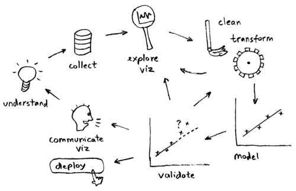

[back to current section](#machine-learning-concepts)

### Cross Validation

Cross-validation is a technique to evaluate predictive models by partitioning the original sample into a training set to train the model, and a validation set to evaluate it. For example, a k-fold cross validation divides the data into k folds (or partitions), trains on each k-1 fold, and evaluate on the remaining 1 fold. This results to k models/evaluations, which can be averaged to get an overall model performance.

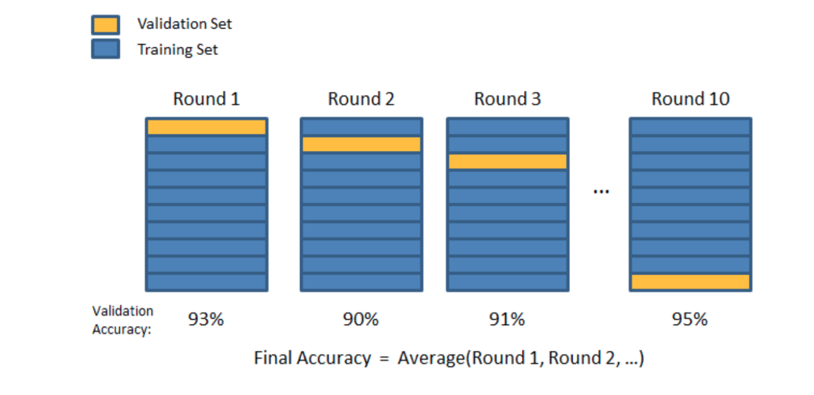

[back to current section](#machine-learning-concepts)

### Distribution Mismatch

Learn how to identify and address data distribution mismatch in this series of videos: [1](https://www.coursera.org/lecture/machine-learning-projects/training-and-testing-on-different-distributions-Xs9IV), [2](https://www.coursera.org/lecture/machine-learning-projects/bias-and-variance-with-mismatched-data-distributions-ht85t), [3](https://www.coursera.org/lecture/machine-learning-projects/addressing-data-mismatch-biLiy).

[back to current section](#machine-learning-concepts)

### Feature Importance

* In linear models, feature importance can be calculated by the scale of the coefficients.
* In tree-based methods (such as random forest), important features are likely to appear closer to the root of the tree.  We can get a feature's importance for random forest by computing the averaging depth at which it appears across all trees in the forest.

[back to current section](#machine-learning-concepts)

### Mean Squared Error vs. Mean Absolute Error

* **Similarity**: both measure the average model prediction error; range from 0 to infinity; the lower the better.
* Mean Squared Error (MSE) gives higher weights to large error (e.g., being off by 10 just MORE THAN TWICE as bad as being off by 5), whereas Mean Absolute Error (MAE) assign equal weights (being off by 10 is just twice as bad as being off by 5).
* MSE is continuously differentiable, MAE is not (where y_pred == y_true).

[back to current section](#machine-learning-concepts)

### L1 vs L2 regularization

* **Similarity**: both L1 and L2 regularization **prevent overfitting** by shrinking (imposing a penalty) on the coefficients.
* **Difference**: L2 (Ridge) shrinks all the coefficient by the same proportions but eliminates none, while L1 (Lasso) can shrink some coefficients to zero, performing variable selection.
* **Which to choose**: If all the features are correlated with the label, ridge outperforms lasso, as the coefficients are never zero in ridge. If only a subset of features are correlated with the label, lasso outperforms ridge as in lasso model some coefficient can be shrunken to zero.
* In Graph (a), the black square represents the feasible region of the L1 regularization while graph (b) represents the feasible region for L2 regularization. The contours in the plots represent different loss values (for the unconstrained regression model ). The feasible point that minimizes the loss is more likely to happen on the coordinates on graph (a) than on graph (b) since graph (a) is more **angular**.  This effect amplifies when your number of coefficients increases, i.e. from 2 to 200. The implication of this is that the L1 regularization gives you sparse estimates. Namely, in a high dimensional space, you got mostly zeros and a small number of non-zero coefficients.

[back to current section](#machine-learning-concepts)

### Correlation vs Covariance

* Both determine the relationship and measure the dependency between two random variables.
* Correlation is when the change in one item may result in the change in the another item, while covariance is when two items vary together (joint variability).
* Covariance is nothing but a measure of correlation. On the contrary, correlation refers to the scaled form of covariance.
* Range: correlation is between -1 and +1, while covariance lies between negative infinity and infinity.

[back to current section](#machine-learning-concepts)

### Would adding more data address underfitting

Underfitting happens when a model is not complex enough to learn well from the data. It is the problem of model rather than data size. So a potential way to address underfitting is to increase the model complexity (e.g., to add higher order coefficients for linear model, increase depth for tree-based methods, add more layers / number of neurons for neural networks etc.).

[back to current section](#machine-learning-concepts)

### Reducing Avoidable Bias

Learn how to reduce avoidable bias in [this video](https://www.coursera.org/lecture/machine-learning-projects/avoidable-bias-LG12R).

[back to current section](#machine-learning-concepts)

### Activation Function

For neural networks:

* Non-linearity: ReLU is often used. Use Leaky ReLU (a small positive gradient for negative input, say, `y = 0.01x` when x < 0) to address dead ReLU issue.
* Multi-class: softmax.
* Binary: sigmoid.
* Regression: linear.

[back to current section](#machine-learning-concepts)

### Bagging

To address overfitting, we can use an ensemble method called bagging (bootstrap aggregating), which reduces the variance of the meta learning algorithm. Bagging can be applied to decision tree or other algorithms.

Here is a [great illustration](http://scikit-learn.org/stable/auto_examples/ensemble/plot_bias_variance.html#sphx-glr-auto-examples-ensemble-plot-bias-variance-py) of a single estimator vs. bagging.

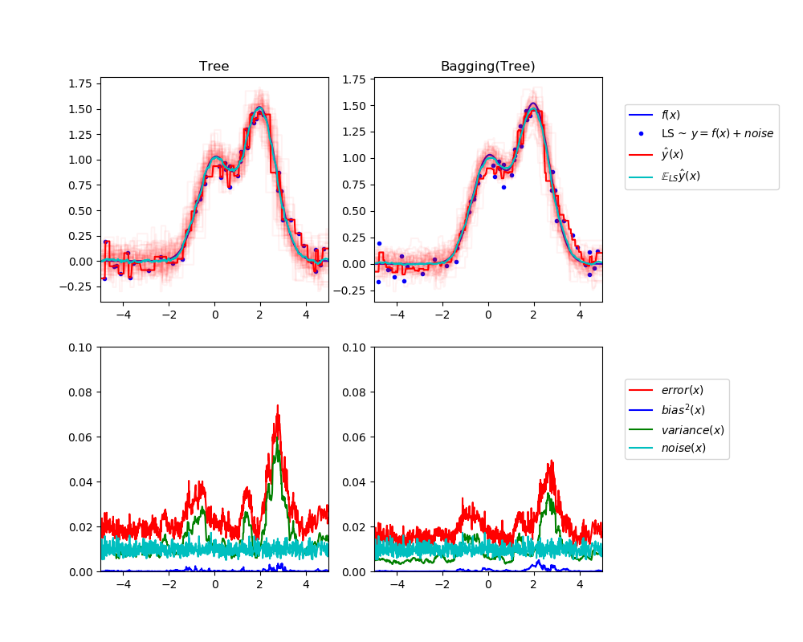

* Bagging is when sampling is performed *with* replacement. When sampling is performed *without* replacement, it's called pasting.
* Bagging is popular due to its boost for performance, but also due to that individual learners can be trained in parallel and scale well.
* Ensemble methods work best when the learners are as independent from one another as possible.
* Voting: soft voting (predict probability and average over all individual learners) often works better than hard voting.
* out-of-bag instances can act validation set for bagging.

[back to current section](#machine-learning-concepts)

### Stacking

* Instead of using trivial functions (such as hard voting) to aggregate the predictions from individual learners, train a model to perform this aggregation.
* First split the training set into two subsets: the first subset is used to train the learners in the first layer.
* Next the first layer learners are used to make predictions (meta features) on the second subset, and those predictions are used to train another models (to obtain the weights of different learners) in the second layer.
* We can train multiple models in the second layer, but this entails subsetting the original dataset into 3 parts.

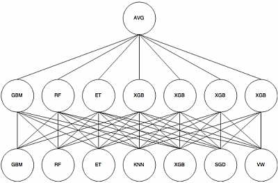

[back to current section](#machine-learning-concepts)

### Generative vs discriminative

* Discriminative algorithms model *p(y|x; w)*, that is, given the dataset and learned parameter, what is the probability of y belonging to a specific class. A discriminative algorithm doesn't care about how the data was generated, it simply categorizes a given example
* Generative algorithms try to model *p(x|y)*, that is, the distribution of features given that it belongs to a certain class. A generative algorithm models how the data was generated.

[back to current section](#machine-learning-concepts)

### Parametric vs Nonparametric

* A learning model that summarizes data with a set of parameters of fixed size (independent of the number of training examples) is called a parametric model.
* A model where the number of parameters is not determined prior to training. Nonparametric does not mean that they have no parameters. On the contrary, nonparametric models (can) become more and more complex with an increasing amount of data.

[back to current section](#machine-learning-concepts)

[back to top](#data-science-cheatsheets)

## Deep Learning Concepts

* [Neural Network Model](#neural-network-model)
* [Backpropagation](#backpropagation)
* [Common Activation Functions](#common-activation-functions)
* [Weight Initialization](#weight-initialization)
* [Gradient Descent Variants](#gradient-descent-variants)
* [Learning Rate](#learning-rate)
* [Batch Size](#batch-size)
* [Choice of Optimizers](#choice-of-optimizers)
* [Common Regularizers](#common-regularizers)
* [Common Normalization](#common-normalization)
* [Neural Networks From Scratch](#neural-networks-from-scratch)
* [Notes from Coursera Deep Learning Specialization](https://github.com/khanhnamle1994/cracking-the-data-science-interview/tree/master/Cheatsheets/Notes-From-Coursera-DL-Specialization.pdf)

### Neural Network Model

Here is the [reference](http://ufldl.stanford.edu/tutorial/supervised/MultiLayerNeuralNetworks/):

A neural network is put together by hooking together many of our simple “neurons,” so that the output of a neuron can be the input of another. For example, here is a small neural network:

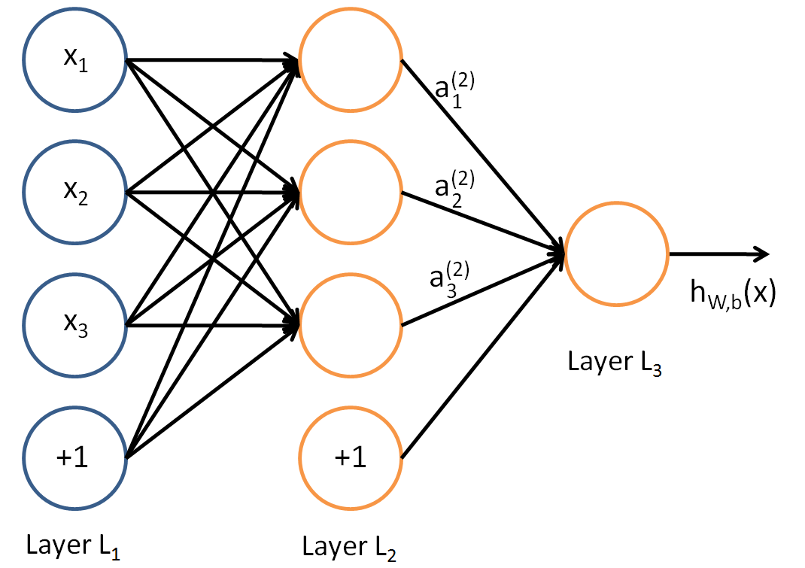

- In this figure, we have used circles to also denote the inputs to the network.
- The circles labeled “+1” are called *bias units*, and correspond to the intercept term.
- The leftmost layer of the network is called the *input layer*, and the rightmost layer the *output layer* (which, in this example, has only one node).
- The middle layer of nodes is called the *hidden layer*, because its values are not observed in the training set.
- We also say that our example neural network has *3 input units* (not counting the bias unit), *3 hidden units*, and *1 output unit*.

**Notation**
- We will let `n_l` denote the number of layers in our network; thus `n_l = 3` in our example.
- We label layer l as `L_l`, so layer `L_1` is the input layer, and layer `L_nl` the output layer.
- Our neural network has parameters `(W, b) = (W(1), b(1), W(2), b(2))`, where we write `W(l)_ij` to denote the parameter (or weight) associated with the connection between unit j in layer l, and unit i in layer l + 1. Thus, in our example, we have `W(1) ∈ ℜ^{3×3}`, and `W(2) ∈ ℜ^{1×3}`.
- Also, `b(l)_i` is the bias associated with unit i in layer l + 1. Note that bias units don’t have inputs or connections going into them, since they always output the value +1.
- We also let `s_l` denote the number of nodes in layer l (not counting the bias unit).

**Forward Propagation**
- We will write `a(l)_i` to denote the activation (meaning output value) of unit i in layer l. For `l = 1`, we also use `a(1)_i = x_i` to denote the i-th input.
- Given a fixed setting of the parameters W, b, our neural network defines a hypothesis `h_W,b(x)` that outputs a real number. Specifically, the computation that this neural network represents is given by:

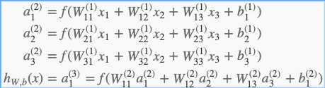

- In the sequel, we also let `z(l)_i` denote the total weighted sum of inputs to unit i in layer l, including the bias term, so that `a(l)_i = f(z(l)_i)`.
- Note that this easily lends itself to a more compact notation. Specifically, if we extend the activation function f(⋅) to apply to vectors in an element-wise fashion, then we can write the equations above more compactly as:

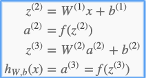

- We call this step *forward propagation*. More generally, recalling that we also use `a(1) = x` to also denote the values from the input layer, then given layer l’s activations `a(l)`, we can compute layer l + 1’s activations `a(l + 1)` as:

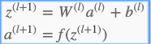

- By organizing our parameters in matrices and using matrix-vector operations, we can take advantage of fast linear algebra routines to quickly perform calculations in our network.

**Multiple Hidden Layers**
- We have so far focused on one example neural network, but one can also build neural networks with multiple hidden layers.
- The most common choice is a n_l-layered network where layer 1 is the input layer, layer n_l is the output layer, and each layer l is densely connected to layer l + 1.
- In this setting, to compute the output of the network, we can successively compute all the activations in layer L2, then layer L3, and so on, up to layer L_nl, using the equations above that describe the forward propagation step.
- This is one example of a *feedforward* neural network, since the connectivity graph does not have any directed loops or cycles.
- Neural networks can also have multiple output units. For example, here is a network with two hidden layers layers L2 and L3 and two output units in layer L4:

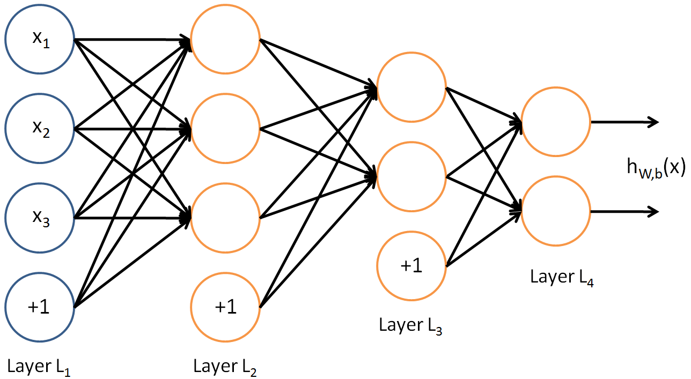

- To train this network, we would need training examples (x(i),y(i)) where y(i) ∈ ℜ^2.
- This sort of network is useful if there’re multiple outputs that you’re interested in predicting.

[back to current section](#deep-learning-concepts)

### Backpropagation

- Given a training example `(x,y)`, we will first run a “forward pass” to compute all the activations throughout the network, including the output value of the hypothesis `hW,b(x)`.
- Then, for each node i in layer l, we would like to compute an “error term” `δ(l)_i` that measures how much that node was “responsible” for any errors in our output.
- For an output node, we can directly measure the difference between the network’s activation and the true target value, and use that to define `δ(n_l)_i` (where layer n_l is the output layer).
- For hidden units, we will compute `δ(l)_i` based on a weighted average of the error terms of the nodes that uses `a(l)_i` as an input.

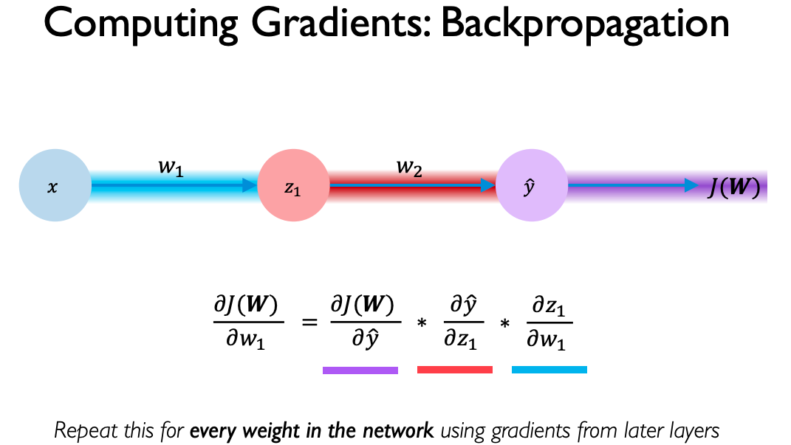

[back to current section](#deep-learning-concepts)

### Common Activation Functions

* Activation functions introduce non-linear properties to our network. The main purpose is to convert an input signal of a node in a neural network to an output signal. That output signal now is used as an input in the next layer in the stack.
*  Neural Network without Activation function would simply be a Linear Regression Model, which has limited power and does not performs good most of the times. We want our Neural Network to not just learn and compute a linear function but something more complicated than that. Specifically, we want our network to represent non-linear complex arbitrary functional mappings between inputs and outputs (Universal Function Approximators).
* Another important feature of an Activation function is that it should be differentiable. We need it to be this way so that we can perform back-propagation optimization strategy: (1) Propagating backwards in the network to compute gradients of loss/error with respect to weights and (2) Accordingly optimize the weights using Gradient Descent or any other Optimization technique to reduce error.

**Sigmoid or Logistic**

- It is an activation function of the form `f(x) = 1 / 1 + exp(-x)`.
- Its range falls between 0 and 1. It is a S — shaped curve.
- It is easy to understand and apply but it has major reasons which have made it fall out of popularity:
  - (1) Sigmoids suffer from vanishing gradient problem (gradients are saturated and killed).
  - (2) Sigmoids' output isn’t zero centered. This makes the gradient updates go too far in different directions, which makes optimization harder.
  - (3) Sigmoids have slow convergence.

**Tanh — Hyperbolic tangent**

- Its mathematical formula is `f(x) = 1 — exp(-2x) / 1 + exp(-2x)`.
- Its output is zero centered because its range falls between -1 to 1.
- It is a rescaled version of the sigmoid. Since optimization is easier in this method, in practice it is always preferred over the sigmoid function.
- But still it suffers from the vanishing gradient problem.

**ReLU -Rectified linear units**

- Its mathematical function is given by `max(0, x)`.
- It is piece-wise linear and saturates at exactly 0 whenever the input is less than 0.
- It avoids and rectifies vanishing gradient problem.
- It should only be used within the hidden layers of the neural network.
- It could result in Dead Neurons.
- To fix this problem another modification was introduced called **Leaky ReLU** to fix the problem of dying neurons. It introduces a small slope to keep the updates alive.

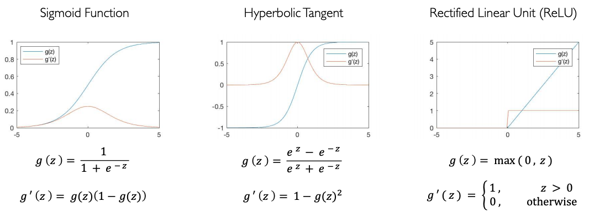

[back to current section](#deep-learning-concepts)

### Weight Initialization

- Why is initialization important?
  - Initializing all the weights with 0 leads the neurons to learn the same features during training.
  - Initializing the weights with values too small or too large leads respectively to slow learning or divergence.

- The problem of exploding or vanishing gradients:
  - A too-large initialization leads to exploding gradients. That is, the gradients of the cost with the respect to the parameters are too big. This leads the cost to oscillate around its minimum value.
  - A too-small initialization leads to vanishing gradients. That is, the gradients of the cost with the respect to the parameters are too small. This leads to convergence of the cost before it has reached the minimum value.

- Proper initialization:
  - Rules of thumb: (1) The mean of the activations should be 0, (2) The variance of the activations should stay the same across every layer.
  - Xavier initialization for tanh activations.
    - All the weights of layer `l` are picked randomly from a normal distribution with mean 0 and variance `1 / n^{# of neurons in previous layer (l - 1)}`.
    - Biases are initialized with 0s.
  - He initialization for ReLU activations.
    - The weights are initialized by multiplying by 2 the variance of the Xavier initialization.

[back to current section](#deep-learning-concepts)

### Gradient Descent Variants

**Batch Gradient Descent** computes the gradient of the cost function w.r.t. to the parameters `θ` for the entire training dataset:

`θ = θ − η ⋅ ∇_θ J(θ)`

- As we need to calculate the gradients for the whole dataset to perform just one update, batch gradient descent can be very slow and is intractable for datasets that don't fit in memory.
- Batch gradient descent also doesn't allow us to update our model online, i.e. with new examples on-the-fly.

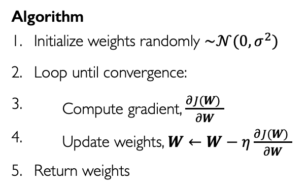

**Stochastic Gradient Descent** in contrast performs a parameter update for each training example x(i) and label y(i):

`θ = θ − η ⋅ ∇_θ J(θ; x(i); y(i))`

- Batch gradient descent performs redundant computations for large datasets, as it recomputes gradients for similar examples before each parameter update. SGD does away with this redundancy by performing one update at a time. It is therefore usually much faster and can also be used to learn online.
- It has been shown that when we slowly decrease the learning rate, SGD shows the same convergence behavior as batch gradient descent, almost certainly converging to a local or the global minimum for non-convex and convex optimization respectively.

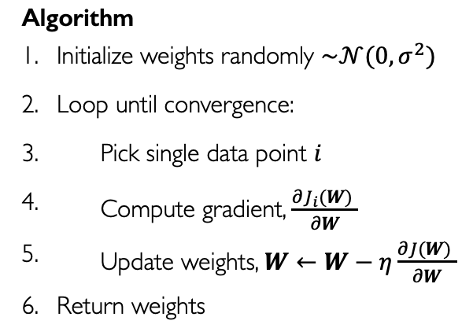

**Mini-Batch Gradient Descent** finally takes the best of both worlds and performs an update for every mini-batch of n training examples:

`θ = θ − η ⋅ ∇_θ J(θ; x(i:i+n); y(i:i+n))`

- It reduces the variance of the parameter updates, which can lead to more stable convergence.
- It can make use of highly optimized matrix optimizations common to state-of-the-art deep learning libraries that make computing the gradient w.r.t. a mini-batch very efficient.
- Common mini-batch sizes range between 50 and 256, but can vary for different applications.

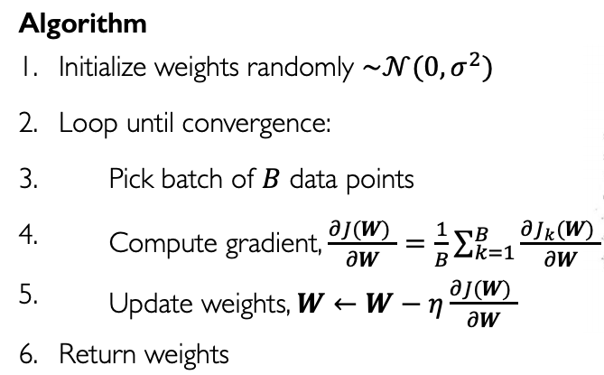

[back to current section](#deep-learning-concepts)

### Learning Rate

The learning rate influences the optimization’s convergence. It also counterbalances the influence of the cost function’s curvature.
- If the learning rate is too small, updates are small and optimization is slow, especially if the cost curvature is low. Also, you’re likely to settle into an poor local minimum or plateau.
- If the learning rate is too large, updates will be large and the optimization is likely to diverge, especially if the cost function’s curvature is high.
- If the learning rate is chosen well, updates are appropriate and the optimization should converge to a good set of parameters.

It is common to start with a large learning rate — say, between 0.1 and 1 — and decay it during training. Choosing the right decay (how often? by how much?) is non-trivial. An excessively aggressive decay schedule slows progress toward the optimum, while a slow-paced decay schedule leads to chaotic updates with small improvements.

In fact, finding the “best decay schedule” is non trivial. However, adaptive learning-rate algorithms such as Momentum Adam and RMSprop help adjust the learning rate during the optimization process.

[back to current section](#deep-learning-concepts)

### Batch Size

Batch size is the number of data points used to train a model in each iteration. Typical small batches are 32, 64, 128, 256, 512, while large batches can be thousands of examples.

Choosing the right batch size is important to ensure convergence of the cost function and parameter values, and to the *generalization* of your model. Some research has considered how to make the choice, but there is no consensus. In practice, you can use a *hyperparameter search*.

Research into batch size has revealed the following principles:
- Batch size determines the frequency of updates. The smaller the batches, the more, and the quicker, the updates.
- The larger the batch size, the more accurate the gradient of the cost will be with respect to the parameters. That is, the direction of the update is most likely going down the local slope of the cost landscape.
- Having larger batch sizes, but not so large that they no longer fit in GPU memory, tends to improve parallelization efficiency and can accelerate training.

In choosing batch size, there’s a balance to be struck depending on the available computational hardware and the task you’re trying to achieve.

[back to current section](#deep-learning-concepts)

### Choice of Optimizers

The choice of optimizer influences both the speed of convergence and whether it occurs.
- **Momentum**:
  - Momentum usually speeds up the learning with a very minor implementation change.
  - Momentum uses more memory for a given batch size than stochastic gradient descent but less than RMSprop and Adam.
- **RMSProp**:
  - RMSprop’s adaptive learning rate usually prevents the learning rate decay from diminishing too slowly or too fast.
  - RMSprop maintains per-parameter learning rates.
  - RMSprop uses more memory for a given batch size than stochastic gradient descent and Momentum, but less than Adam.
- **Adam**:
  - Adaptive Moment Estimation is most popular today. The hyperparameters of Adam (learning rate, exponential decay rates for the moment estimates, etc.) are usually set to predefined values (given in the paper), and do not need to be tuned.
  - Adam performs a form of learning rate annealing with adaptive step-sizes.
  - Of the optimizers profiled here, Adam uses the most memory for a given batch size.
  - Adam is often the default optimizer in machine learning.

[back to current section](#deep-learning-concepts)

### Common Regularizers

These are techniques that constrain our optimization problem to discourage complex models (aka, to prevent overfitting) and help improve generelization of our model on unnseen data.

* **Weight Decay**: ([Paper](https://papers.nips.cc/paper/563-a-simple-weight-decay-can-improve-generalization.pdf)):

    - When training neural networks, it is common to use "weight decay," where after each update, the weights are multiplied by a factor slightly less than 1. This prevents the weights from growing too large, and can be seen as gradient descent on a quadratic regularization term.
    - Weight decay is used as part of the back-propagation algorithm.
    - There are 3 ways to do weight decay: Lasso (shrinks coefficients to 0), Ridge (makes coefficients smaller), and Elastic Net (tradeoff between variable selection and small coefficients).

* **Dropout**: ([Paper](http://jmlr.org/papers/volume15/srivastava14a.old/srivastava14a.pdf))

    - During training, randomly set some activations to 0.
    - Typically drop 50% of activations in layer.
    - Forces network to not rely on any 1 node.
    - One of the drawbacks of dropout is that it increases training time. A dropout network typically takes 2-3 times longer to train than a standard neural network of the same architecture. A major cause of this increase is that the parameter updates are very noisy. Each training case effectively tries to train a different random architecture. Therefore, the gradients that are being computed are not gradients of the final architecture that will be used at test time.
    - At test time, we replace the masks by their expectation. This is simply the constant vector 0.5 if dropout probability is 0.5.

* **Early Stopping**:

  - This approach stops the training process as soon as the validation loss reaches a plateau or starts to increase.

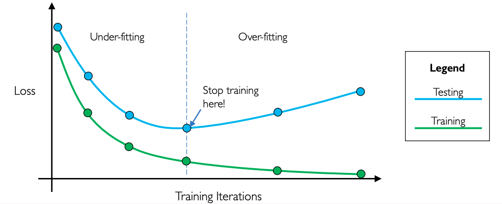

[back to current section](#deep-learning-concepts)

### Common Normalization

**Why Normalization?**

1. It normalizes each feature so that they maintains the contribution of every feature, as some feature has higher numerical value than others. This way our network can be unbiased(to higher value features).
2. It reduces *Internal Covariate Shift*. It is the change in the distribution of network activations due to the change in network parameters during training. To improve the training, we seek to reduce the internal covariate shift.
3. Batch Norm makes loss surface smoother (i.e. it bounds the magnitude of the gradients much more tightly).
4. It makes the Optimization faster because normalization doesn’t allow weights to explode all over the place and restricts them to a certain range.
5. An unintended benefit of Normalization is that it helps network in Regularization (only slightly, not significantly).

**Batch Normalization**: ([Paper](https://arxiv.org/abs/1502.03167))

- Batch normalization is a method that normalizes activations in a network across the mini-batch of definite size.
- During training, batch normalization computes the mean and variance of each feature in the mini-batch. It then subtracts the mean and divides the feature by its mini-batch standard deviation.
- Backpropagation takes into account the normalization.
- At test time, the global mean and stddev is used.

We can add γ and β as scale and shift learn-able parameters respectively to increase the magnitude of the weights, which makes the network perform better. This all can be summarized as:

There are 2 problems with Batch Normalization:
1. *Variable Batch Size* → If batch size is of 1, then variance would be 0 which doesn’t allow batch norm to work. Furthermore, if we have small mini-batch size then it becomes too noisy and training might affect. There would also be a problem in *distributed training*. As, if you are computing in different machines then you have to take same batch size because otherwise γ and β will be different for different systems.
2. *Recurrent Neural Network* → In an RNN, the recurrent activations of each time-step will have a different story to tell(i.e. statistics). This means that we have to fit a separate batch norm layer for each time-step. This makes the model more complicated and space consuming because it forces us to store the statistics for each time-step during training.

**Layer Norm**: ([Paper](https://arxiv.org/abs/1607.06450))

- Layer normalization normalizes input across the features instead of normalizing input features across the batch dimension in batch normalization.
- A mini-batch consists of multiple examples with the same number of features.
- Layer normalization performs better than batch norm in case of RNNs.

**Weight Norm**: ([Paper](https://arxiv.org/abs/1602.07868))

- Weight normalization is a method that normalize weights of a layer instead of normalizing the activations directly.
- Weight normalization separates the weight vector from its direction. This has a similar effect as in batch normalization with variance. The only difference is in variation instead of direction.

[back to current section](#deep-learning-concepts)

### Neural Networks From Scratch

These are the code snippets from [Emil Wallner](https://github.com/emilwallner/Deep-Learning-From-Scratch):

* [Method of Least Squares](https://github.com/khanhnamle1994/cracking-the-data-science-interview/tree/master/Cheatsheets/Least-Squares.py): First cost function.
* [Gradient Descent](https://github.com/khanhnamle1994/cracking-the-data-science-interview/tree/master/Cheatsheets/Gradient-Descent.py): Finding the minimum of the cost function.
* [Linear Regression](https://github.com/khanhnamle1994/cracking-the-data-science-interview/tree/master/Cheatsheets/Linear-Regression.py): Automatically decrease the cost function.
* [Perceptron](https://github.com/khanhnamle1994/cracking-the-data-science-interview/tree/master/Cheatsheets/Perceptron.py): Use a linear regression equation to mimic a neuron.
* [Backpropagation](https://github.com/khanhnamle1994/cracking-the-data-science-interview/tree/master/Cheatsheets/Backprop.py): Leverage backpropagation to solve non-linear problems.

[back to current section](#deep-learning-concepts)

[back to top](#data-science-cheatsheets)

## Supervised Learning

* [Linear regression](#linear-regression)
* [Logistic regression](#logistic-regression)
* [Naive Bayes](#naive-bayes)
* [KNN](#knn)
* [SVM](#svm)
* [Decision Trees](#decision-trees)
* [Random Forest](#random-forest)
* [Boosting Trees](#boosting-trees)
* [MLP](#mlp)
* [CNN](#cnn)
* [RNN and LSTM](#rnn-and-lstm)

### Linear regression

* How to learn the parameter: minimize the cost function.
* How to minimize cost function: gradient descent.
* Regularization:
    - L1 (Lasso): can shrink certain coef to zero, thus performing feature selection.
    - L2 (Ridge): shrink all coef with the same proportion; almost always outperforms L1.
    - Elastic Net: combined L1 and L2 priors as regularizer.
* Assumes linear relationship between features and the label.
* Can add polynomial and interaction features to add non-linearity.

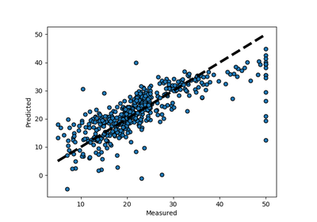

[back to current section](#supervised-learning)

### Logistic regression

* Generalized linear model (GLM) for binary classification problems.
* Apply the sigmoid function to the output of linear models, squeezing the target to range [0, 1].
* Threshold to make prediction: usually if the output > .5, prediction 1; otherwise prediction 0.
* A special case of softmax function, which deals with multi-class problems.

[back to current section](#supervised-learning)

### Naive Bayes

* Naive Bayes (NB) is a supervised learning algorithm based on applying [Bayes' theorem](https://en.wikipedia.org/wiki/Bayes%27_theorem).
* It is called naive because it builds the naive assumption that each feature are independent of each other.
* NB can make different assumptions (i.e., data distributions, such as Gaussian, Multinomial, Bernoulli).
* Despite the over-simplified assumptions, NB classifier works quite well in real-world applications, especially for text classification (e.g., spam filtering).
* NB can be extremely fast compared to more sophisticated methods.

[back to current section](#supervised-learning)

### KNN

* Given a data point, we compute the K nearest data points (neighbors) using certain distance metric (e.g., Euclidean metric). For classification, we take the majority label of neighbors; for regression, we take the mean of the label values.
* Note for KNN we don't train a model; we simply compute during inference time. This can be computationally expensive since each of the test example need to be compared with every training example to see how close they are.
* There are approximation methods can have faster inference time by partitioning the training data into regions.
* When K equals 1 or other small number the model is prone to over-fitting (high variance), while when K equals number of data points or other large number the model is prone to under-fitting (high bias).

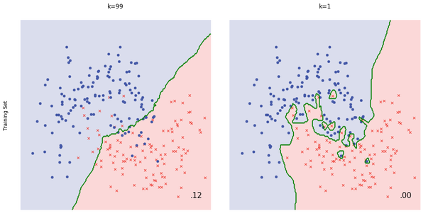

[back to current section](#supervised-learning)

### SVM

* Can perform linear, nonlinear, or outlier detection (unsupervised).
* Large margin classifier: using SVM we not only have a decision boundary, but want the boundary to be as far from the closest training point as possible.
* The closest training examples are called support vectors, since they are the points based on which the decision boundary is drawn.
* SVMs are sensitive to feature scaling.

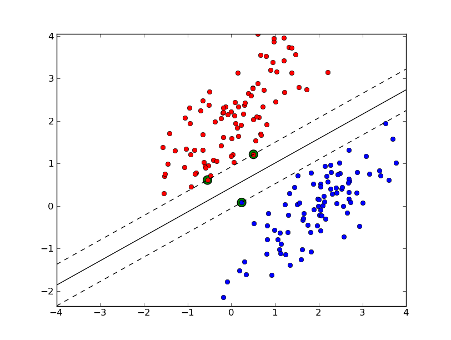

[back to current section](#supervised-learning)

### Decision Trees

* Non-parametric, supervised learning algorithms.
* Given the training data, a decision tree algorithm divides the feature space into regions. For inference, we first see which region does the test data point fall in, and take the mean label values (regression) or the majority label value (classification).
* **Construction**: top-down, chooses a variable to split the data such that the target variables within each region are as homogeneous as possible. Two common metrics: gini impurity or information gain, won't matter much in practice.
* Advantage: simple to understand & interpret, mirrors human decision making.
* Disadvantage:
    - can overfit easily (and generalize poorly) if we don't limit the depth of the tree.
    - can be non-robust: A small change in the training data can lead to a totally different tree.
    - instability: sensitive to training set rotation due to its orthogonal decision boundaries.

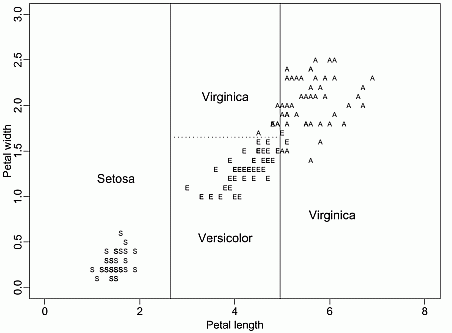

[back to current section](#supervised-learning)

### Random Forest

Random forest improves bagging further by adding some randomness. In random forest, only a subset of features are selected at random to construct a tree (while often not subsample instances). The benefit is that random forest **decorrelates** the trees.

For example, suppose we have a dataset. There is one very predicative feature, and a couple of moderately predicative features. In bagging trees, most of the trees will use this very predicative feature in the top split, and therefore making most of the trees look similar, **and highly correlated**. Averaging many highly correlated results won't lead to a large reduction in variance compared with uncorrelated results.

In random forest, for each split, we only consider a subset of the features and therefore reduce the variance even further by introducing more uncorrelated trees. In practice, tuning random forest entails having a large number of trees (the more the better, but always consider computation constraint). Also, `min_samples_leaf` (The minimum number of samples at the leaf node)to control the tree size and overfitting. Always cross validate the parameters.

[back to current section](#supervised-learning)

### Boosting Trees

**How it works**

Boosting builds on weak learners, and in an iterative fashion. In each iteration, a new learner is added, while all existing learners are kept unchanged. All learners are weighted based on their performance (e.g., accuracy), and after a weak learner is added, the data are re-weighted: examples that are misclassified gain more weights, while examples that are correctly classified lose weights. Thus, future weak learners focus more on examples that previous weak learners misclassified.

**Difference from random forest (RF)**

* RF grows trees **in parallel**, while Boosting is sequential
* RF reduces variance, while Boosting reduces errors by reducing bias

**XGBoost (Extreme Gradient Boosting)**

* XGBoost uses a more regularized model formalization to control overfitting, which gives it better performance.

[back to current section](#supervised-learning)

### MLP

A feedforward neural network of multiple layers. In each layer we can have multiple neurons, and each of the neuron in the next layer is a linear/nonlinear combination of the all the neurons in the previous layer. In order to train the network we back propagate the errors layer by layer. In theory MLP can approximate any functions.

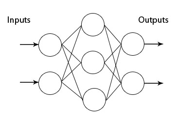

[back to current section](#supervised-learning)

### CNN

The Conv layer is the building block of a Convolutional Network. The Conv layer consists of a set of learnable filters (such as 5 * 5 * 3, width * height * depth). During the forward pass, we slide (or more precisely, convolve) the filter across the input and compute the dot product. Learning again happens when the network back propagate the error layer by layer.

Initial layers capture low-level features such as angle and edges, while later layers learn a combination of the low-level features and in the previous layers and can therefore represent higher level feature, such as shape and object parts.

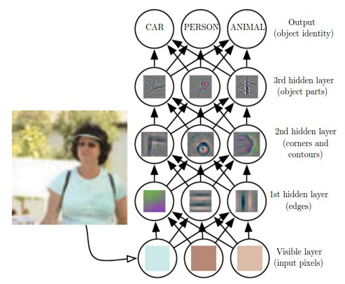

[back to current section](#supervised-learning)

### RNN and LSTM

RNN is another paradigm of neural network where we have difference layers of cells, and each cell not only takes as input the cell from the previous layer, but also the previous cell within the same layer. This gives RNN the power to model sequence.

This seems great, but in practice RNN barely works due to exploding/vanishing gradient, which is cause by a series of multiplication of the same matrix. To solve this, we can use a variation of RNN, called long short-term memory (LSTM), which is capable of learning long-term dependencies.

The math behind LSTM can be pretty complicated, but intuitively LSTM introduce: (1) an input gate, (2) an output gate, (3) a forget gate, and (4) a memory cell (internal state).

LSTM resembles human memory: it forgets old stuff (old internal state * forget gate) and learns from new input (input node * input gate).

[back to current section](#supervised-learning)

[back to top](#data-science-cheatsheets)

## Unsupervised Learning

* [Clustering](#clustering)
* [Principal Component Analysis](#principal-component-analysis)
* [Autoencoder](#autoencoder)
* [Generative Adversarial Network](#generative-adversarial-network)

### Clustering

* Clustering is a unsupervised learning algorithm that groups data in such a way that data points in the same group are more similar to each other than to those from other groups.
* Similarity is usually defined using a distance measure (e.g, Euclidean, Cosine, Jaccard, etc.).
* The goal is usually to discover the underlying structure within the data (usually high dimensional).
* The most common clustering algorithm is K-means, where we define K (the number of clusters) and the algorithm iteratively finds the cluster each data point belongs to.

[scikit-learn](http://scikit-learn.org/stable/modules/clustering.html) implements many clustering algorithms. Below is a comparison adopted from its page.

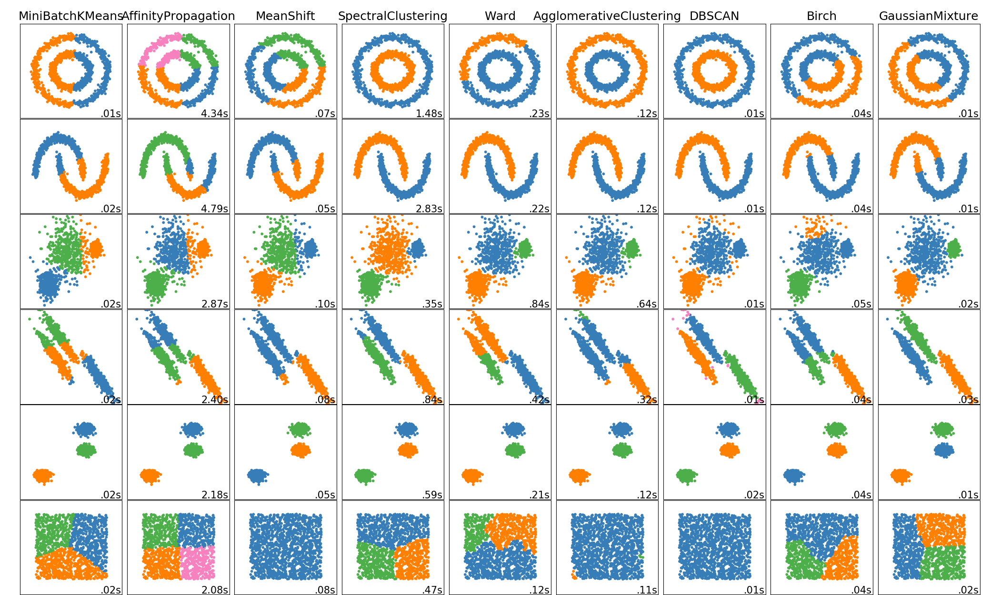

[back to current section](#unsupervised-learning)

### Principal Component Analysis

* Principal Component Analysis (PCA) is a dimension reduction technique that projects the data into a lower dimensional space.
* PCA uses Singular Value Decomposition (SVD), which is a matrix factorization method that decomposes a matrix into three smaller matrices (more details of SVD [here](https://en.wikipedia.org/wiki/Singular-value_decomposition)).
* PCA finds top N principal components, which are dimensions along which the data vary (spread out) the most. Intuitively, the more spread out the data along a specific dimension, the more information is contained, thus the more important this dimension is for the pattern recognition of the dataset.
* PCA can be used as pre-step for data visualization: reducing high dimensional data into 2D or 3D. An alternative dimensionality reduction technique is [t-SNE](https://lvdmaaten.github.io/tsne/).

Here is a visual explanation of PCA:

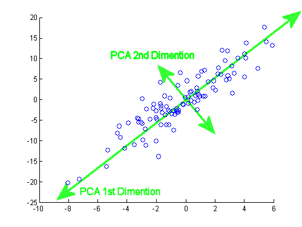

[back to current section](#unsupervised-learning)

### Autoencoder

* The aim of an autoencoder is to learn a representation (encoding) for a set of data.
* An autoencoder always consists of two parts, the encoder and the decoder. The encoder would find a lower dimension representation (latent variable) of the original input, while the decoder is used to reconstruct from the lower-dimension vector such that the distance between the original and reconstruction is minimized
* Can be used for data denoising and dimensionality reduction.

[back to current section](#unsupervised-learning)

### Generative Adversarial Network

* Generative Adversarial Network (GAN) is an unsupervised learning algorithm that also has supervised flavor: using supervised loss as part of training.
* GAN typically has two major components: the **generator** and the **discriminator**. The generator tries to generate "fake" data (e.g, images or sentences) that fool the discriminator into thinking that they're real, while the discriminator tries to distinguish between real and generated data. It's a fight between the two players thus the name adversarial, and this fight drives both sides to improve until "fake" data are indistinguishable from the real data.
* How does it work, intuitively:
	- The generator takes a **random** input and generates a sample of data.
	- The discriminator then either takes the generated sample or a real data sample, and tries to predict whether the input is real or generated (i.e., solving a binary classification problem).
	- Given a truth score range of [0, 1], ideally the we'd love to see discriminator give low score to generated data but high score to real data. On the other hand, we also wanna see the generated data fool the discriminator. And this paradox drives both sides become stronger.
* How does it work, from a training perspective:
	- Without training, the generator creates 'garbage' data only while the discriminator is too 'innocent' to tell the difference between fake and real data.
	- Usually we would first train the discriminator with both real (label 1) and generated data (label 0) for N epochs so it would have a good judgement of what is real vs. fake.
	- Then we **set the discriminator non-trainable**, and train the generator. Even though the discriminator is non-trainable at this stage, we still use it as a classifier so that **error signals can be back propagated and therefore enable the generator to learn**.
	- The above two steps would continue in turn until both sides cannot be improved further.
* Here are some [tips and tricks to make GANs work](https://github.com/soumith/ganhacks)
* One Caveat is that the **adversarial part is only auxiliary: The end goal of using GAN is to generate data that even experts cannot tell if it's real or fake**.

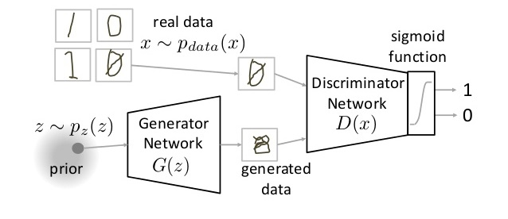

[back to current section](#unsupervised-learning)

[back to top](#data-science-cheatsheets)

## Computer Vision

* [ConvNet Architecture](#convnet-architecture)
* [ConvNet Layers](#convnet-layers)
* [Convolutional Layer](#convolutional-layer)
* [Pooling Layer](#pooling-layer)
* [ConvNet Layer Patterns](#convnet-layer-patterns)
* [ConvNet Layer Sizing Patterns](#convnet-layer-sizing-patterns)
* [ConvNet Examples](#convnet-examples)
* [Transfer Learning](#transfer-learning)
* [Convolutional Filters](#convolutional-filters)

### ConvNet Architecture

Here is the [reference](https://cs231n.github.io/convolutional-networks/).

- Convolutional Neural Networks take advantage of the fact that the input consists of images and they constrain the architecture in a more sensible way. In particular, unlike a regular Neural Network, the layers of a ConvNet have neurons arranged in 3 dimensions: **width, height, depth**.
- The neurons in a layer will only be connected to a small region of the layer before it, instead of all of the neurons in a fully-connected manner.
- Here is a visualization:

*Left: A ConvNet arranges its neurons in three dimensions (width, height, depth), as visualized in one of the layers. Every layer of a ConvNet transforms the 3D input volume to a 3D output volume of neuron activations. In this example, the red input layer holds the image, so its width and height would be the dimensions of the image, and the depth would be 3 (Red, Green, Blue channels).*

[back to current section](#computer-vision)

### ConvNet Layers

- A simple ConvNet is a sequence of layers, and every layer of a ConvNet transforms one volume of activations to another through a differentiable function.
- We use three main types of layers to build ConvNet architectures: **Convolutional Layer**, **Pooling Layer**, and **Fully-Connected Layer** (exactly as seen in regular Neural Networks). We will stack these layers to form a full ConvNet **architecture**.
- In this way, ConvNets transform the original image layer by layer from the original pixel values to the final class scores.
- Note that some layers contain parameters and other don’t. In particular, the CONV/FC layers perform transformations that are a function of not only the activations in the input volume, but also of the parameters (the weights and biases of the neurons). On the other hand, the RELU/POOL layers will implement a fixed function.
- The parameters in the CONV/FC layers will be trained with gradient descent so that the class scores that the ConvNet computes are consistent with the labels in the training set for each image.

*The activations of an example ConvNet architecture. The initial volume stores the raw image pixels (left) and the last volume stores the class scores (right). Each volume of activations along the processing path is shown as a column. Since it's difficult to visualize 3D volumes, we lay out each volume's slices in rows. The last layer volume holds the scores for each class, but here we only visualize the sorted top 5 scores, and print the labels of each one. The architecture shown here is a tiny VGG Net.*

[back to current section](#computer-vision)

### Convolutional Layer

* Accepts a volume of size `W1 × H1 × D1`
* Requires four hyperparameters:
    * Number of filters K,
    * their spatial extent F (filter has size F x F),
    * the stride S,
    * the amount of zero padding P.
* Produces a volume of size `W2 × H2 × D2` where:
    * `W2 = (W1 − F + 2P)/S + 1` (For example, if an image is 100 x 100, a filter is 6 × 6, the padding is 7, and the stride is 4, the result of convolution will be (100 – 6 + (2)(7)) / 4 + 1 = 28 × 28)
    * `H2 = (H1 − F + 2P)/S + 1` (i.e. width and height are computed equally by symmetry)
    * `D2 = K`
* With parameter sharing, it introduces `F⋅F⋅D1` weights per filter, for a total of `(F⋅F⋅D1)⋅K` weights and K biases.
* In the output volume, the d-th depth slice (of size `W2 × H2`) is the result of performing a valid convolution of the d-th filter over the input volume with a stride of S, and then offset by d-th bias.

A common setting of the hyperparameters is `F = 3, S = 1, P = 1`.

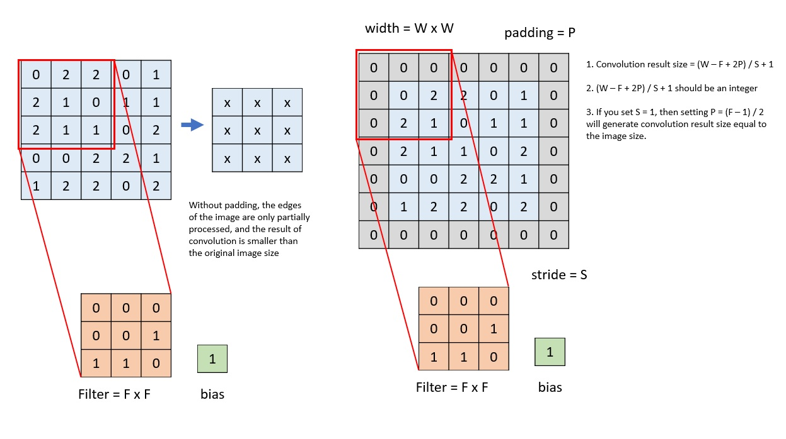

[back to current section](#computer-vision)

### Pooling Layer

* Accepts a volume of size `W1 × H1 × D1`
* Requires two hyperparameters:
    * their spatial extent F,
    * the stride S,
* Produces a volume of size `W2 × H2 × D2` where:
    * `W2 = (W1 − F)/S + 1`
    * `H2 = (H1 − F)/S + 1`
    * `D2 = D1`
* Introduces zero parameters since it computes a fixed function of the input.
* For Pooling layers, it is not common to pad the input using zero-padding.

It is worth noting that there are only two commonly seen variations of the max pooling layer found in practice: A pooling layer with `F = 3, S = 2` (also called overlapping pooling), and more commonly `F = 2, S = 2`. Pooling sizes with larger receptive fields are too destructive.

*Pooling layer downsamples the volume spatially, independently in each depth slice of the input volume. In this example, the input volume of size [224x224x64] is pooled with filter size 2, stride 2 into output volume of size [112x112x64]. Notice that the volume depth is preserved.*

*The most common downsampling operation is max, giving rise to max pooling, here shown with a stride of 2. That is, each max is taken over 4 numbers (little 2x2 square).*

[back to current section](#computer-vision)

### ConvNet Layer Patterns

The most common form of a ConvNet architecture stacks a few CONV-RELU layers, follows them with POOL layers, and repeats this pattern until the image has been merged spatially to a small size. At some point, it is common to transition to fully-connected layers. The last fully-connected layer holds the output, such as the class scores. In other words, the most common ConvNet architecture follows the pattern:

`INPUT -> [[CONV -> RELU]*N -> POOL?]*M -> [FC -> RELU]*K -> FC`

where the `*` indicates repetition, and the `POOL?` indicates an optional pooling layer. Moreover, `N >= 0` (and usually `N <= 3`), `M >= 0`, `K >= 0` (and usually `K < 3`). For example, here are some common ConvNet architectures you may see that follow this pattern:

* `INPUT -> FC`, implements a linear classifier. Here `N = M = K = 0`.
* `INPUT -> CONV -> RELU -> FC`
* `INPUT -> [CONV -> RELU -> POOL]*2 -> FC -> RELU -> FC`. Here we see that there is a single CONV layer between every POOL layer.
* `INPUT -> [CONV -> RELU -> CONV -> RELU -> POOL]*3 -> [FC -> RELU]*2 -> FC`. Here we see two CONV layers stacked before every POOL layer. This is generally a good idea for larger and deeper networks, because multiple stacked CONV layers can develop more complex features of the input volume before the destructive pooling operation.

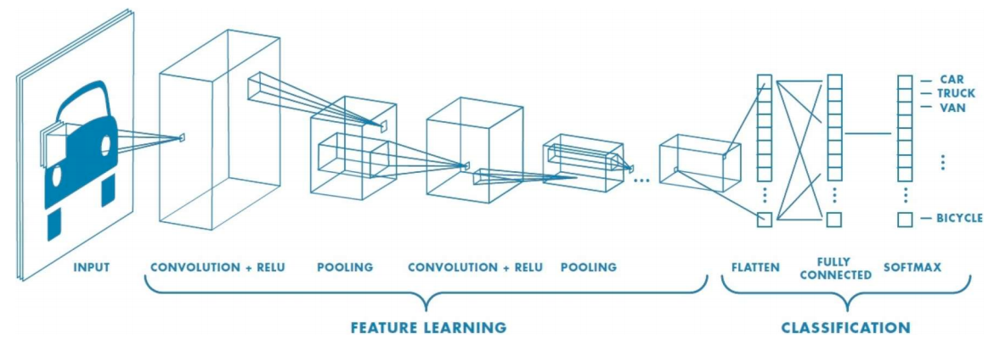
*(1) Feature Extraction: Learn features in input image through convolution, introduce non-linearity through activation function, reduce dimensionality and preserve spatial invariance with pooling; (2) Classification: Convolution and Pooling layers output high-level features of input, Fully-connected layer uses these features for classifying input image, use softmax to express output as probability of image belonging to a particular class; (3) Use backpropagation with cross-entropy loss to learn weights for convolutional filers and fully-connected layers*

[back to current section](#computer-vision)

### ConvNet Layer Sizing Patterns

- The **input layer** (that contains the image) should be divisible by 2 many times.
  - Common numbers include 32 (e.g. CIFAR-10), 64, 96 (e.g. STL-10), or 224 (e.g. common ImageNet ConvNets), 384, and 512.

- The **conv layers** should be using small filters (e.g. 3x3 or at most 5x5), using a stride of `S = 1`, and crucially, padding the input volume with zeros in such way that the conv layer does not alter the spatial dimensions of the input.
  - That is, when `F = 3`, then using `P = 1` will retain the original size of the input.
  - When `F = 5`, `P = 2`.
  - For a general F, it can be seen that `P = (F − 1) / 2` preserves the input size.
  - If you must use bigger filter sizes (such as 7x7 or so), it is only common to see this on the very first conv layer that is looking at the input image.

- The **pool layers** are in charge of downsampling the spatial dimensions of the input.
  - The most common setting is to use max-pooling with 2x2 receptive fields (i.e. `F = 2`), and with a stride of 2 (i.e. `S = 2`).
  - Note that this discards exactly 75% of the activations in an input volume (due to downsampling by 2 in both width and height).

[back to current section](#computer-vision)

### ConvNet Examples

There are several architectures in the field of Convolutional Networks that have a name. The most common are:

* **LeNet**. The first successful applications of Convolutional Networks were developed by Yann LeCun in 1990’s. Of these, the best known is the [LeNet](http://yann.lecun.com/exdb/publis/pdf/lecun-98.pdf) architecture that was used to read zip codes, digits, etc.
* **AlexNet** (8 layers, 61 million parameters). The first work that popularized Convolutional Networks in Computer Vision was the [AlexNet](http://papers.nips.cc/paper/4824-imagenet-classification-with-deep-convolutional-neural-networks), developed by Alex Krizhevsky, Ilya Sutskever and Geoff Hinton. The AlexNet was submitted to the ImageNet ILSVRC challenge in 2012 and significantly outperformed the second runner-up (top 5 error of 16% compared to runner-up with 26% error). The Network had a very similar architecture to LeNet, but was deeper, bigger, and featured Convolutional Layers stacked on top of each other (previously it was common to only have a single CONV layer always immediately followed by a POOL layer).
* **ZF Net** (8 layers, more filters). The ILSVRC 2013 winner was a Convolutional Network from Matthew Zeiler and Rob Fergus. It became known as the [ZFNet](http://arxiv.org/abs/1311.2901) (short for Zeiler & Fergus Net). It was an improvement on AlexNet by tweaking the architecture hyperparameters, in particular by expanding the size of the middle convolutional layers and making the stride and filter size on the first layer smaller.
* **GoogLeNet** (Inception modules, 22 layers, 5 million parameters). The ILSVRC 2014 winner was a Convolutional Network from [Szegedy et al.](http://arxiv.org/abs/1409.4842) from Google. Its main contribution was the development of an Inception Module that dramatically reduced the number of parameters in the network (4M, compared to AlexNet with 60M). Additionally, this paper uses Average Pooling instead of Fully Connected layers at the top of the ConvNet, eliminating a large amount of parameters that do not seem to matter much. There are also several followup versions to the GoogLeNet, such as [Inception-v4](http://arxiv.org/abs/1602.07261).
* **VGGNet** (19 layers). The runner-up in ILSVRC 2014 was the network from Karen Simonyan and Andrew Zisserman that became known as the [VGGNet](http://www.robots.ox.ac.uk/~vgg/research/very_deep/). Its main contribution was in showing that the depth of the network is a critical component for good performance. Their final best network contains 16 CONV/FC layers and, appealingly, features an extremely homogeneous architecture that only performs 3x3 convolutions and 2x2 pooling from the beginning to the end. A downside of the VGGNet is that it is more expensive to evaluate and uses a lot more memory and parameters (140M). Most of these parameters are in the first fully connected layer, and it was since found that these FC layers can be removed with no performance downgrade, significantly reducing the number of necessary parameters.
* **ResNet** (152 layers). [Residual Network](http://arxiv.org/abs/1512.03385) developed by Kaiming He et al. was the winner of ILSVRC 2015. It features special skip connections and a heavy use of batch normalization. The architecture is also missing fully connected layers at the end of the network.

Review a complete list of computer vision models in PyTorch [here](https://pytorch.org/docs/stable/torchvision/models.html). The models subpackage contains definitions of models for addressing different tasks, including: image classification, pixelwise semantic segmentation, object detection, instance segmentation, person keypoint detection and video classification.

[back to current section](#computer-vision)

### Transfer Learning

* Review transfer learning in [this lecture video](https://www.coursera.org/lecture/machine-learning-projects/transfer-learning-WNPap).
* Assuming that both tasks have the same input, transfer learning makes sense when you have a lot of data from the problem you are transferring from and usually relatively less data for the problem you are transferring to. It doesn't make sense if the opposite happens.
* Examples: Image Recognition (1M images) -> Radiology Diagnosis (100 images), Speech Recognition (10,000 hours) -> Wakeword/Triggered Detection (1 hour). Low level features from task A could be helpful for learning task B.
* Learn about the hyperparameters involved when applying transfer learning in [Stanford CS230's lecture 5](https://youtu.be/IM9ANAbufYM?list=PLoROMvodv4rOABXSygHTsbvUz4G_YQhOb&t=3783) from 1:03:03 to 1:10:22: There are 3 hyperparameters we need to take care of - the number of pretrained layers, the number of randomly initialized weights for the fine-tuning task, and the number of frozen layers.

[This tutorial](https://nbviewer.jupyter.org/github/fchollet/deep-learning-with-python-notebooks/blob/master/5.3-using-a-pretrained-convnet.ipynb) from Francis Chollet is very handy. There are two ways to leverage a pre-trained network: feature extraction and fine-tuning.
* **Feature extraction** consists of using the representations learned by a previous network to extract interesting features from new samples. These features are then run through a new classifier, which is trained from scratch.

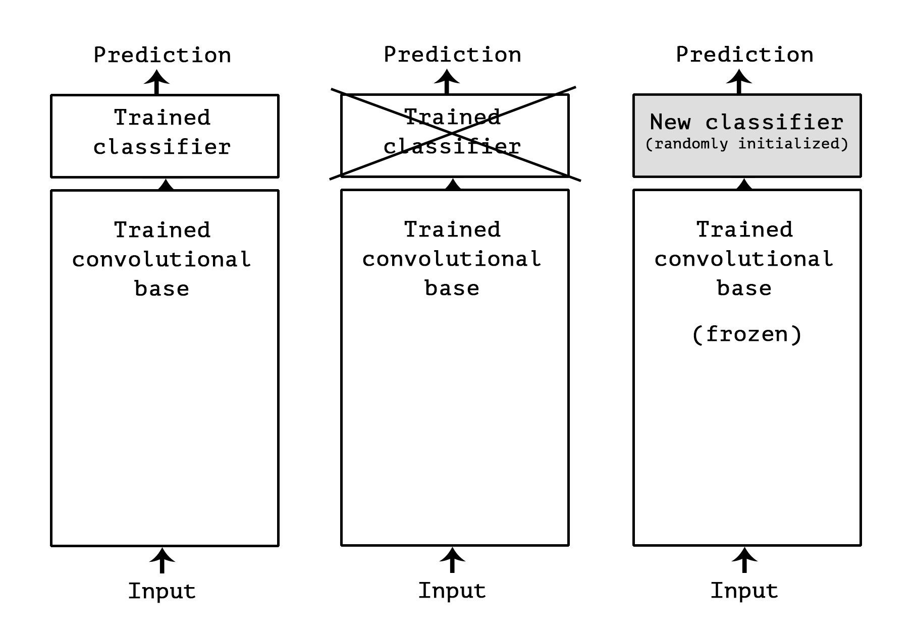

* **Fine-tuning** consists in unfreezing a few of the top layers of a frozen model base used for feature extraction, and jointly training both the newly added part of the model (in our case, the fully-connected classifier) and these top layers. This is called "fine-tuning" because it slightly adjusts the more abstract representations of the model being reused, in order to make them more relevant for the problem at hand.

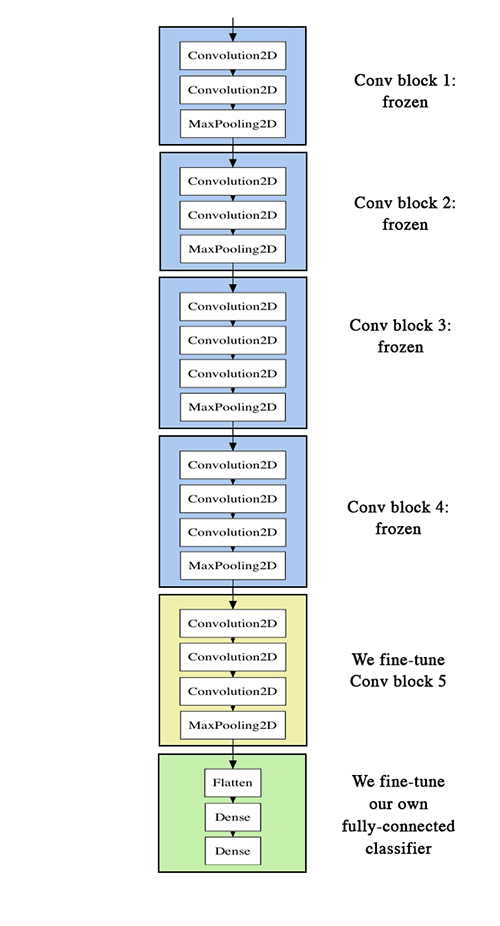

[back to current section](#computer-vision)

[back to top](#data-science-cheatsheets)

## Natural Language Processing

* [Tokenization](#tokenization)
* [Stemming and lemmatization](#stemming-and-lemmatization)
* [N-gram](#ngram)
* [Bag of Words](#bag-of-words)
* [word2vec](#word2vec)
* [Recurrent Neural Networks](http://karpathy.github.io/2015/05/21/rnn-effectiveness/)
* [Long Short Term Memory Networks](http://colah.github.io/posts/2015-08-Understanding-LSTMs/)
* [Gated Recurrent Units](https://arxiv.org/abs/1412.3555v1)

### Tokenization

* Tokenization is the process of converting a sequence of characters into a sequence of tokens.
* Consider this example: `The quick brown fox jumped over the lazy dog`. In this case each word (separated by space) would be a token.
* Sometimes tokenization doesn't have a definitive answer. For instance, `O'Neill` can be tokenized to `o` and `neill`, `oneill`, or `o'neill`.
* In some cases tokenization requires language-specific knowledge. For example, it doesn't make sense to tokenize `aren't` into `aren` and `t`.
* For a more detailed treatment of tokenization please check [here](https://nlp.stanford.edu/IR-book/html/htmledition/tokenization-1.html).

[back to current section](#natural-language-processing)

### Stemming and lemmatization

* The goal of both stemming and lemmatization is to reduce inflectional forms and sometimes derivationally related forms of a word to a common base form.
* Stemming usually refers to a crude heuristic process that chops off the ends of words.
* Lemmatization usually refers to doing things properly with the use of a vocabulary and morphological analysis of words.
* If confronted with the token `saw`, stemming might return just `s`, whereas lemmatization would attempt to return either `see` or `saw` depending on whether the use of the token was as a verb or a noun.
* For a more detailed treatment please check [here](https://nlp.stanford.edu/IR-book/html/htmledition/stemming-and-lemmatization-1.html).

[back to current section](#natural-language-processing)

### N gram

* n-gram is a contiguous sequence of n items from a given sample of text or speech.
* An n-gram of size 1 is referred to as a "unigram"; size 2 is a "bigram" size 3 is a "trigram". Larger sizes are sometimes referred to by the value of n in modern language, e.g., "four-gram", "five-gram", and so on.
* Consider this example: `The quick brown fox jumped over the lazy dog.`
  - bigram would be `the quick`, `quick brown`, `brown fox`, ..., i.e, every two consecutive words (or tokens).
  - trigram would be `the quick brown`, `quick brown fox`, `brown fox jumped`, ..., i.e., every three consecutive words (or tokens).
* ngram model models sequence, i.e., predicts next word (n) given previous words (1, 2, 3, ..., n-1).
* multiple gram (bigram and above) captures **context**.
* to choose n in n-gram requires experiments and making tradeoff between stability of the estimate against its appropriateness. Rule of thumb: trigram is a common choice with large training corpora (millions of words), whereas a bigram is often used with smaller ones.
* n-gram can be used as features for machine learning and downstream NLP tasks.

[back to current section](#natural-language-processing)

### Bag of Words

* Why? Machine learning models cannot work with raw text directly; rather, they take numerical values as input.
* Bag of words (BoW) builds a **vocabulary** of all the unique words in our dataset, and associate a unique index to each word in the vocabulary.
* It is called a "bag" of words, because it is a representation that completely ignores the order of words.
* Consider this example of two sentences: (1) `John likes to watch movies, especially horor movies.` and (2) `Mary likes movies too.` We would first build a vocabulary of unique words (all lower cases and ignoring punctuations): `[john, likes, to, watch, movies, especially, horor, mary, too]`. Then we can represent each sentence using term frequency, i.e, the number of times a term appears. So (1) would be `[1, 1, 1, 1, 2, 1, 1, 0, 0]`, and (2) would be `[0, 1, 0, 0, 1, 0, 0, 1, 1]`.
* A common alternative to the use of dictionaries is the [hashing trick](https://en.wikipedia.org/wiki/Feature_hashing), where words are directly mapped to indices with a hashing function.
* As the vocabulary grows bigger (tens of thousand), the vector to represent short sentences / document becomes sparse (almost all zeros).

[back to current section](#natural-language-processing)

### word2vec

* Shallow, two-layer neural networks that are trained to construct linguistic context of words.
* Takes as input a large corpus, and produce a vector space, typically of several hundred dimension, and each word in the corpus is assigned a vector in the space.
* The key idea is **context**: words that occur often in the same context should have same/opposite meanings.
* Two flavors:
    - continuous bag of words (CBOW): the model predicts the current word given a window of surrounding context words.
    - skip gram: predicts the surrounding context words using the current word.

[back to current section](#natural-language-processing)

[back to top](#data-science-cheatsheets)

## Stanford Materials

The Stanford cheatsheets are collected from [Shervine Amidi's teaching materials](https://stanford.edu/~shervine/teaching/):

* [CS221 - Artificial Intelligence](https://github.com/khanhnamle1994/cracking-the-data-science-interview/tree/master/Cheatsheets/Stanford-CS221-Artificial-Intelligence)
* [CS229 - Machine Learning](https://github.com/khanhnamle1994/cracking-the-data-science-interview/tree/master/Cheatsheets/Stanford-CS229-Machine-Learning)
* [CS230 - Deep Learning](https://github.com/khanhnamle1994/cracking-the-data-science-interview/tree/master/Cheatsheets/Stanford-CS230-Deep-Learning)

[back to top](#data-science-cheatsheets)
