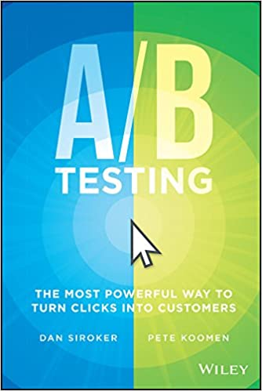

# AB Testing

This is my notes from the book "[A/B Testing](https://www.amazon.com/Testing-Most-Powerful-Clicks-Customers/dp/1118792416)" written by Optimizely's co-founders, Dan Siroker and Pete Koomen.

Here are the sections:

* [What To Test](#what-to-test)
* [Seek The Global Maximum](#seek-the-global-maximum)
* [Less Is More](#less-is-more)
* [Words Matter](#words-matter)
* [Fail Fast And Learn](#fail-fast-and-learn)
* [Choose The Right Solution](#choose-the-right-solution)
* [The Cure For HIPPO Syndrome](#the-cure-for-hippo-syndrome)
* [The Dream Team](#the-dream-team)
* [Iterate](#iterate)
* [How AB Tests Can Go Awry](#how-ab-tests-can-go-awry)
* [Beyond The Page](#beyond-the-page)
* [Personalize](#personalize)
* [60 Things To AB Test](#60-things-to-ab-test)

## What To Test

- You can't pick a winner until you decide how you're keeping score. A/B testing starts with determining **quantifiable success metrics**.
- There are a number of possible **conversion goals**: time on site, page views, average order value, revenue per visitor, and so on. Take the time to pick the one that's right for you.
- Site analytics along with your own instincts will suggest **bottlenecks** where you can focus your attention.
- Understanding visitor intent with the help of interviews and usability tests will suggest **hypotheses** about what to change and how.
- **Prioritize** your experiments based on your prediction of their impact.
- **Start testing**, and continue until you begin to see diminishing returns.

[back to top](#ab-testing)

## Seek The Global Maximum

- Incrementalism can lead to local maxima. Be willing to **explore** to find the big wins before testing smaller changes and tweaks.
- Conversely, sometimes it's the incremental refinements that prove or disprove your hypotheses about what your users respond to. **Use the insights from small tests** to guide and inform your thinking about bigger changes.
- Consider entirely new **alternative approaches** to your principal business goals. Be willing to go beyond just testing ""variations on a theme" - you might be surprised.
- If you're working on a major site redesign or overhaul, don't wait until the new design is live to A/B test it. **A/B test the redesign** itself.

[back to top](#ab-testing)

## Less Is More

- More technologically or visually impressive pages don't necessarily lead to the user behavior you want. Experiment with **keeping it simple** and make any additional complexity earn its keep in your key success metrics.
- Every form field that users have to fill out is one more point of resistance between them and their conversion. Consider **deleting optional fields** and seeing if that lifts conversion.
- Giving visitors fewer distractions and fewer changes to leave the checkout funnel by **removing choices** can help boost conversion rates.
- Long forms have high risk for conversion failure. **Breaking up a long form** with required fields into multiple pages can increase changes for conversion.

[back to top](#ab-testing)

## Words Matter

- There are endless word combinations to use on your website. Don't be afraid to **brainstorm and think broadly**: a testing platform **lowers the "barrier to entry"** of ideas, minimizes the risks of failure, and enables quick and potentially huge wins.
- Decisions around messaging and verbiage can easily lead to contentious debates on a team. A/B testing is a way to **put opinions aside** and get concrete feedback on what works and what doesn't.
- If you want someone to do something, **tell them to do it**.
- Different ways of **framing** the same message can cause people to think of it in different ways. Play with alternative ways of framing the same information and see what differences emerge.

[back to top](#ab-testing)

## Fail Fast And Learn

- What works for **returning users** may not work for new users, and vice-versa.
- **Something that works on one page may not work on another**; something that works at one scale may not work at another.
- What one type of user wants may not be what another type of user wants. A failed test, sometimes more than a successful test, may prompt a drill-down that reveals a **key difference between segments of users**.
- Sometimes a variation may win against the original, but it may not **win by enough of a margin** to justify the implementation overhead or other drawbacks of the variation that are external to the test itself.
- Any test that reveals that an initiative isn't performing is a blessing in disguise: it allows you to **free up resources** from things that aren't working and divert them to the things that are.

[back to top](#ab-testing)

## Choose The Right Solution

- Building your own testing platform requires a significant and ongoing engineering investment, but can ultimately provide the greatest level of control and the **tightest integration** with your team and deployment cycles.
- An **A/A test** is a helpful way to ensure that your solution is functioning, reporting, and analyzing correctly.
- Many A/B testing SaaS platforms are easy to use **without requiring engineering support**: marketers and product people without a coding background can create and run variations in a visual "What You See Is What You Get" environment.
- An agency can help your team with the **ideation** of tests, **execution** of tests, or both.
- When picking the solution that best fits your company, consider making **key stakeholders** part of the exploration process. The earlier you bring others on board, the easier it will be to get buy-in.

[back to top](#ab-testing)

## The Cure For HIPPO Syndrome

- In some workplaces, and to varying degrees, the **HiPPo Syndrome** holds sway, but often all it takes are a few humble tests and a curiosity and interest in testing begin to take root.
- Allay the wary with the reassurance that you're not proposing sudden changes: it's "**just an experiment.**"
- In month one, run a test that is politically palatable and easy enough that it can show a **quick win.** Product pages can be a great place to start.
- **Share wins** not only with your immediate boss but, if possible, with the company at large. Communication is key in getting people to care about testing.
- Get creative with how you **introduce stakeholders and co-workers** to A/B testing.

[back to top](#ab-testing)

## The Dream Team

- A/B testing is by nature **inter-disciplinary** and **cross-departmental**. Collaboration is key.
- Some companies have a **centralized testing team** responsible for coordinating and executing all A/B tests company-wide.
- Other organizations adopt a **decentralized** model, where each product owner/manager is responsible for testing within his or her product domain.
- Regardless of which structure you adopt, make sure there is at least one **point person** within the organization whom people can come to about all things testing.
- Ensure your point person or team maintains **allies across your organization** to ensure that testing is part of your planning process.
- Make sure that your testers are enabled and **empowered to be creative**, and that the friction of running and iterating new tests is low.
- **Maintain records** about who tested what and when, how the test was set up, and what the result was. This will enable your organization to work collaboratively to build up a set of collective wisdom and best practices.

[back to top](#ab-testing)

## Iterate

- **Multivariate tests** are a powerful way to test a number of variables simultaneously, and can reveal **interaction effects** between them. However, they require more traffic and can be slower to achieve statistical significance.
- We have found that the companies that have had the greatest success with A/B testing favor a nimbler, more **iterative approach** that tests a handful of different variants of a single variable at a time and incorporates the winner as they go on to the next test.
- When working on a complex change like a site redesign, we recommend that you **move testing further up the process** so that it becomes something that happen *during* the design and rollout of the new site, rather than *after*.

[back to top](#ab-testing)

## How AB Tests Can Go Awry

- A/B testing can help even the smallest of organizations and sites, but it becomes more powerful the **more traffic** a site has. If your site is starved for traffic, A/B testing probably shouldn't be your first priority.
- Testing will occasionally reveal a change that increases one metric but decreases another. **Don't push failure down the funnel.**
- Consider whether you are willing to test a page variant that is in some way **off-brand** or one that you wouldn't necessarily be quick to roll out to all yor users should it "win" the test.

[back to top](#ab-testing)

## Beyond The Page

- Not only the **subject lines** but the **timing** can be critical in influencing open rates and click-through rates for email. Roll out large email campaigns gradually, test variations, and then send the winner on to the rest of your list.
- **Price testing** can be one of the most important types of testing to conduct for your business, and there are a number of ways to do it.
- The **last-minute discount** is a great technique for testing price without needing to deal with back-end integration or worrying about upsetting users.
- **Anchoring** the price of a product into context with other prices can greatly affect how users react.
- **Presentation** can be everything when it comes to pricing. For a quick-and-easy price test, try various breakdowns (e.g., monthly, yearly, or weekly) and see what works best.
- **Serial testing** is one way to test prices without needing to show different users different prices at the same time; however, this advantage is offset by difficulties in ensuring the accuracy of its results.

[back to top](#ab-testing)

## Personalize

- **Segmentation** allows you to compare how different segments of users responded to the same experience. Differences that you observe between groups can be illuminating and give you an opportunity to go beyond the **average best experience** of the one-to-many web toward an improved one-to-few experience.
- **Targeting** is deliberately providing different types of users with different experiences, and can be a powerful technique under many circumstances.
- Consider how your user experience may or may not be optimized across different **platforms**, screen dimensions, touch input versus mouse input, and so on.
- Sometimes **geo-targeting**, or tailoring users' experience based on their location, can be an extremely powerful way to optimize beyond the "average best."
- While personalization is frequently a boon for your success metrics, occasionally a **universal** call to action works better than a targeted one. Test to make sure personalization is working for your key success metrics.

[back to top](#ab-testing)

## 60 Things To AB Test

### Calls To Action

Your website exists for visitors to take action: reading, purchasing, signing up, downloading, or sharing. Here are some ways to test CTA that can yield quick, easy and big wins.

1. *Buy now?* *Purchase?* *Check out?* *Add to cart?* Change the call to action text on your buttons to see which word or phrase converts more visitors.
2. Try varying the location of your CTA button, making some CTAs more prominent than others.
3. Test multiple CTAs per page against one CTA per page.
4. Change buttons to hyperlinks to find out which display your users prefer.
5. Find out if CTAs with text, icons, or text plus icons convert more users on your site.
6. Test different colors, shapes, and sizes for CTA buttons on your website.

### Content

Content fuels your online business, particularly if you're a B2B company. Testing how you position and advertise content on your site can uncover big conversion and engagement lifts.

7. Test gated content against non-gated content. Find out if your users are willing to sign up or provide more information to access materials on your site.
8. Do site visitors crave more information about your company before signing up or making a purchase? Test adding or removing "About" content on your home page.
9. Content tone can make a big difference in keeping users on your site. See what your visitors prefer by testing various tones and styles.
10. Test how your content is displayed. Do users prefer to scroll down the page or click through to another page to learn more?

### Copy

Copy is your direct line of communication with website visitors - it sets the tone and helps users understand what you're all about. Use these tests to make the copy on your site better resonate with your audience.

11. Test different headline texts. Try variations that are straightforward against ones that are abstract, goofy, or creative.
12. Find out if your site visitors prefer shorter versions of headlines, tag-lines, product descriptions, and other content on your site.
13. Run a multivariate test. Test different combinations of headlines and tag-lines in combination with the visual imagery on your page to find the ultimate winning variation.
14. Test paragraphs versus bulleted lists.
15. Test how you frame your copy. Users may have different reactions to positive versus negative messaging.
16. Try making your site easier to read with larger fonts, higher-contrast colors, and professional fonts. Studies show this increases trustworthiness and increases conversions.

### Visual Media

Digital media have the power to greatly influence conversions and engagement on a website, and testing digital media is a great idea because the right media can subconsciously influence people to act in a way that's aligned with your testing goals.

17. Test different types of images on your landing page. People versus products is a good place to start.
18. And iterate from there! Try a static image versus a product video versus a 360 degree product image.
19. See how a stock image stacks up against an image of your employees or customers in action.
20. Test a rotating carousel on your homepage versus a static image or video.
21. Test different voice-overs for the videos on your site. Test whether a male or a female voice leads to the most completed views.
22. Try different variations of your site's product demo: animated versus screencast.
23. Test auto-play against click-to-play video.

### Funnels

If your goal is to get more people from one page to the next - like in a checkout funnel, signup flow, or lead nurture - then A/B testing is your best bet. Funnels are rife with low-hanging fruit to test.

24. Test removing extraneous distractions - like product offers, promotions, or shipping information - from each page in the purchase flow. Often times, a simplified experience can drive more conversions.
25. Test the number of pages in your funnel. How does packing more information on one page compare to spreading information across multiple pages?
26. Test removing navigation to any pages outside the checkout funnel.
27. Or try replacing certain steps within your funnel with modal boxes. For example, try making shipping options a modal box instead of a page.

### Site Navigation

From the moment a visitor lands on your site, the navigation menu sets a foundation - it's how people maneuver your site's flow and prioritize what's important. Here are some ideas for how to make it better:

28. Test the order of menu items in your site navigation.
29. Test the display of your navigation bar. Do site visitors prefer a horizontal or vertical orientation?
30. Or what about a fixed navigation bar that travels down the page as your site visitors scroll?
31. Test out the title of your navigation items. A simple change, like "Why Use Us" to "How It Works," may have a significant impact.
32. *Testing Tips*: If a test fails, try targeting the test to new versus returning visitors. Returning visitors are accustomed to seeing the site in a certain way - if a link or menu item is missing from the spot they normally go to in order to find it, they're not going to do the work to locate it.

### Forms

Any potential friction point on a website is prime for testing. Forms are frequently cumbersome areas of websites. Try these tests on the forms on your site:

33. Test the length of signup forms. Try removing non-essential signup boxes or relocating them to a page further down the funnel.
34. Try a special offer, discount, or promotion to increase sign-ups. People love free stuff.
35. Spam is the worst. Try adding text that assures users you won't fill up their inboxes with unnecessary junk.
36. Try making individual form fields larger. Larger fields feel more friendly.
37. Try asking for different information in your form fields - for example, business email versus regular email, or work phone versus mobile phone.

### Mobile Site

The mobile web is pervasive. Improving your mobile website through testing will help create an optimized experience that generates more click-throughs, revenue, and conversions.

38. Test the length of your mobile web pages. Are mobile users more willing to click to a new page or scroll down a page when browsing your site on their devices?
39. Try different displays and navigation options. Blinds, buttons, and blocks are good places to start.

### Advertising

A/B testing increases the value of the money you're already spending on marketing programs, such as search engine marketing. To ensure you're getting the biggest bang for your buck out of each paid initiative, try these tests:

40. Test the headlines on your paid campaigns to see which ones get the most clicks.
41. Try changing up the display URL on your ads. This can impact how many visitors click the ad.
42. The landing page each ad directs to is an excellent place for testing. You paid for that visitor to land there, so you want to do everything you can to convert that visitor.

### Social

The reasons someone would share your site are many - make it easy for them to do so. Here are a few tests to increase likes, re-tweets, and +1s on your content:

43. Change the size and placement of social icons to see what compels users to share more often.
44. Test standard social media icons against ones you've designed to match the look and feel of your site.
45. Try finding your optimal Twitter voice. Tweet the same link with differe types of text at the same time two days in a row and see which tone of voic gets more engagement.
46. Test different types of customer reviews on your site to see which are most compelling to your audience. Some examples include testimonials, Yelp reviews, and ResellerRatings.

### Email

How do you make sure your marketing emails get opened and clicked? Here are some testable elements that can increase open rates and click-throughs:

47. Test length and copy of your email subject lines.
48. Test personalized versus un-personalized emails by using the recipient's name in the subject or email text.
49. Find the optimal time to reach your audience by measuring open rates on different days of the week and at different times of the day.
50. If you distribute a newsletter or email update, see how a weekly send stacks up against a monthly blast.
51. Would readers prefer an email from your CEO, your marketing director, your broader team, or someone else? Test different "from" addresses to find out.

### Personalize It

Today, we're more accustomed to web experiences that are custom-tailored to who we are and the URLs we've come from. Try testing these personalization techniques and see if visitors convert better.

52. Create seasonal or holiday-specific promotional offers and test them on visitors living in specific locations.
53. Test auto-filling form fields related to a site visitor's location. Make things easier for your users.
54. Test matching language-specific content to users coming from a certain country or region.
55. Test different page designs and messaging for new versus returning visitors.
56. Test whether showing different landing pgaes for visitors coming from mobile devices versus desktop browsers performs better than having the same landing page for both.

### Pricing and Shipping

Finding the right pricing point can drive more visitors to make a purchase. Use these tests to maximize revenue from your site:

57. Test offering a free trial versus a money-back guarantee to see which converts more users in the short term and in the long term.
58. Test having checkboxes auto-selected as default.
59. On your pricing page, test whether annual billings or monthly billing generates more subscriptions.
60. Try anchoring customers high before showing them a lower price.

[back to top](#ab-testing)
