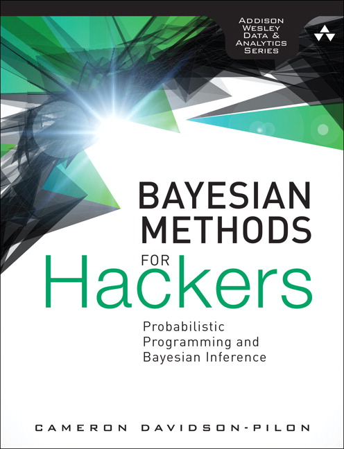

This folder contains some Notebook code from the book "[Bayesian Methods for Hackers](http://camdavidsonpilon.github.io/Probabilistic-Programming-and-Bayesian-Methods-for-Hackers/)". The book is is designed as an introduction to Bayesian inference from a computational/understanding-first, and mathematics-second, point of view. For the mathematically trained, they may cure the curiosity this text generates with other texts designed with mathematical analysis in mind. For the enthusiast with less mathematical background, or one who is not interested in the mathematics but simply the practice of Bayesian methods, this text should be sufficient and entertaining.

