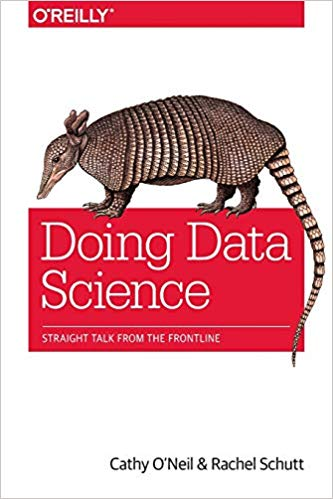

This folder contains some R code from the book "[Doing Data Science - Straight Talk From the Front Line](https://www.amazon.com/Doing-Data-Science-Straight-Frontline/dp/1449358659)". The book is based on Columbia University’s Introduction to Data Science class. It is a collaboration between course instructor Rachel Schutt, Senior VP of Data Science at News Corp, and data science consultant Cathy O’Neil, a senior data scientist at Johnson Research Labs, who attended and blogged about the course.

