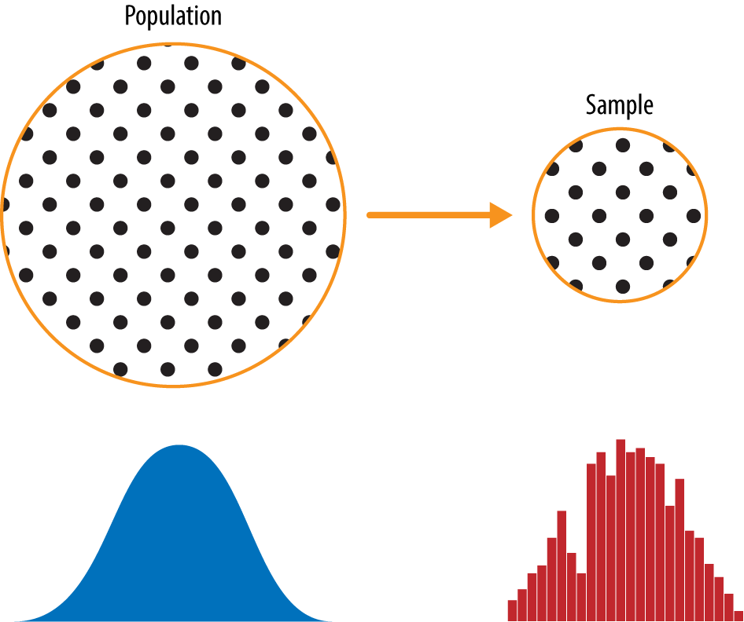
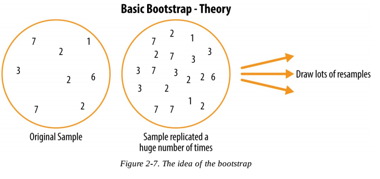
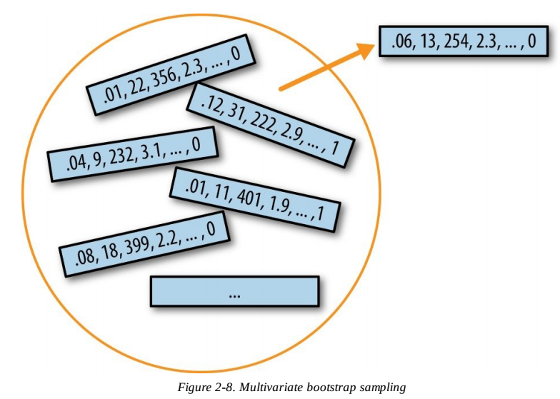
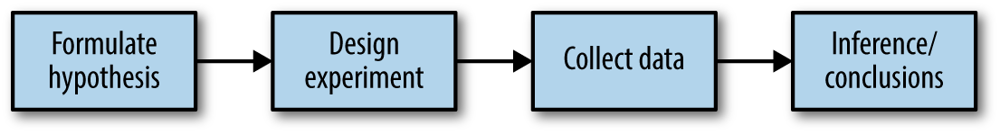

# Practical Statistics For Data Scientists

Code associated with the book "[Practical Statistics for Data Scientists: 50 Essential Concepts](https://www.amazon.com/Practical-Statistics-Data-Scientists-Essential/dp/1491952962)"

The scripts are stored by chapter and replicate most of the figures and code snippets.

**HOW TO GET THE DATA**:
* Run R script:
* The data is not saved on github and you will need to download the data.
* You can do this in R using the sript `src/download_data.r`. This will copy the data into the data directory ~/statistics-for-data-scientists/data.

**Manual download**:
Alternatively, you can manually download the files from https://drive.google.com/drive/folders/0B98qpkK5EJemYnJ1ajA1ZVJwMzg or from https://www.dropbox.com/sh/clb5aiswr7ar0ci/AABBNwTcTNey2ipoSw_kH5gra?dl=0

**IMPORTANT NOTE**:
The scripts all assume that you have cloned the repository into the top level home directory (~/). If you save the repository elsewhere, you will need to edit the line:
```
  PSDS_PATH <- file.path('~', 'statistics-for-data-scientists')
```
to point to the appropriate directory in all of the scripts.


Here are the chapters:

* [Exploratory Data Analysis](#exploratory-data-analysis)
* [Data and Sampling Distributions](#data-and-sampling-distributions)
* [Statistical Experiments and Significance Testing](#statistical-experiments-and-significance-testing)
* [Regression and Prediction](#regression-and-prediction)
* [Classification](#classification)
* [Statistical Machine Learning](#statistical-machine-learning)
* [Unsupervised Learning](#unsupervised-learning)

## Exploratory Data Analysis

Here are the sections:

* [Elements of Structured Data](#elements-of-structured-data)
* [Rectangular Data](#rectangular-data)
* [Estimates of Location](#estimates-of-location)
* [Estimates of Variability](#estimates-of-variability)
* [Exploring the Data Distribution](#exploring-the-data-distribution)
* [Exploring Binary and Categorical Data](#exploring-binary-and-categorical-data)
* [Correlation](#correlation)
* [Exploring Two or More Variables](#exploring-two-or-more-variables)

### Elements of Structured Data

* Data is typically classified in software by type.
* Data types include continuous, discrete, categorical, and ordinal.
* Data typing in software acts as a signal to the software on how to process the data.

### Rectangular Data

* The basic data structure in data science is a rectangular matrix in which rows are records and columns are variables/features.
* Terminology can be confusing; there are a variety of synonyms arising from the different disciplines that contribute to data science (statistics, computer science, and information technology).

### Estimates of Location

* The basic metric for location is the mean, but it can be sensitive to extreme values (outliers).
* Other metrics (median, trimmed mean) are more robust.

### Estimates of Variability

* The variance and standard deviation are the most widespread and routinely reported statistics of variability.
* Both are sensitive to outliers.
* More robust metrics include mean and median absolute deviations from the mean and percentiles (quantiles).

### Exploring the Data Distribution

* A frequency histogram plots frequency counts on the y-axis and variable values on the x-axis; it gives a sense of the distribution of the data at a glance.
* A frequency table is a tabular version of the frequency counts found in a histogram.
* A boxplot - with the top and bottom of the box at the 75th and 25th percentiles, respectively - also gives a quick sense of the distribution of the data; it is often used in side-by-side displays to compare distributions.
* A density plot is a smoothed version of a histogram; it requires a function to estimate a plot based on the data (multiple estimates are possible, of course).

### Exploring Binary and Categorical Data

* Categorical data is typically summed up in proportions, and can be visualized in a bar chart.
* Categories might represent distinct things (apples and oranges, male and female), levels of a factor variable (low, medium, and high), or numeric data that has been binned.
* Expected value is the sum of values times their probability of occurrence, often used to sum up factor variable levels.

### Correlation

* The correlation coefficient measures the extent to which two variables are associated with one another.
* When high values of v1 go with high values of v2, v1 and v2 are positively associated.
* When high values of v1 are associated with low values of v2, v1 and v2 are negatively associated.
* The correlation coefficient is a standardized metric so that it always ranges from -1 to +1.
* A correlation coefficient of 0 indicates no correlation, but be aware that random arrangements of data will produce both positive and negative values for the correlation coefficient just by chance.

### Exploring Two or More Variables

* Hexagonal binning and contour plots are useful tools that permit graphical examination of 2 numeric variables at a time, without being overwhelmed by huge amounts of data.
* Contingency tables are the standard tool for looking at the counts of 2 categorical variables.
* Boxplots and violin plots allow you to plot a numeric variable against a categorical variable.

[back to top](#practical-statistics-for-data-scientists)

## Data and Sampling Distributions

A popular misconception holds that the era of big data means the end of a need for sampling. In fact, the proliferation of data of varying quality and relevance reinforces the need for sampling as a tool to work efficiently with a variety of data and to minimize bias. Even in a big data project, predictive models are typically developed and piloted with samples. Samples are also used in tests of various sorts (e.g., pricing, web treatments).

Figure below shows a schematic that underpins the concepts in this chapter. The lefthand side represents a population that, in statistics, is assumed to follow an underlying but *unknown* distribution. The only thing available is the *sample* data and its empirical distribution, shown on the righthand side. To get from the lefthand side to the righthand side, a *sampling* procedure is used (represented by an arrow). Traditional statistics focused very much on the lefthand side, using theory based on strong assumptions about the population. Modern statistics has moved to the righthand side, where such assumptions are not needed.



Here are the sections:

* [Random Sampling and Sample Bias](#random-sampling-and-sample-bias)
* [Selection Bias](#selection-bias)
* [Sampling Distribution of a Statistic](#sampling-distribution-of-a-statistic)
* [The Bootstrap](#the-bootstrap)
* [Confidence Intervals](#confidence-intervals)
* [Normal Distribution](#normal-distribution)
* [Long Tailed Distribution](#long-tailed-distribution)
* [Student t-Distribution](#student-t-distribution)
* [Binomial Distribution](#binomial-distribution)
* [Poisson and Related Distributions](#poisson-and-related-distributions)

### Random Sampling and Sample Bias

- Even in the era of big data, random sampling remains an important arrow in the data scientist's quiver.
  - *Random sampling* is a process in which each available member of the population being sampled has an equal chance of being chosen for the sample at each draw.
  - Sampling can be done *with replacement*, in which observations are put back in the population after each draw for possible future re-selection.
  - Or it can be done *without replacement*, in which case observations, once selected, are unavailable for future draws.
- Bias occurs when measurements or observations are systematically in error because they are not representative of the full population.
- Data quality is often more important than data quantity, and random sampling can reduce bias and facilitate quality improvement that would be prohibitively expensive.

[back to current section](#data-and-sampling-distributions)

### Selection Bias

- Specifying a hypothesis, then collecting data following randomization and random sampling principles, ensures against bias.
- All other forms of data analysis run the risk of bias resulting from the data collection/analysis process (repeated running of models in data mining, data snooping in research, and after-the-fact selection of interesting events).
- *Regression to the mean* refers to a phenomenon involving successive measurements on a given variable: extreme observations tend to be followed by more central ones. Attaching special focus and meaning to the extreme value can lead to a form of selection bias.

[back to current section](#data-and-sampling-distributions)

### Sampling Distribution of a Statistic

- The frequency distribution of a sample statistic tells us how that metric would turn out differently from sample to sample.
- This sampling distribution can be estimated via the bootstrap, or via formulas that rely on the central limit theorem.
  - **Central Limit Theorem** is the tendency of the sampling distribution to take on a normal shape as sample size rises.
  - It says that the means drawn from multiple samples will resemble the familiar bell-shaped normal curve, even if the source population is not normally distributed, provided that the sample size is large enough and the departure of the data from normality is not too great.
  - The central limit theorem allows normal-approximation formulas like the t-distribution to be used in calculating sampling distributions for inference — that is, confidence intervals and hypothesis tests.
- A key metric that sums up the variability of a sample statistic is its *standard error*.
  - The standard error can be estimated using a statistic based on the standard deviation s of the sample values, and the sample size n: `SE = s / \sqrt{n}`.
  - As the sample size increases, the standard error decreases.

[back to current section](#data-and-sampling-distributions)

### The Bootstrap

One easy and effective way to estimate the sampling distribution of a statistic, or of model parameters, is to draw additional samples, with replacement, from the sample itself and recalculate the statistic or model for each resample. This procedure is called the bootstrap, and it does not necessarily involve any assumptions about the data or the sample statistic being normally distributed.

Conceptually, you can imagine the bootstrap as replicating the original sample thousands or millions of times so that you have a hypothetical population that embodies all the knowledge from your original sample (it’s just larger). You can then draw samples from this hypothetical population for the purpose of estimating a sampling distribution. See figure below.



In practice, it is not necessary to actually replicate the sample a huge number of times. We simply replace each observation after each draw; that is, we sample with replacement. In this way we effectively create an infinite population in which the probability of an element being drawn remains unchanged from draw to draw.

The number of iterations of the bootstrap is set somewhat arbitrarily. The more iterations you do, the more accurate the estimate of the standard error, or the confidence interval. The result from this procedure is a bootstrap set of sample statistics or estimated model parameters, which you can then examine to see how variable they are.

The bootstrap can be used with multivariate data, where the rows are sampled as units (see Figure below). A model might then be run on the bootstrapped data, for example, to estimate the stability (variability) of model parameters, or to improve predictive power. With classification and regression trees (also called decision trees), running multiple trees on bootstrap samples and then averaging their predictions (or, with classification, taking a majority vote) generally performs better than using a single tree. This process is called bagging.



[back to current section](#data-and-sampling-distributions)

### Confidence Intervals

- **Confidence intervals** are the typical way to present estimates as an interval range.
- The more data you have, the less variable a sample estimate will be.
  - Confidence intervals always come with a coverage level, expressed as a (high) percentage, say 90% or 95%.
  - One way to think of a 90% confidence interval is as follows: it is the interval that encloses the central 90% of the bootstrap sampling distribution of a sample statistic.
  - The higher the level of confidence, the wider the interval. Also, the smaller the sample, the wider the interval (i.e., the more uncertainty). Both make sense: the more confident you want to be, and the less data you have, the wider you must make the confidence interval to be sufficiently assured of capturing the true value.
- The bootstrap is an effective way to construct confidence intervals.

[back to current section](#data-and-sampling-distributions)

### Normal Distribution

- The normal distribution was essential to the historical developments of statistics, as it permitted mathematical approximation of uncertainty and variability.
  - In a normal distribution, 68% of the data lies within one standard deviation of the mean, and 95% lies within two standard deviations.
  - While raw data is typically not normally distributed, errors often are, as are averages and totals in large samples.
  - To convert data to *z-scores*, you subtract the mean of the data and divide by the standard deviation; you can then compare the data to a normal distribution.

[back to current section](#data-and-sampling-distributions)

### Long Tailed Distribution

- While the normal distribution is often appropriate and useful with respect to the distribution of errors and sample statistics, it typically does not characterize the distribution of raw data.
- Sometimes, the distribution is highly skewed (asymmetric), such as with income data, or the distribution can be discrete, as with binomial data.
- Both symmetric and asymmetric distributions may have long tails. The tails of a distribution correspond to the extreme values (small and large). Long tails, and guarding against them, are widely recognized in practical work.

[back to current section](#data-and-sampling-distributions)

### Student t-Distribution

- The t-distribution is a normally shaped distribution, but a bit thicker and longer on the tails. It is used extensively in depicting distributions of sample statistics.
- Distributions of sample means are typically shaped like a t-distribution, and there is a family of t-distributions that differ depending on how large the sample is. The larger the sample, the more normally shaped the t-distribution becomes.
- The t-distribution has been used as a reference for the distribution of a sample mean, the difference between two sample means, regression parameters, and other statistics.

[back to current section](#data-and-sampling-distributions)

### Binomial Distribution

- Binomial outcomes are important to model, since they represent, among other things, fundamental decisions (buy or don't buy, click or don't click, survive or die, etc.)
- The binomial distribution is the frequency distribution of the number of successes (x) in a given number of trials (n) with specified probability (p) of success in each trial.
  -  There are 2 possible outcomes: one with probability p and the other with probability 1 - p.
  - Mean: `n * p`
  - Variance: `n * p(1 - p)`
- With large n, and provided p is not too close to 0 or 1, the binomial distribution can be approximated by the normal distribution.

[back to current section](#data-and-sampling-distributions)

### Poisson and Related Distributions

- For events that occur at a constant rate, the number of events per unit of time or space can be modeled as a Poisson distribution.
- In this scenario, you can also model the time or distance between one event and the next as an exponential distribution.
- A changing event rate over time (e.g., an increasing probability of device failure) can be modeled with the Weibull distribution.

[back to current section](#data-and-sampling-distributions)

[back to top](#practical-statistics-for-data-scientists)

## Statistical Experiments and Significance Testing

Design of experiments is a cornerstone of the practice of statistics, with applications in virtually all areas of research. The goal is to design an experiment in order to confirm or reject a hypothesis. Data scientists are faced with the need to conduct continual experiments, particularly regarding user interface and product marketing. This chapter reviews traditional experimental design and discusses some common challenges in data science. It also covers some oft-cited concepts in statistical inference and explains their meaning and relevance (or lack of relevance) to data science.

Whenever you see references to statistical significance, t-tests, or p-values, it is typically in the context of the classical statistical inference “pipeline” (see Figure below). This process starts with a hypothesis (“drug A is better than the existing standard drug,” “price A is more profitable than the existing price B”). An experiment (it might be an A/B test) is designed to test the hypothesis—designed in such a way that, hopefully, will deliver conclusive results. The data is collected and analyzed, and then a conclusion is drawn. The term *inference* reflects the intention to apply the experiment results, which involve a limited set of data, to a larger process or population.



Here are the sections:

* [AB Testing](#ab-testing)
* [Hypothesis Test](#hypothesis-test)
* [Resampling](#resampling)
* [Statistical Significance and P-Values](#statistical-significance-and-p-values)
* [t-Tests](#t-tests)
* [Multiple Testing](#multiple-testing)
* [Degrees of Freedom](#degrees-of-freedom)
* [ANOVA](#ANOVA)
* [Chi-Square Test](#chi-square-test)
* [Multi-Arm Bandit Algorithm](#multi-arm-bandit-algorithm)
* [Power and Sample Size](#power-and-sample-size)

### AB Testing

- An A/B test is an experiment with two groups to establish which of two treatments, products, procedures, or the like is superior.
  - *Treatment group* is the group of subjects exposed to a specific treatment.
  - *Control group* is the group of subjects exposed to no (or standard) treatment.
- A proper A/B test has subjects that can be assigned to one treatment or another. Ideally, subjects are randomized to treatments.
  - You need to pay attention to the *test statistic* - the metric used to measure the effect of the treatment. Most common is a binary variable: click or no click, buy or don't buy, fraud or no fraud, and so on.
- Without a control group, there is no assurance that "other things are equal" and that any difference is really due to the treatment.

[back to current section](#statistical-experiments-and-significance-testing)

### Hypothesis Test

- A *null hypothesis* is a logical construct embodying the notion that nothing special has happened, and any effect you observe is due to random chance.
  - Our hope is that we can, in fact, prove the null hypothesis wrong, and show that the outcomes for groups A and B are more different than what chance might produce.
- The *hypothesis test* assumes that the null hypothesis is true, creates a "null model" (a probability model), and tests whether the effect you observe is a reasonable outcome of that model.

[back to current section](#statistical-experiments-and-significance-testing)

### Resampling

- A *resampling* in statistics means to repeatedly sample values from observed data, with a general goal of assessing random variability in a statistic. It can also be used to assess and improve the accuracy of some machine learning models (i.e., bagging).
- There are two main types of resampling procedures: the bootstrap and permutation tests. The bootstrap is used to assess the reliability of an estimate. Permutation tests are used to test hypotheses, typically involving two or more groups.
- In a permutation procedure, two or more samples are involved, typically the groups in an A/B or other hypothesis test. Permute means to change the order of a set of values. The first step in a permutation test of a hypothesis is to combine the results from groups A and B (and, if used, C, D, ...) together. This is the logical embodiment of the null hypothesis that the treatments to which the groups were exposed do not differ.
- We then test that hypothesis by randomly drawing groups from this combined set, and seeing how much they differ from one another.
- The permutation procedure is as follows:
  1. Combine the results from the different groups in a single data set.
  2. Shuffle the combined data, then randomly draw (without replacing) a resample of the same size as group A.
  3. From the remaining data, randomly draw (without replacing) a resample of the same size as group B.
  4. Do the same for groups C, D, and so on.
  5. Whatever statistic or estimate was calculated for the original samples (e.g., difference in group proportions), calculate it now for the resamples, and record. This constitutes one permutation iteration.
  6. Repeat the previous steps R times to yield a permutation distribution of the test statistic.
- Now go back to the observed difference between groups and compare it to the set of permuted differences.
  - If the observed difference lies well within the set of permuted differences, then we have not proven anything - the observed difference is within the range of what chance might produce.
  - However, the observed difference lies outside most of the permutation distribution, then we conclude that chance is not responsible. In technical terms, the difference is *statistically significant*.

[back to current section](#statistical-experiments-and-significance-testing)

### Statistical Significance and P-Values

- Significance tests are used to determine whether an observed effect is within the range of chance variation for a null hypothesis model.
- The *p-value* is the probability that results as extreme as the observed results might occur, given a null hypothesis model.
  -  We can estimate a p-value from our permutation test by taking the proportion of times that the permutation test produces a difference equal to or greater than the observed difference.
- The *alpha* value is the threshold of "unusualness" in a null hypothesis chance model. Typical alpha levels are 5% and 1%.
- In assessing statistical significance, two types of error are possible:
  - **Type 1 error**: Mistakenly concluding an effect is real (when it is due to chance).
  - **Type 2 error**: Mistakenly concluding an effect is due to chance (when it is real).
- For a data scientist, a p-value is a useful metric in situations where you want to know whether a model result that appears interesting and useful is within the range of normal chance variability.
  - For example, p-values are sometimes used as intermediate inputs in some statistical or machine learning models - a feature might be included in or excluded from a model depending on its p-value.

[back to current section](#statistical-experiments-and-significance-testing)

### t-Tests

- The **t-test** provides insight into whether the difference between the means of two groups is due to chance or is reliable.
- t-test can be used when evaluating the results of an A/B test: "Would the difference between the control group and the treatment group be the same in a new sample from the same population?"
- The results of a t-test are evaluated through the ratio of the difference between the groups and the difference within the groups.
  - This ratio is known as the *t-statistic*; the t-statistic has a corresponding *p-value*, which represents the probability that what is observed could be produced by random data.
  - The lower the p-value, the more confident we can be that the difference is not produced by chance and is indeed a reliable difference between the means of the two groups.
  - In research, a p-value of 0.05 or less is generally considered reliable (statistically significant), but in a more entrepreneurial setting you may decide that a higher p-value is acceptable.
  - P-values correspond to t-statistics based on the size of the samples: The larger the sample size (more degrees of freedom), the lower the p-value for the same t-statistic (ratio of differences).

[back to current section](#statistical-experiments-and-significance-testing)

### Multiple Testing

- The more variables you add, or the more models you run, the greater the probability that something will emerge as “significant” just by chance.
- Multiplicity in a research study or data mining project (multiple comparisons, many variables, many models, etc.) increases the risk of concluding that something is significant just by chance.
- The bottom line for data scientists on multiplicity is:
  - For predictive modeling, the risk of getting an illusory model whose apparent efficacy is largely a product of random chance is mitigated by cross-validation, and use of a holdout sample.
  - For other procedures without a labeled holdout set to check the model, you must rely on: (1) Awareness that the more you query and manipulate the data, the greater the role that chance might play; and (2) Resampling and simulation heuristics to provide random chance benchmarks against which observed results can be compared.

[back to current section](#statistical-experiments-and-significance-testing)

### Degrees of Freedom

- The number of degrees of freedom forms part of the calculation to standardize test statistics so they can be compared to reference distribution.
- The concept of degrees of freedom lies behind the factoring of categorical variables into n - 1 indicator or dummy variables when doing a regression (to avoid multicollinearity).
  - When you use a sample to estimate the variance for a population, you will end up with an estimate that is slightly biased downward if you use n in the denominator. If you use n – 1 in the denominator, the estimate will be free of that bias.

[back to current section](#statistical-experiments-and-significance-testing)

### ANOVA

- ANOVA is a statistical procedure for analyzing the results of an experiment with multiple groups.
- It is the extension of similar procedures for the A/B test, used to assess whether the overall variation among groups is within the range of chance variation.
- A useful outcome of an ANOVA is the identification of variance components associated with group treatments, interaction effects, and errors.
- The basics for it can be seen in the following resampling procedure (specified here for the A-B-C-D test of web page stickiness):
  1. Combine all the data together in a single box.
  2. Shuffle and draw out four resamples of five values each.
  3. Record the mean of each of the four groups.
  4. Record the variance among the four group means.
  5. Repeat steps 2-4 many times (say 1,000).
- What proportion of the time did the resampled variance exceed the observed variance? This is the p-value.
- There is a statistical test for ANOVA based on the *F-statistic*.
  - The F-statistic is based on the ratio of the variance across group means (i.e., the treatment effect) to the variance due to residual error.
  - The higher this ratio, the more statistically significant the result.

[back to current section](#statistical-experiments-and-significance-testing)

### Chi-Square Test

- There are two types of **Chi-Square Tests**:
  1. The *goodness of fit* test (does a coin tossed 20 times turn up 10 heads and 10 tails?)
  2. The *test of independence* (is there a relationship between gender and salary?)
- We have some outcomes, and a variable that we think might have an effect.
  - We look at *observed* values of the outcome, with and without our variable of interest.
  - We then *calculate* the expected values.
  - From that, we calculate the deviations from what we observed.
  - We scale the deviations based on the expected values, and adjust for number of sets of samples.
  - The *chi-square statistic* is one measure of that deviation (whatever we are observing, is it random or is it unlikely to be random?)
- Statisticians (using probability and combinatorics) have already calculated a look-up table, called the chi-squared table.
  - Given a certain observed deviation, that table tells us what is the probability that this deviation is due to chance.
  - If that probability is really tiny, then we say “Hey, that can’t be due to chance. There must be some sort of an effect.”
  - If the p-value is big, we say “This could be purely due to chance. No need to get excited about this.”
  - That in a nutshell is how Chi-square works: It is a measure of deviation, compared against pre-computed values that tells us how probable these deviations are.
- Chi-square tests, or similar resampling simulations, are used in data science applications more as a filter to determine whether an effect or feature is worthy of further consideration than as a formal test of significance.
- They can also be used in automated feature selection in machine learning, to assess class prevalence across features and identify features whether the prevalence of a certain class is unusually high or low, in a way that is not compatible with random variation.

[back to current section](#statistical-experiments-and-significance-testing)

### Multi-Arm Bandit Algorithm

Multi-arm bandits offer an approach to testing, especially web testing, that allows explicit optimization and more rapid decision making than the traditional statistical approach to designing experiments.

**How it works**

Your goal is to win as much money as possible, and more specifically, to identify and settle on the winning arm sooner rather than later. The challenge is that you don’t know at what rate the arms pay out — you only know the results of pulling the arm. Suppose each “win” is for the same amount, no matter which arm. What differs is the probability of a win. Suppose further that you initially try each arm 50 times and get the following results:

* **Arm A**: 10 wins out of 50
* **Arm B**: 2 win out of 50
* **Arm C**: 4 wins out of 50

We start pulling A more often, to take advantage of its apparent superiority, but we don’t abandon B and C. We just pull them less often. If A continues to outperform, we continue to shift resources (pulls) away from B and C and pull A more often. If, on the other hand, C starts to do better, and A starts to do worse, we can shift pulls from A back to C. If one of them turns out to be superior to A and this was hidden in the initial trial due to chance, it now has an opportunity to emerge with further testing.

A more sophisticated algorithm uses “**Thompson’s sampling.**” This procedure “samples” (pulls a bandit arm) at each stage to maximize the probability of choosing the best arm. Of course you don’t know which is the best arm — that’s the whole problem! — but as you observe the payoff with each successive draw, you gain more information. Thompson’s sampling uses a Bayesian approach: some prior distribution of rewards is assumed initially, using what is called a beta distribution (this is a common mechanism for specifying prior information in a Bayesian problem). As information accumulates from each draw, this information can be updated, allowing the selection of the next draw to be better optimized as far as choosing the right arm.

[back to current section](#statistical-experiments-and-significance-testing)

### Power and Sample Size

- Finding out how big a sample size you need requires thinking ahead to the statistical test you plan to conduct.
- You must specify the minimum size of the effect that you want to detect.
- You must also specify the required probability of detecting that effect size (power).
- Finally, you must specify  the significance level (alpha) at which the test will be conducted.

[back to current section](#statistical-experiments-and-significance-testing)

[back to top](#practical-statistics-for-data-scientists)

## Regression and Prediction

Here are the sections:

* [Simple Linear Regression](#simple-linear-regression)
* [Multiple Linear Regression](#multiple-linear-regression)
* [Prediction Using Regression](#prediction-using-regression)
* [Factor Variables In Regression](#factor-variables-in-regression)
* [Interpreting The Regression Equation](#interpreting-the-regression-equation)
* [Testing The Assumptions Regression Diagnostics](#testing-the-assumptions-regression-diagnostics)
* [Polynomial And Spline Regression](#polynomial-and-spline-regression)

### Simple Linear Regression

- The regression equation models the relationship between a response variable `y` and a predictor variable `X` as a line: `Y = b_0 + b_1 * X`
  - We can this as "Y equals b_1 times X, plus a constant b_0."
  - The symbol b_0 is known as the *intercept*, and the symbol b_1 as the *slope* for `X`.
  - The `Y` variable is known as the *response* or *dependent* variable since it depends on `X`.
  - The `X` variable is known as the *predictor* or *independent* variable.
  - The ML community tends to use other terms, calling `Y` the *target* and `X` a *feature* vector.
- A regression model yields fitted values and residuals - predictions of the response and the errors of the predictions.
  - The *fitted* values are typically denoted by `Y^_i` (Y-hat): `Y^_i = b^_0 + b^_1 * X_i`
  - We compute the *residuals* `e^_i` by subtracting the *fitted* values from the original data: `e^_i = Y_i - Y^_i`
- Regression models are typically fit by the method of least squares.
  - The regression line is the estimate that minimizes the sum of squared residual values (*residual sum of squares*).
  - Least squares are sensitive to outliers, although this tends to be a significant problem only in small or moderate-sized problems.
- Regression is used both for prediction and explanation.

[back to current section](#regression-and-prediction)

### Multiple Linear Regression

- Multiple linear regression models the relationship between a response variable `Y` and multiple predictor variables `X_1, ..., X_p`.
- The most important metrics to evaluate a model are *root mean squared error* (RMSE) and *R-Squared* (R^2).
  - RMSE is the square root of the average squared error in the predicted `y^_i` values. This measures the overall accuracy of the model, and is a basis for comparing it to other models.
  - R-squared statistic (also known as *coefficient of determination*) ranges from 0 to 1 and measures the proportion of variation in the data that is accounted for in the model.
  - The *t-statistic* (and its mirror image, the *p-value*) measures the extent to which a coefficient is "statistically significant" - that is, outside the range of what a random chance arrangement of predictor and target variable might produce. The higher the t-statistic (and the lower the p-value), the more significant the predictor.
- *Stepwise regression* is a way to automatically determine which variables should be included in the model.
  - This approach successively adds and drops predictors to find a model that lowers AIC.
  - AIC has the form: `AIC = 2P + n log(RSS/n)` (where P is the number of variables and n is the number of records. The goal is to find the model that minimizes AIC; models with k more extra variables are penalized by 2k).
- Simpler yet are forward selection and backward selection:
  - In *forward selection*, you start with no predictors and add them one-by-one, at each step adding the predictor that has the largest contribution to R^2, stopping when the contribution is no longer statistically significant.
  - In *backward selection*, or *backward elimination*, you start with the full model and take away predictors that are not statistically significant until you are left with a model in which all predictors are statistically significant.
- Cross-validation extends the idea of a holdout sample to multiple sequential holdout samples. The division of the data into the training sample and the holdout sample is also called *a fold*. The algorithm for basic k-fold cross-validation is as follows:
  1. Set aside 1/k of the data as a holdout sample.
  2. Train the model on the remaining data.
  3. Apply (score) the model to the 1/k holdout, and record needed model assessment metrics.
  4. Restore the first 1/k of the data, and set aside the next 1/k (excluding any records that got picked the first time).
  5. Repeat steps 2 and 3.
  6. Repeat until each record has been used in the holdout portion.
  7. Average or otherwise combine the model assessment metrics.
- Weighted regression is used to give certain records more or less weight in fitting the equation.

[back to current section](#regression-and-prediction)

### Prediction Using Regression

- Extrapolation beyond the range of the data can lead to error.
- *Confidence intervals* quantify uncertainty around regression coefficients.
- *Prediction intervals* quantify uncertainty in individual predictions.
- The *bootstrap algorithm* for modeling both the regression model error and the individual data point error would look as follows:
  1. Take a bootstrap sample from the data (spelled out in greater detail earlier).
  2. Fit the regression, and predict the new value.
  3. Take a single residual at random from the original regression fit, add it to the predicted value, and record the result.
  4. Repeat steps 1 through 3, say, 1,000 times.
  5. Find the 2.5th and the 97.5th percentiles of the results.

[back to current section](#regression-and-prediction)

### Factor Variables In Regression
- *Factor variables* need to be converted into numeric variables for use in a regression.
- The most common method to encode a factor variable with P distinct values is to represent them using P - 1 dummy variables.
- A factor variable with many levels, even in very big data sets, may need to be consolidated into a variable with fewer levels.
- Some factors have levels that are ordered and can be represented as a single numeric variable.

[back to current section](#regression-and-prediction)

### Interpreting The Regression Equation

- Because of correlation between predictors, care must be taken in the interpretation of the coefficients in multiple linear regression.
  - Having correlated predictors can make it difficult to interpret the sign and value of regression coefficients.
- *Multicollinearity* can cause numerical instability in fitting the regression equation. It occurs when:
  - A variable is included multiple times by error.
  - P dummies, instead of P – 1 dummies, are created from a factor variable (see “Factor Variables in Regression”).
  - Two variables are nearly perfectly correlated with one another.
- A *confounding variable* is an important predictor that is omitted from a model and can lead to a regression equation with spurious relationships.
  - With correlated variables, the problem is one of commission: including different variables that have a similar predictive relationship with the response.
  - With confounding variables, the problem is one of omission: an important variable is not included in the regression equation. Naive interpretation of the equation coefficients can lead to invalid conclusions.
- An *interaction term* between two variables is needed if the relationship between the variables and the response is interdependent. It can be challenging to decide which interaction terms should be included in the model. Several different approaches are commonly taken:
  - In some problems, prior knowledge and intuition can guide the choice of which interaction terms to include in the model.
  - Stepwise selection can be used to sift through the various models.
  - Penalized regression can automatically fit to a large set of possible interaction terms.
  - Perhaps the most common approach is the use tree models, as well as their descendents, random forest and gradient boosted trees. This class of models automatically searches for optimal interaction terms.

[back to current section](#regression-and-prediction)

### Testing The Assumptions Regression Diagnostics

- While outliers can cause problems for small data sets, the primary interest with outliers is to identify problems with the data, or locate anomalies.
- Single records (including regression outliers) can have a big influence on a regression equation with small data, but this effect washes out in big data.
- If the regression model is used for formal inference (p-values and the like), then certain assumptions about the distribution of the residuals shouuld be checked. In general, however, the distribution of residuals is not critical in data science.
  - *Heteroskedasticity* is the lack of constant residual variance across the range of the predicted values.
- The *partial residuals plot* can be used to qualitatively assess the fit for each regression term, possibly leading to alternative model specification.
  - The basic idea is to isolate the relationship between a predictor variable and the response, *taking into account all of the other predictor variables*.

[back to current section](#regression-and-prediction)

### Polynomial And Spline Regression

- *Outliers* in a regression are records with a large residual.
- *Multicollinearity* can cause numerical instability in fitting the regression equation.
- A *confounding variable* is an important predictor that is omitted from a model and can lead to a regression equation with spurious relationships.
- An *interaction term* between two variables is needed if the effect of one variable depends on the level of the other.
- *Polynomial regression* can fit nonlinear relationships between predictors and the outcome variable.
- *Splines* are series of polynomial segments strung together, joining at knots.
- *Generalized additive models* (GAM) automate the process of specifying the knots in spline.

[back to current section](#regression-and-prediction)

[back to top](#practical-statistics-for-data-scientists)

## Classification

* [Naive Bayes](#naive-bayes)
* [Discriminant Analysis](#discriminant-analysis)
* [Logistic Regression](#logistic-regression)
* [Evaluating Classification Models](#evaluating-classification-models)
* [Strategies for Imbalanced Data](#strategies-for-imbalanced-data)

### Naive Bayes

- Naive Bayes works with categorical (factor) predictors and outcomes.
- It asks, "Within each outcome category, which predictor categories are most probable?"
- That information is then inverted to estimate probabilities of outcome categories, given predictor values.
- To apply naive Bayes to numerical predictors, one of two approaches must be taken:
  - Bin and convert the numerical predictors to categorical predictors and apply the algorithm of the previous section.
  - Use a probability model to estimate the conditional probability `P(X_j | Y = i)`.

[back to current section](#classification)

### Discriminant Analysis

- Discriminant analysis works with continuous or categorical predictors, as well as categorical outcomes.
- Using the covariance matrix, it calculates a *linear discriminant function*, which is used to distinguish records belong to one class from those belong to another.
  - The covariance measures the relationship between two variables x and z.
  - The covariance matrix for x and z consists of the individual variable variances, `s_x^2` and `s_y^2`, on the diagonal (where row and column are the same variable) and the covariances between variable pairs on the off-diagonals.
- This function is applied to the records to derive weights, or scores, for each record (one weight for each possible class) that determines its estimated class.

[back to current section](#classification)

### Logistic Regression

- Logistic regression is like linear regression, except that the outcome is a binary variable.
  - Linear regression is fit using least squares, and the quality of the fit is evaluated using RMSE and R-squared statistics.
  - In logistic regression, there is no closed-form solution and the model must be fit using *Maximum Likelihood Estimation (MLE)*. This is a process that tries to find the model that is most likely to have produced the data we see.
- Several transformations are needed to get the model into a form that can be fit as a linear model, with the log of the odds ratio as the response variable. After the linear model is fit (by an iterative process), the log odds is mapped back to a probability.
  - The log odds function (logit function) maps the probability from `(0, 1)` to any value `(-inf, inf)`.
  - The odds ratio is easiest to understand for a binary factor variable `X`: `Odds(Y = 1 | X = 1) / Odds(Y = 1 | X = 0)`. This is interpreted as the odds that `Y = 1` when `X = 1` versus the odds that `Y = 1` when `X = 0` (i.e, if the odds ratio is 2, then the odds that `Y = 1` are 2 times higher when `X = 1` versus `X = 0`).
  - We work with odds because the coefficients `Beta_j` in the logistic regression is the log of the odds ratio for `X_j`.
  - In logistic regression, the MLE finds the solution such that the estimated log odds best describes the observed outcome. The mechanics of the algorithm involve a quasi-Newton optimization that iterates between a scoring step (Fisher's scoring), based on the current parameters, and an update to the parameters to improve the fit.
- Logistic regression is popular because it is computationally fast, and produces a model that can be scored to new data without recomputation.
  - It is the most common form of Generalized Linear Models, which are characterized by 2 main components:
    - A probability distribution or family (binomial in the case of logistic regression).
    - A link function mapping the response to the predictors (logit in the case of logistic regression).

[back to current section](#classification)

### Evaluating Classification Models

- *Accuracy* (the percent of the predicted classification that are correct) is but a first step in evaluating a model.
- Other metrics focus on more specific performance characteristics.
  - Confusion matrix is a table showing the number of correct and incorrect predictions categorized by type of response.
  - *Precision* measures the accuracy of a predicted positive outcome: `(TP) / (TP + FP)`
  - *Recall* measures the strength of the model to predict a positive outcome (the proportion of the 1s that it correctly identifies): `(TP) / (TP + FN)`
  - *Specificity* measures a model's ability to predict a negative outcome: `(TN) / (TN + FP)`
- *AUC* (area under the ROC curve) is a common metric for the ability of a model to distinguish 1s from 0s.
  - The *ROC Curve* plots recall on the y-axis against specificity on the x-axis. It shows the tradeoff between correctly identifying 1s and misclassifying 0s.
  - The larger the value of AUC, the more effective the classifier. An AUC of 1 indicates a perfect classifier: it gets all the 1s correctly classified, and doesn't misclassify any 0s as 1s. A completely ineffective classifier (the diagonal line) will have an AUC of 0.5.
- Similarly, *lift* measures how effective a model is in identifying the 1s, and it is often calculated decile by decile, starting with the most probable 1s.
  - To compute a lift chart, you first produce a *cumulative gains chart* that shows the recall on the y-axis and the total number of records on the x-axis.
  - The *lift curve* is the ratio of the cumulative gains to the diagonal line corresponding to random selection. It lets you look at the consequences of setting different probability cutoffs for classifying records as 1s.

[back to current section](#classification)

### Strategies for Imbalanced Data

- Highly imbalanced data are problematic for classification algorithms.
- If we have enough data, one solution is to *undersample* the prevalent class. The basic idea in undersampling is that the data for the dominant class has many redundant records. Dealing with a smaller, more balanced data set yields benefits in model performance, and makes it easier to prepare the data, and to explore and pilot models.
- One criticism of the undersampling method is that it throws away data and is not using all the information at hand:
  - In this case, we should *oversample* the rarer class by drawing additional rows with replacement (bootstrapping).
  - We can achieve a similar effect by weighting the data. The sum of the weights for both classes should be roughly equal.
- A variation of upsampling via bootstrapping is *data generation* by perturbing existing records to create new records.
  - By creating new records that are similar but not identical to existing records, the algorithm has a chance to learn a more robust set of rules. This notion is similar in spirit to ensemble statistical models such as boosting and bagging.
  - The *SMOTE* algorithm (Synthetic Minority Oversampling Technique) finds a record that is similar to the record being upsampled and creates a synthetic record that is a randomly weighted average of the original record and the neighboring record, where the weight is generated separately for each predictor. The number of synthetic oversampled records created depends on the oversampling rato required to bring the data set into approximate balance, with respect to outcome classes.
- Imbalanced data usually indicates that correctly classifying one class (the 1s) has higher value, and that value ratio should be built into the assessment metric.

[back to current section](#classification)

[back to top](#practical-statistics-for-data-scientists)

## Statistical Machine Learning

* [K Nearest Neighbors](#k-nearest-neighbors)
* [Tree Models](#tree-models)
* [Bagging and Random Forest](#bagging-and-random-forest)
* [Boosting](#boosting)

### K Nearest Neighbors

- kNN classifies a record by assigning it to the class that similar records belong to.
- Similarity (distance) is determined by Euclidean distance or Manhattan distance.
  - Euclidean distance corresponds to the straight-line distance between two points.
  - Manhattan distance is the distance between two points traversed in a single direction at a time.
- The number of nearest neighbors to compare a record to, K, is determined by how well the algorithm performs on training data, using different values for K.
- Typically, the predictor variables are standardized so that variables of large scale do not dominate the distance metric.
  - Standardization / normalization puts all variables on similar scales by subtracting the mean and dividing by the standard deviation.
  - These are called z-scores, stated in terms of "standard deviations away from the mean."
- kNN is often used as a first stage in predictive modeling, and the predicted value is added back into the data as a predictor for second-stage modeling.

[back to current section](#statistical-machine-learning)

### Tree Models

- Decision trees produce a set of rules to classify or predict an outcome.
- The rules correspond to successive partitioning of the data into subpartitions.
- Each partition, or split, references a specific value of a predictor variable and divides the data into records where that predictor value is above or below that split value.
- At each stage, the tree algorithm chooses the split that minimizes the outcome impurity within each subpartition.
- When no further splits can be made, the tree is fully grown and each terminal node, or leaf, has records of a single class; new cases following that rule (split) path would be assigned that class.
- A fully grown tree overfits the data and must be pruned back so that it captures signal and not noise.
- Multiple-tree algorithms like random forests and boostred trees yield better predictive performance, but lose the rule-based communicative power of single trees.

[back to current section](#statistical-machine-learning)

### Bagging and Random Forest

- Ensemble models improve model accuracy by combining the results from many models. The simple version is as follows:
  - Develop a predictive model and record the predictions for a given dataset.
  -  Repeat for multiple models, on the same data.
  - For each record to be predicted, take an average (or a weighted average, or a majority vote) of the predictions.
- Bagging is a particular type of ensemble model based on fitting many models to bootstrapped samples of the data and averaging the models.
- Random forest is a special type of bagging applied to decision trees. In addition to resampling the data, the random forest algorithm samples the predictor variables when splitting the trees.
- A useful output from the random forest is a measure of variable importance that ranks the predictors in terms of their contribution to model accuracy.
- The random forest has a set of hyper-parameters that should be tuned using cross-validation to avoid overfitting.
  - *nodesize*: The minimum size for terminal nodes (leaves in the tree). The default is 1 for classification and 5 for regression.
  - *maxnode*: The maximum number of nodes in each decision tree. By default, there is no limit and the largest tree will be fit subject to the constraints of *nodesize*.

[back to current section](#statistical-machine-learning)

### Boosting

- Boosting is a class of ensemble models based on fitting a sequence of models, with more weight given to records with large errors in successive rounds.
- Stochastic gradient boosting is the most general type of boosting and offers the best performance. The most common form of stochastic gradient boosting uses tree models.
- XGBoost is a popular and computationally efficient software package for stochastic gradient boosting: it is available in all common languages used in data science.
- Boosting is prone to overfitting the data, and the hyperparameters need to be tuned to avoid this.
  - *eta*: (Learning Rate) The shrinkage factor between 0 and 1 applied to the weight values in the boosting algorithm.
  - *nrounds*: The number of boosting rounds. If *eta* is set to a small value, it is important to increase the number of rounds since the algorithm learns more slowly.
  - *max_depth*: The maximum depth of the tree. In contrast to the random forest, which fits very deep trees, boosting usually fits the shallow trees. This has the advantage of avoiding spurious complex interactions in the model that can arise from noisy data.
  - *subsample* and *colsample_bytree*: Fraction of the records to sample without replacement and the fraction of predictors to sample for use in fitting the trees.
  - *lambda* and *alpha*: The regularization parameters to help control overfitting.
- Regularization is one way to avoid overfitting by including a penalty term on the number of parameters in a model.
  - *alpha* is the Manhattan distance.
  - *lambda* is the squared Euclidean distance.
- Cross-validation is especially important for boosting due to the large number of hyperparameters that need to be set.
  - Cross-validation randomly splits up the data into K different groups, also called *folds*.
  - For each fold, a model is trained on the data not in the fold and then evaluated on the data in the field.
  - This yields a measure of accuracy of the model on out-of-sample data.
  - The best set of hyperparameters is the one given by the model with the lowest overall error as computed by averaging the errors from each of the folds.

[back to current section](#statistical-machine-learning)

[back to top](#practical-statistics-for-data-scientists)

## Unsupervised Learning

* [Principal Component Analysis](#principal-component-analysis)
* [K Means Clustering](#k-means-clustering)
* [Hierarchical Clustering](#hierarchical-clustering)
* [Model Based Clustering](#model-based-clustering)
* [Scaling and Categorical Variables](#scaling-and-categorical-variables)

### Principal Component Analysis

- Principal components are linear combinations of the predictor variables (numeric data only).
- They are calculated so as to minimize correlation between components, reducing redundancy.
- A limited number of components will typically explain most of the variance in the outcome variable.
- The limited set of principal components can then be used in place of the (more numerous) original predictors, reducing dimensionality.

[back to current section](#unsupervised-learning)

### K Means Clustering

- The number of desired clusters, K, is chosen by the user.
- The algorithm develops clusters by iteratively assigning records to the nearest cluster mean until cluster assignments do not change.
- Practical considerations usually dominate the choice of K: there is no statistically determined optimal number of clusters.

[back to current section](#unsupervised-learning)

### Hierarchical Clustering

- Start with every record in its own cluster.
- Progressively, clusters are joined to nearby clusters until all records belong to a single cluster  (the agglomerative algorithm).
- The agglomerative history is retained and plotted, and the user (without specifying the number of clusters beforehand) can visualize the number and structure of clusters at different stages.
- Inter-cluster distances are computed in different ways, all relying on the set of all inter-record distances.

[back to current section](#unsupervised-learning)

### Model Based Clustering

- Clusters are assumed to derive from different data-generating processes with different probability distributions.
- Different models are fit, assuming different numbers of (typically normal) distributions.
- The method chooses the model (and the associated number of clusters) that fits the data well without using too many parameters (i.e., overfitting).

[back to current section](#unsupervised-learning)

### Scaling and Categorical Variables

- Variables measured on different scales need to be transformed to similar scales, so that their impact on algorithms is not determined mainly by their scale.
- A common scaling method is normalization (standardization) - subtracting the mean and dividing by the standard deviation.
- Another method is Gower's distance, which scales all variables to the 0-1 range (it is often used with mixed numeric and categorical data).

[back to current section](#unsupervised-learning)

[back to top](#practical-statistics-for-data-scientists)
