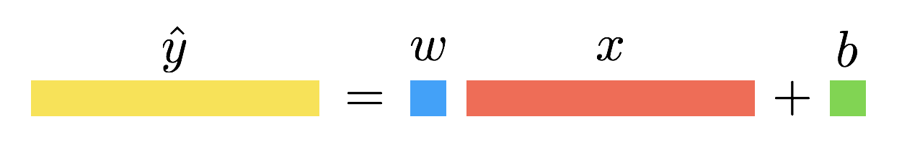
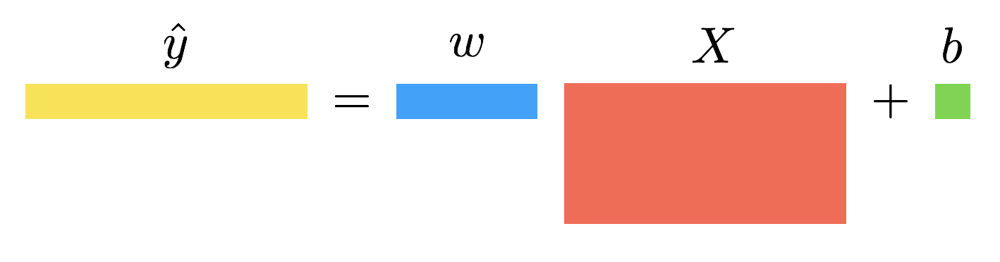
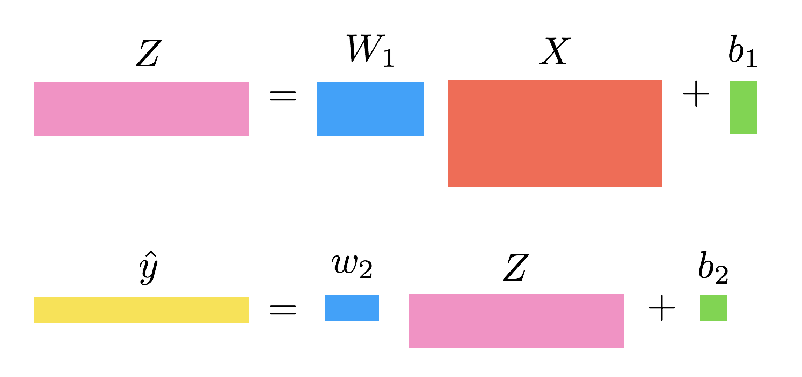
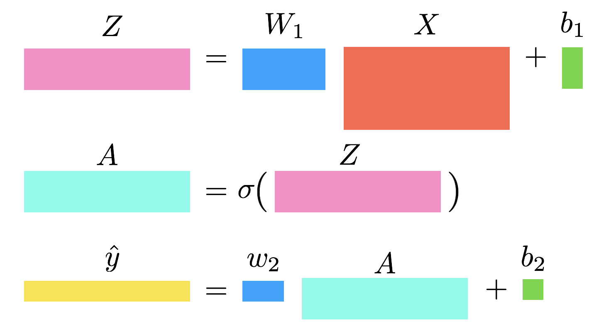

# Workera Resources

This content comes from Workera's The Skills Boost:

- [The Machine Learning Algorithms Interview](#the-machine-learning-algorithms-interview)
- [The Deep Learning Algorithms Interview](#the-deep-learning-algorithms-interview)
- [The Machine Learning Case Study Interview](#the-machine-learning-case-study-interview)
- [The Deep Learning Case Study Interview](#the-deep-learning-case-study-interview)
- [The Data Science Case Study interview](#the-data-science-case-study-interview)

## [The Machine Learning Algorithms Interview](https://github.com/khanhnamle1994/cracking-the-data-science-interview/blob/master/Question-Bank/Workera/Machine-Learning-Algorithms-Interview.pdf)

([Full Resource](https://workera.ai/resources/machine-learning-algorithms-interview/))

### 1 - Explain different loss functions

**Cross Entropy**: Cross-entropy loss, or log loss, measures the performance of a classification model whose output is a probability value between 0 and 1. Cross-entropy loss increases as the predicted probability diverges from the actual label.

```
def CrossEntropy(yHat, y):
    if y == 1:
      return -log(yHat)
    else:
      return -log(1 - yHat)
```

In binary classification, where the number of classes `𝑀` equals 2, cross-entropy can be calculated as:

`−(𝑦 log(𝑝) + (1 − 𝑦) log(1 − 𝑝))`

If `𝑀 > 2` (i.e. multiclass classification), we calculate a separate loss for each class label per observation and sum the result.

`− \sum_{c=1}^M 𝑦_{𝑜,𝑐} log(𝑝_{𝑜,𝑐})`

**Hinge**: Used for classification.

```
def Hinge(yHat, y):
    return np.max(0, 1 - yHat * y)
```

**Huber**: Typically used for regression. It’s less sensitive to outliers than the MSE as it treats error as square only inside an interval.

```
def Huber(yHat, y, delta=1.):
    return np.where(np.abs(y-yHat) < delta,.5*(y-yHat)**2 , delta*(np.abs(y-yHat)-0.5*delta))
```

**Kullback-Leibler**

```
def KLDivergence(yHat, y):
    return np.sum(yHat * np.log((yHat / y)))
```

**MAE (L1)**: Mean Absolute Error, or L1 loss.
```
    return np.sum(np.absolute(yHat - y))
```

**MSE (L2)**: Mean Squared Error, or L2 Loss.
```
def MSE(yHat, y):
    return np.sum((yHat - y)**2) / y.size
```

[back to current section](#the-machine-learning-algorithms-interview)

### 2 - Explain Linear Regression ([Notes](http://cs229.stanford.edu/notes-spring2019/cs229-notes1.pdf))

Read these notes: [https://ml-cheatsheet.readthedocs.io/en/latest/linear_regression.html](https://ml-cheatsheet.readthedocs.io/en/latest/linear_regression.html)

[back to current section](#the-machine-learning-algorithms-interview)

### 3 - Explain Logistic Regression ([Notes](http://cs229.stanford.edu/notes-spring2019/cs229-notes1.pdf))

Read these notes: [https://ml-cheatsheet.readthedocs.io/en/latest/logistic_regression.html](https://ml-cheatsheet.readthedocs.io/en/latest/logistic_regression.html)

[back to current section](#the-machine-learning-algorithms-interview)

### 4 - Explain Generalized Linear Models ([Notes](http://cs229.stanford.edu/notes-spring2019/cs229-notes1.pdf))

- Both linear and logistic regression methods are special cases of a broader family of models, called Generalized Linear Models (GLMs).
  - Exponential family class distributions have this form: `p(y; eta) = b(y) exp(eta^T T(y) - a(eta))`, where `eta` is the natural parameter of the distribution, `T(y)` is the sufficient statistic, and `a(eta)` is the log partition function.
  - A fixed choice of `T`, `a`, and `b` defines a family of distributions that is parameterized by `eta`. As we vary `eta`, we then get different distributions within this family.
  - In the regression example, our parameters are in a Gaussian distribution. In the classification one, our parameters are in a Bernoulli distribution.
- There’re many other distributions that are members of the exponential family: The multinomial, the Poisson (for modeling count-data); the gamma and the exponential (for modeling continuous, non-negative random variables, such as time intervals); the beta and the Dirichlet (for distributions over probabilities); and many more.

[back to current section](#the-machine-learning-algorithms-interview)

5. In Support Vector Machines, what is the kernel trick? ([Notes](http://cs229.stanford.edu/notes-spring2019/cs229-notes3.pdf))

### 6 - Why is the Naive Bayes classifier called Naive? ([Notes](http://cs229.stanford.edu/notes-spring2019/cs229-notes2.pdf))

- In Naive Bayes, in order to model `p(x|y)`, we will make a very strong assumption. We will assume that the `x_i`’s are conditionally independent given y. This assumption is called the **Naive Bayes (NB) assumption**.
- For instance, if `y = 1` means spam email; “buy” is word 2087 and “price” is word 39831; then we are assuming that if I tell you `y = 1` (that a particular piece of email is spam), then knowledge of `x_2087` (knowledge of whether “buy” appears in the message) will have no effect on your beliefs about the value of `x_39831` (whether “price” appears). More formally, this can be written `p(x_2087|y) = p(x_2087|y, x_39831)`.
- Note that this is not the same as saying that `x_2087` and `x_39831` are independent, which would have been written ``“p(x_2087) = p(x_2087|x_39831)”``; rather, we are only assuming that `x_2087` and `x_39831` are conditionally independent given y.

[back to current section](#the-machine-learning-algorithms-interview)

### 7 - How does a discriminative model differ from a generative model? ([Notes](http://cs229.stanford.edu/notes-spring2019/cs229-notes2.pdf))

- Consider a classification problem in which we want to learn to distinguish between elephants (y = 1) and dogs (y = 0), based on some features of an animal. Given a training set, an algorithm like logistic regression or the perceptron algorithm (basically) tries to find a straight line—that is, a decision boundary—that separates the elephants and dogs. Then, to classify a new animal as either an elephant or a dog, it checks on which side of the decision boundary it falls, and makes its prediction accordingly.
- Here’s a different approach. First, looking at elephants, we can build a model of what elephants look like. Then, looking at dogs, we can build a separate model of what dogs look like. Finally, to classify a new animal, we can match the new animal against the elephant model, and match it against the dog model, to see whether the new animal looks more like the elephants or more like the dogs we had seen in the training set.
- Algorithms that try to learn `p(y|x)` directly (such as logistic regression), or algorithms that try to learn mappings directly from the space of inputs X to the labels {0, 1}, (such as the perceptron algorithm) are called **discriminative** learning algorithms.
- Algorithms that instead try to model `p(x|y)` (and `p(y)`) are called **generative** learning algorithms. For instance, if y indicates whether an example is a dog (0) or an elephant (1), then `p(x|y = 0)` models the distribution of dogs’ features, and `p(x|y = 1)` models the distribution of elephants’ features.
- After modeling `p(y)` (called the class priors) and `p(x|y)`, our algorithm can then use Bayes rule to derive the posterior distribution on y given x:

`p(y|x) = [p(x|y) * p(y)] / p(x)`

[back to current section](#the-machine-learning-algorithms-interview)

### 8 - What is the bias-variance tradeoff? ([Notes](http://cs229.stanford.edu/section/error-analysis.pdf))

- High bias is synonymous with underfitting: the model didn’t gather enough information from the training set, and doesn’t capture the link between the features and the target.
- High variance is synonymous with overfitting:  the model is too closely related to the examples in the training set and doesn’t generalize well to other examples.
- If the error is still too high, then the data is simply noisy. The model is neither overfitting or underfitting, and the high error is simply due to the amount of noise in the dataset.

[back to current section](#the-machine-learning-algorithms-interview)

### 9 - How to do error analysis in a machine learning pipeline? ([Notes](http://cs229.stanford.edu/section/error-analysis.pdf))

- Even though understanding whether our poor test error is due to high bias or high variance is important, knowing which parts of the machine learning algorithm lead to this error or score is crucial.
- If you build a complicated system, you might want to figure out how much error is attributable to each of the components. One thing to do is plug in the ground-truth for each component, and see how accuracy changes.
- Error analysis is also useful when publishing a paper, since it's a convenient way to analyze the error of an algorithm and explain which parts should be improved.
- While error analysis tries to explain the difference between current performance and perfect performance, ablative analysis tries to explain the difference between some baseline (much poorer) performance and current performance.
- When presenting the results in a paper, ablative analysis really helps analyzing the features that helped decreasing the misclassification rate. Instead of simply giving the loss/error rate of the algorithm, we can provide evidence that some specific features are actually more important than others.
- In brief, do not waste your time improving parts of your algorithm that won’t really help decreasing your error rate, and focus on what really matters.

[back to current section](#the-machine-learning-algorithms-interview)

### 10 - How to do cross-validation? ([Notes](http://cs229.stanford.edu/notes/cs229-notes5.pdf))

- In **hold-out cross validation**, we do the following:
  1. Randomly split training set `S` into `S_train` and `S_cv` (the hold-out cross validation set).
  2. Train each model `M_i` on `S_train` only, to get some hypothesis `h_i`.
  3. Select and output the hypothesis `h_i` that had the smallest error on the hold-out cross validation set.
- The disadvantage of using hold-out cross validation is that it "wastes" some portion of the data. Another method is called **k-fold cross validation** that holds out less data each time.
  - A typically choice for the number of folds would be `k = 10`.
  - This procedure may be more computationally expensive, since we now need to train each model `k` times.
  - If we choose `k = m`, this is called **leave-one-out cross validation**.

[back to current section](#the-machine-learning-algorithms-interview)

### 11 - How to do feature selection? ([Notes](http://cs229.stanford.edu/notes/cs229-notes5.pdf))

- Given `n` features, there are `2^n` possible feature subsets, and thus feature selection can be posed as a model selection problem over `2^n` possible models. For large values of `n`, it's usually too expensive to explicitly enumerate over and compare all `2^n` models, and so typically some heuristic search procedure is used to find a good feature subset.
- *Wrapper model feature selection* is a procedure that "wraps" around your learning algorithm, and repeatedly makes calls to the learning algorithm to evaluate how well it does using different feature subsets. This includes *forward search* and *backward search*.
  - **Forward search** starts off with `F is empty` as the initial set of features. For `i = 1, ..., n`, use some version of cross validation to evaluate features `F_i` and set `F` to be the best feature subset found. Finally, select and output the best feature subset that was evaluated during the entire search procedure.
  - **Backward search** starts off with `F = {1, ..., n}` as the set of all features, and repeatedly deletes features one at a time (evaluating single-feature deletions in a similar manner to how forward search evaluates single-feature additions) until `F is empty`.
- *Filter feature selection* methods give heuristic, but computationally much cheaper, ways of choosing a feature subset. The idea here is to compute some simple score `S(i)` that measures how informative each feature `x_i` is about the class labels `y`. Then, we simply pick the `k` features with the largest scores `S(i)`.
  - One possible choice of the score would be define `S(i)` to be the correlation between `x_i` and `y`, as measured on the training data. This would result in our choosing the features that are the most strongly correlated with the class labels.
  - In practice, it is more common to choose `S(i)` to be the **KL divergence** between `x_i` and `y`. If `x_i` and `y` are independent random variables, then the KL-divergence between the two distributions will be 0. This is consistent with the idea if `x_i` and `y` are independent, then `x_i` is clearly very "non-informative" about `y`, and thus the score `S(i)` should be small. Conversely, if `x_i` is very "informative" about `y`, then their KL-divergence would be large.

[back to current section](#the-machine-learning-algorithms-interview)

### 12 - What is the Bayesian way to combat overfitting? ([Notes](http://cs229.stanford.edu/notes/cs229-notes5.pdf))

- [Using Maximum a Posteriori instead of Maximum Likelihood to estimate our parameters](https://github.com/khanhnamle1994/cracking-the-data-science-interview/blob/master/Question-Bank/Data-Science-Prep/MLE-vs-MAP.md). They have the same formula except for the prior term at the end of MAP.
- Using this choice of prior, the fitted parameters `theta_MAP` will have smaller norm than that selected by maximum likelihood. In practice, this causes the Bayesian MAP estimate to be less susceptible to overfitting than the ML estimate of the parameters. For example, Bayesian logistic regression turns out to be an effective algorithm for text classification, even though in text classification we usually have n ≫ m.

[back to current section](#the-machine-learning-algorithms-interview)

### 13 - How does k-Means clustering algorithm work? ([Notes](http://cs229.stanford.edu/notes-spring2019/cs229-notes7a.pdf))

- The k-Means clustering algorithm is as follows:
  1. Initialize k **cluster centroids** randomly.
  2. Repeat until convergence:
    - "Assigning" each training example to the closest centroid
    - Moving each cluster centroid to the mean of the points assigned to it.
- The **distortion function** measures the sum of squared distances between each training example and the cluster centroid to which it has been assigned. This value monotonically decrease and will eventually converge.
- This distortion function is non-convex, and so coordinate descent on it is not guaranteed to converge to the global minimum. In other words, k-means can be susceptible to local optima.

[back to current section](#the-machine-learning-algorithms-interview)

### 14 - Why is the EM algorithm useful? ([Notes](http://cs229.stanford.edu/notes-spring2019/cs229-notes7b.pdf))

- The Expectation-Maximization algorithm is used for density estimation. It is an iterative algorithm that has 2 main steps:
  - In the E-step, it tries to "guess" the values of the random variables `z`s.
  - In the M-step, it updates the parameters of our model based on our guesses. Since in the M-step we are pretending that the guesses in the first part were correct, the maximization becomes easy.
- The EM-algorithm is reminiscent of the K-means clustering algorithm, except that instead of the "hard" cluster assignments `c`, we instead have the "soft" assignments `w_j`. Similar to K-means, it is also susceptible to local optima, so reinitializing at several different initial parameters may be a good idea.

[back to current section](#the-machine-learning-algorithms-interview)

### 15 - How does Principal Component Analysis work? ([Notes](http://cs229.stanford.edu/notes-spring2019/cs229-notes10.pdf))

- PCA tries to identify the subspace in which the data approximately lies.
  - Prior to running PCA, we typically first preprocess the data by normalizing each feature to have mean 0 and variance 1. We do this by subtracting the mean and dividing by the empirical standard deviation.
  - To compute the "major axis of variation" `u` - that is, the direction on which the data approximately lies, we find the unit vector u so that when the data is projected onto the direction onto the direction corresponding to `u`, the variance of the projected data is maximized.
  - More specifically, if we wish to project our data into a k-dimensional subspace, we should choose `u_1, ..., u_k` to be the top k eigenvectors of `\Sum`, which is the empirical covariance matrix of the data. The `u_i`s now form a new, orthogonal basis for the data.
- PCA is referred to as a **dimensionality reduction** algorithm. The vectors `u_1, ..., u_k` are called the first k **principal components** of the data.
- PCA has many applications:
  - Compression is an obvious application. If we reduce high dimensional data to `k = 2` or `3` dimensions, then we can also plot the `y^(i)`'s to visualize the data.
  - Another standard application is to preprocess a dataset to reduce its dimension before running a supervised learning algorithm with the inputs. Apart from computational benefits, reducing the data's dimension can also reduce the complexity of the hypohtesis class considered and help avoid overfitting.
  - Lastly, we can also view PCA as a noise reduction algorithm.

[back to current section](#the-machine-learning-algorithms-interview)

[back to top](#workera-resources)

## [The Deep Learning Algorithms Interview](https://github.com/khanhnamle1994/cracking-the-data-science-interview/blob/master/Question-Bank/Workera/Deep-Learning-Algorithms-Interview.pdf)

([Full Resource](https://workera.ai/resources/deep-learning-algorithms-interview/))

### 1 - Explain Neural Networks from first principle ([Notes](http://cs229.stanford.edu/notes-spring2019/cs229-notes-deep_learning.pdf))

Suppose we have three input features `x1`, `x2`, `x3` which are collectively called the *input layer*, four hidden units which are collectively called the *hidden layer* and one output neuron called the *output layer*. The term hidden layer is called “hidden” because we do not have the ground truth/training value for the hidden units. This is in contrast to the input and output layers, both of which we know the ground truth values from `(x(i), y(i))`.

The first hidden unit requires the input `x1`, `x2`, `x3` and outputs a value denoted by `a_1`. We use the letter `a` since it refers to the neuron’s “activation” value. In this particular example, we have a single hidden layer but it is possible to have multiple hidden layers. Let `a[1]_1` denote the output value of the first hidden unit in the first hidden layer. We use zero-indexing to refer to the layer numbers. That is, the input layer is layer 0, the first hidden layer is layer 1 and the output layer is layer 2. Again, more complex neural networks may have more hidden layers. Given this mathematical notation,
the output of layer 2 is `a[2]_1`.

We can unify our notation: `x1 = a[0]_1`, `x2 = a[0]_2`, `x3 = a[0]_3`. To clarify, foo[1] with brackets denotes anything associated with layer 1, `x(i)` with parenthesis refers to the i-th training example, and `a[l]_j` refers to the activation of the j-th unit in layer l.

We can represent `g(x)` with a single neuron in the neural network. We can break `g(x)` into two distinct computations: (1) `z = w^T x + b` and (2) `a = σ(z)` where `σ(z)` is an activation function (sigmoid, ReLU, or tanh).

The first hidden unit in the first hidden layer will perform the following computation:

`z[1]_1 = W[1]_1^T x + b[1]_1` and `a[1]_1 = g(z[1]_1)`

where `W` is a matrix of parameters and `W_1` refers to the first row of this matrix. The parameters associated with the first hidden unit is the vector `W[1]_1` and the scalar `b[1]_1`.

For the second and third hidden units in the first hidden layer, the computation is defined as:

`z[1]_2 = W[1]_2^T x + b[1]_2` and `a[1]_2 = g(z[1]_2)`

`z[1]_3 = W[1]_3^T x + b[1]_3` and `a[1]_3 = g(z[1]_3)`

where each hidden unit has its corresponding parameters `W` and `b`. Moving on, the output layer performs the computation:

`z[2]_1 = W[2]_1^T a[1] + b[2]_1` and `a[2]_1 = g(z[2]_1)`

where `a[1]` is defined as the concatenation of all first layer activations.

The activation `a[2]_1` from the second layer, which is a single scalar as defined by `a[2]_1 = g(z[2]_1)`, represents the neural network’s final output prediction.

[back to current section](#the-deep-learning-algorithms-interview)

### 2 - What is the most effective initialization for neural networks? ([Notes](https://www.deeplearning.ai/ai-notes/initialization/index.html))

- To prevent the gradients of the network’s activations from vanishing or exploding, we will stick to the following rules of thumb:
  - The mean of the activations should be zero.
  - The variance of the activations should stay the same across every layer.
- Under these two assumptions, the back-propagated gradient signal should not be multiplied by values too small or too large in any layer. It should travel to the input layer without exploding or vanishing.
- The recommended initialization is **Xavier initialization**, where all the weights of each layer are picked randomly from a normal distribution with mean `\mu = 0` and variance `\sigma^2 = 1 / n^[l-1]`, where `n^[l-1]` is the number of neuron in layer `l - 1`. Biases are initialized with zeros.

[back to current section](#the-deep-learning-algorithms-interview)

### 3 - Explain how back-propagation works in a fully-connected neural network ([Notes](http://cs230.stanford.edu/section/3/))

When datasets are large and high-dimensional, it is computationally very expensive (sometimes impossible!) to find an analytical solution for the optimal parameters of your network. Instead, we use optimization methods. A vanilla optimization approach would be to sample different combinations of parameters and choose the one with the lowest loss value.
- Is this a good idea?
- Would it be possible to extract another piece of information to direct our search towards the optimal parameters?

This is exactly what *gradient descent* does! Apart from the loss value, gradient descent computes the local gradient of the loss when evaluating potential parameters. This information is used to decide which direction the search should go to find better parameter values. This extra piece of information (the local gradient) can be computed relatively easily using *backpropagation*. This recursive algorithm breaks up complex derivatives into smaller parts through the *chain rule*.

#### Univariate Regression

Let’s consider a linear regression. You have a data set `(x, y)` with `m` examples. In other words, `x = (x_1, ..., x_m)` and `y = (y_1, ..., y_m)` are row vectors of `m` scalar examples. The goal is to find the scalar parameters `w` and `b` such that the line `y = wx + b` optimally fits the data. This can be achieved using gradient descent.



**Forward Propagation**

The first step of gradient descent is to compute the loss. To do this, define your model’s output and loss function. In this regression setting, we use the mean squared error loss.

```
\hat{y} = wx + b
L = (1 / m) * ||\hat{y} - y||^2
```

**Backward Propagation**

The next step is to compute the local gradient of the loss with respect to the parameters (i.e. `w` and `b`). This means you need to calculate derivatives. Note that values stored during the forward propagation are used in the gradient equations.

```
dL / dw = (2 / m) * (\hat{y} - y) * x^T
dL / db = (2 / m) * (\hat{y} - y) * 1
```

#### Multivariate Regression

Now consider the case where `X` is a matrix of shape `(n, m)` and `y` is still a row vector of shape `(1, m)`. Instead of a single scalar value, the weights will be a vector (one element per feature) of shape `(1, n)`. The bias parameter is still a scalar.



**Forward Propagation**

```
\hat{y} = wx + b
L = (1 / m) * ||\hat{y} - y||^2
```

**Backward Propagation**

```
dL / dw = (2 / m) * (\hat{y} - y) * x^T
dL / db = (2 / m) * (\hat{y} - y) * 1
```

#### Two Layer Linear Network

Consider stacking two linear layers together. You can introduce a hidden variable `Z` of shape `(k, m)`, which is the output of the first linear layer. The first layer is parameterized by a weight matrix `W_1` of shape `(k, n)` and bias `b_1` of shape `(k, 1)` broadcasted to `(k, m)`. The second layer will be the same as in the multivariate regression case, but its input will be `Z` instead of `X`.



**Forward Propagation**

```
Z = W_1 * X + b_1
\hat{y} = w_2 * Z + b_2
L = (1 / m) * ||\hat{y} - y||^2
```

**Backward Propagation**

```
dL / dw_1 = w_2^T * (2 / m) * (\hat{y} - y) * X^T
dL / db_1 = w_2^T * (2 / m) * (\hat{y} - y) * 1
dL / dw_2 = (2 / m) * (\hat{y} - y) * Z^T
dL / db_2 = (2 / m) * (\hat{y} - y) * 1
```

#### Two Layer Nonlinear Network

In this example, before sending `Z` as the input to the second layer, you will pass it through the sigmoid function. The output is denoted `A` and is the input of the second layer.



**Forward Propagation**

```
Z = W_1 * X + b_1
A = sigmoid(Z)
\hat{y} = w_2 * A + b_2
L = (1 / m) * ||\hat{y} - y||^2
```

**Backward Propagation**

```
dL / dw_1 = [ (w_2^T * (2 / m) * (\hat{y} - y)) \cdot A \cdot (1 - A) ] * X^T
dL / db_1 = [ (w_2^T * (2 / m) * (\hat{y} - y)) \cdot A \cdot (1 - A) ] * 1
dL / dw_2 = (2 / m) * (\hat{y} - y) * A^T
dL / db_2 = (2 / m) * (\hat{y} - y) * 1
```

[back to current section](#the-deep-learning-algorithms-interview)

### 4 - What is the difference between Vanilla, Mini-Batch, and Stochastic Gradient Descent?

**Vanilla Gradient Descent** computes the gradient of the cost function w.r.t. to the parameters `θ` for the entire training dataset: `θ = θ − η ⋅ ∇_θ J(θ)`
- As we need to calculate the gradients for the whole dataset to perform just one update, batch gradient descent can be very slow and is intractable for datasets that don't fit in memory.
- Vanilla gradient descent also doesn't allow us to update our model online, i.e. with new examples on-the-fly.

**Stochastic Gradient Descent** in contrast performs a parameter update for each training example `x(i)` and label `y(i)`: `θ = θ − η ⋅ ∇_θ J(θ; x(i); y(i))`
- Vanilla gradient descent performs redundant computations for large datasets, as it recomputes gradients for similar examples before each parameter update.
- SGD does away with this redundancy by performing one update at a time. It is therefore usually much faster and can also be used to learn online.
- It has been shown that when we slowly decrease the learning rate, SGD shows the same convergence behavior as batch gradient descent, almost certainly converging to a local or the global minimum for non-convex and convex optimization respectively.

**Mini-Batch Gradient Descent** finally takes the best of both worlds and performs an update for every mini-batch of n training examples: `θ = θ − η ⋅ ∇_θ J(θ; x(i:i+n); y(i:i+n))`
- It reduces the variance of the parameter updates, which can lead to more stable convergence.
- It can make use of highly optimized matrix optimizations common to state-of-the-art deep learning libraries that make computing the gradient w.r.t. a mini-batch very efficient.
- Common mini-batch sizes range between 50 and 256, but can vary for different applications.

[back to current section](#the-deep-learning-algorithms-interview)

### 5 - What is your process of optimizing parameters in neural networks? ([Notes](https://www.deeplearning.ai/ai-notes/optimization/))

[back to current section](#the-deep-learning-algorithms-interview)

### 6 - What is the techniques to regularize neural networks? ([Notes](https://www.deeplearning.ai/ai-notes/regularization/))

[back to current section](#the-deep-learning-algorithms-interview)

### 7 - What is your strategy for hyper-parameter tuning? ([Notes](http://cs230.stanford.edu/section/7/))

[back to current section](#the-deep-learning-algorithms-interview)

### 8 - What is your approach to write a deep learning paper? ([Notes](http://cs230.stanford.edu/section/8/))

[back to current section](#the-deep-learning-algorithms-interview)

[back to top](#workera-resources)

## [The Machine Learning Case Study Interview](https://github.com/khanhnamle1994/cracking-the-data-science-interview/blob/master/Question-Bank/Workera/Machine-Learning-Case-Study-Interview.pdf)

([Full Resource](https://workera.ai/resources/machine-learning-case-study-interview/))

1. How would you build a trigger word detection algorithm to spot the word "activate" in a 10 second long audio clip?

2. An e-commerce company is trying to minimize the time it takes customer to purchase their selected items. As a ML engineer, what can you do to help them?

3. You are given a dataset of credit card purchases information. Each record is labeled as fraudulent or safe. You are asked to build a fraud detection algorithm. How would you proceed?

4. You are provided with data from a music streaming platform. Each of the 100,000 records indicates the songs a user has listened to in the past month. How would you build a music recommendation system?

**Company Machine Learning Case Studies**

1. [Machine Learning-Powered Search Ranking of Airbnb Experiences](https://medium.com/airbnb-engineering/machine-learning-powered-search-ranking-of-airbnb-experiences-110b4b1a0789)

2. [Machine Learning at Facebook: Understanding Inference at the Edge](https://research.fb.com/wp-content/uploads/2018/12/Machine-Learning-at-Facebook-Understanding-Inference-at-the-Edge.pdf)

3. [Empowering personalized marketing with machine learning](https://eng.lyft.com/empowering-personalized-marketing-with-machine-learning-fd36e6bdeca6)

4. [Learning a Personalized Homepage](https://netflixtechblog.com/learning-a-personalized-homepage-aa8ec670359a)

[back to top](#workera-resources)

## The Deep Learning Case Study Interview

([Full Resource](https://workera.ai/resources/deep-learning-case-study-interview/))

1. How would you build a speech recognition system powering a virtual assistant like Amazon Alexa, Google Home, Apple Siri, and Baidu’s DuerOS?

2. As a deep learning engineer, you are asked to build an object detector for a zoo. How would you get started?

3. How would you build an algorithm that auto-completes your sentence when writing an email?

4. In your opinion, what are technical challenges related to the deployment of an autonomous vehicle in a geofenced area?

5. You built a computer vision algorithm that can detect pneumonia from chest X-rays. How would you convince a radiologist to use it?

6. You are tackling the school dropout problem. How would you build a model that can determine whether a student is at-risk or not, and plan an intervention?

[back to top](#workera-resources)

## The Data Science Case Study interview

([Full Resource](https://workera.ai/resources/data-science-case-study-interview/))

1. How many cashiers should be at a Walmart store at a given time?

2. You notice a spike in the number of user-uploaded videos on your platform in June. What do you think is the cause, and how would you test it?

3. Your company is thinking of changing its logo. Is it a good idea? How would you test it?

4. Could you tell if a coin is biased?

5. In a given day, how many birthday posts occur on Facebook?

6. What are the different performance metrics for evaluating ride sharing services?

7. How will you test if a chosen credit scoring model works or not? What dataset(s) do you need?

8. Given a user’s history of purchases, how do you predict their next purchase?

[back to top](#workera-resources)
